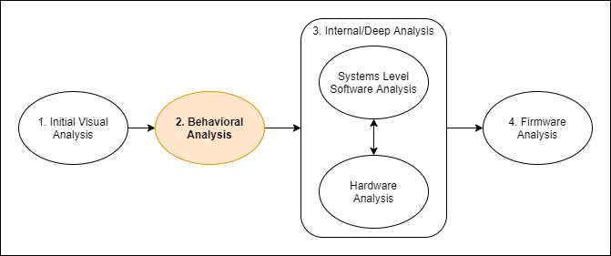

:::danger Incomplete

This document is not yet written.

:::

Ok, so **Behavioral Analysis** might not sound very obvious to everyone. The point with this section is to provide you with some techniques to analyze observable behaviors of the device at runtime. When performing any kind of penetration testing or vulnerability analysis, this could be referred to as the attack surface. It's an awareness of all of the ways to read information or provide information to the system (i.e. the target device).

The intended end user functionality is the overt behavior of a system. If you are able to get direct access to the state of the system (i.e. root access on the device), you're now able to observe what I call the internal behavior of the system. This section starts out by performing analysis on the end user functionality and network behavior. Next we'll work our way from the outside to the inside of the system by covering memory mapped system input/output and cross compilation of binaries.

- [Wired Network Analysis](./WiredNetworkAnalysis) - Wire Capture Of Network Interfaces, Network Scans
- [End-User Functionality](./EndUserFunctionality) - Profiling the overt and expected end user experience and capabilities.
- [Radio Emission Analysis](./RadioEmissionAnalysis) - Analysis and detection of radio emissions given off from target device.
- [Unrestricted Access](./UnrestrictedAccess) - Telnet/SSH access? Root access? Command line injections? Arbitrary read/write/exec of any memory address?

- ~~Architectural Specifics - Static & Runtime Application Analysis (ARM App Intro) (4 - 6 hours)~~ **TODO: I think this should be moved to somewhere else?**
