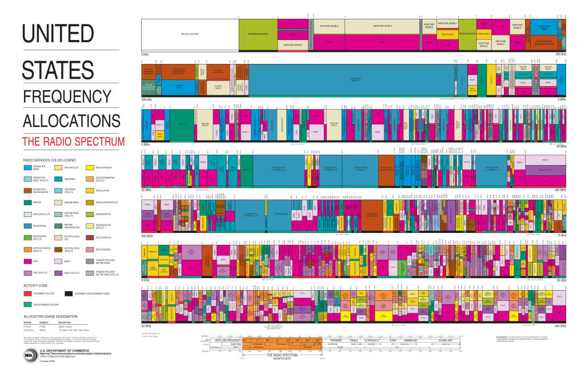
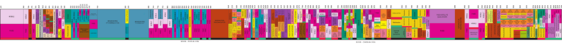
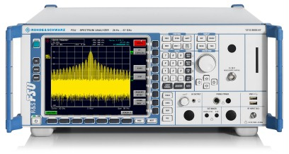
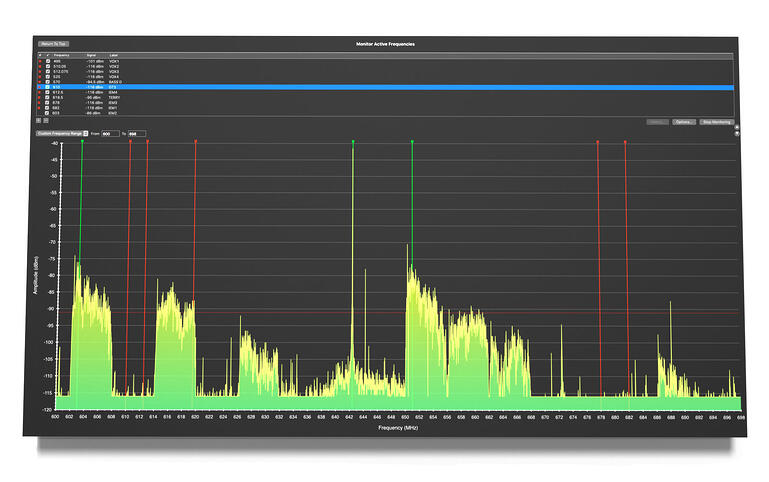
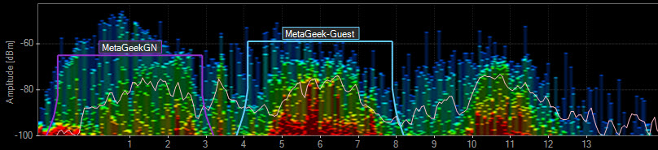
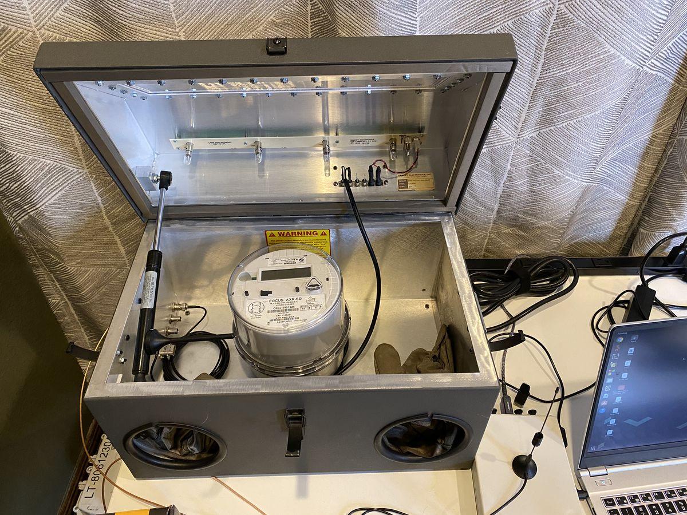

:::danger Incomplete

This document is not yet written.

:::

<!-- TODO: Need to define various terminology: magnitude, decibels. Consider describing decibel log curve. -->

Radio Frequency (RF) Analysis is a complex topic, but worth mentioning even though we don't intend to include any labs for it in this Embedded Systems Analysis material. The general idea is that when we're powering on any unknown device, it could not only be using any wired connection to communicate with the outside world, it can also be using wireless signals.

Many of the smart home devices that control our lights, HVAC, doors, and cameras are controlled over a standard IoT protocol defined by 802.15.4.  Standard Wifi protocols are defined by the 802.11 standard. These are just two examples of local short distance protocols. For longer distance communications, a device could include a SIM card and call home over a 3G, 4G, or 5G cell phone connection. It could also use more proprietary protocols to attempt to discover similar products over short, medium, or long distances.

How do we detect this has occurred and how might you mitigate against this from happening?

## Radio Spectrum

A radio spectrum is a range of radio frequencies. The FCC manages the _standardized_ radio spectrum frequency usages within the United States. The following diagrams are layouts of the spectrum and the uses within. 

2003 Spectrum:

2015-2017 Spectrum:

Note: This is only the US spectrum and only when folks follow the rules! Devices really only have to obey the laws of physics, not the FCC. Also, different countries and regions will have difference radio frequency governance and enforcement.

## Spectrum Analyzers

A spectrum analyzer measures the magnitude of power in a given range of RF frequencies. This can be used to detect unknown or known wireless signals emanating from the target device.

The idea here is that when your device is powered on and operating, you can detect the RF signals that are emitting from the device without depending on potentially false documentation or observations in software. Here is an example of a spectrum analyser output:

Sometimes you might want to survey an area of transmission to determine the best frequency to run your application. For example, in Wifi there are a number of different channels. The issue is that WAPs and most RF devices never stay within their given frequency. They often bleed over into neighboring frequencies. Therefore it can be useful to locate noisier Wifi channels and setup your WAP as far as possible from the noise.

The following spectrum analyzer results show 3 WAPs on channels 1, 6, and 11. By looking at the results you can clearly see the bleed over is give or take an entire channel in both directions.

[Source](https://serverfault.com/questions/471721/adjacent-channel-versus-co-channel-interference)

## Software Defined Radio

Wikipedia describes a Software Defined Radio (SDR) as: "Software-defined radio (SDR) is a radio communication system where components that have been traditionally implemented in hardware (e.g. mixers, filters, amplifiers, modulators/demodulators, detectors, etc.) are instead implemented by means of software on a personal computer or embedded system."

Modern SDRs have made programmable radio technology extremely affordable for hobbyists. The following SDRs provide the capability to send and receive radio communications in any given project. The reason we bring them up here is because they can also be used as spectrum analyzers. Keysight Spectrum analyzers can run tens of thousands of dollars, whereas these low cost versions are as low as $25.

Two very popular hobbyist SDR platforms include:

- [RTLSDR](https://www.rtl-sdr.com/) (~$30)- "RTL-SDR is a very cheap ~$25 USB dongle that can be used as a computer based radio scanner for receiving live radio signals in your area (no internet required). Depending on the particular model it could receive frequencies from 500 kHz up to 1.75 GHz. Most software for the RTL-SDR is also community developed, and provided free of charge." - RTL Homepage

- [hackRF](https://greatscottgadgets.com/hackrf/) (~$300)- "HackRF One is a wide band software defined radio (SDR) half-duplex transceiver created and manufactured by Great Scott Gadgets. It is able to send and receive signals. The transmitter can send 1-50 milliwatts. Its creator, Michael Ossmann, launched a successful KickStarter campaign in 2014 with a first run of the project called HackRF (Project Jawbone).[1] The hardware and software's open source nature has attracted hackers, amateur radio enthusiasts, and information security practitioners." - Wikipedia

Some major advantages of a professional spectrum analyzer over a hobbyist version include:

- Significantly larger range of frequencies. Most of the cheap SDRs won't do above 1.7Ghz without advanced trickery.
- Significantly faster spectrum sweep times.
- Many other analytical and measurement features.

<!-- TODO: Consider discussing antennas and mention how directional antennas on a spec-an can help locate frequency sources. -->

## RF Shielded Enclosures

When you've got that extra need to contain any RF emissions coming from a device, you can use an RF shielded enclosure. Fundamentally, these are boxes that contain special materials that absorb the radio waves to a given degree, causing the reception of any signal emissions to go from a shout to a whisper. Here is an example of a Ramsey RF enclosure with a power meter under evaluation:

The above enclosure is currently open and therefore not containing any RF. The enclosure must be closed and clamped down to decrease the emissions by the given rated decibels. The above enclosure has a window for viewing the device display and any LED indicators, and gloves that allow engineers to access the target device user interfaces that would otherwise be inaccessible once the enclosure is sealed.

The RF enclosures usually have specialized interfaces that allow engineers to communicate with the device while its sealed in the enclosure. These specialized interfaces are implemented with standard endpoints, like USB, DB9, Multi/Single Channel Fiber, and many others. Tip: Usually the safest communication interface is an optical fiber because there is no conductor to carry the radio frequency over.

Note: Enclosures are not full proof. They only decrease the decibel level of the emissions by the given rating of the box.

## Resources

- [FCC Radio Spectrum Allocation](https://www.fcc.gov/engineering-technology/policy-and-rules-division/general/radio-spectrum-allocation)
- [Adjacent Channel vs Co-Channel Interference](https://serverfault.com/questions/471721/adjacent-channel-versus-co-channel-interference)

Instructor Notes

- No Lab, equipment costs too high.

