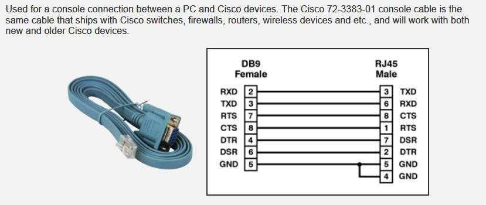

:::danger Incomplete

This document is not yet written.

:::

## Overview

This section is about wired network analysis. When initially plugging anything into the device, it's important to isolate the wired connections from the rest of your networking environment. Through network isolation we can understand what the behavior of the device is with as much of the environment under our control as possible. If you have a development workstation or laptop plugged into the device with a network cable or UART console connection, no other part of the development workstation or the device should be plugged into the internet or other networks. (This prevents the devices from becoming accidental default gateways.)

There are several reasons for isolation:

- Devices that we do not yet understand, could call back to their vendor's servers for purposes of licensing or awareness of the network its plugged into. (For some, this is a violation of privacy, for others is a convenience provided by the vendor (i.e. cloud managed services).)
- Devices can advertise their existence and readiness to serve to the whole network or internet, depending on the configuration of the device. I've experienced many junior engineers not properly isolating systems correctly when they plug their device into a internal LAN, resulting in the device serving DHCP to the entire network. This rookie mistake can prevent other systems performing work for other projects from receiving a network relevant DHCP lease (i.e. prevent other users from getting access to the network).

While outside the scope of this material, using a managed switch with [VLANs](https://en.wikipedia.org/wiki/Virtual_LAN) configured is a nice way to initially isolate network traffic between a device and a development workstation without having to setup an entirely new network environment for the single device.

Take away: Isolate your device until you fully understand the impact on the network and its general behavior.

## Network Analysis

### Know Its LINKED

In networking there is a lot of overloaded terms. For the sake of this discussion, a link is a hardware controlled connection between two ethernet nodes. Note: Firewalls typically have no control over whether a network device is linked to another, this functionality is controlled from the network interface itself. When you have physical access to the target device, the most straight forward way to determine if a device is linked is by looking at the LINK LED lights on both sides of the network connection. If they've successfully auto-negotiated the link, the LEDs will be lit. Auto-negotiation is the process that the network devices use (at a hardware level) to determine what speed (e.g. 10Mbps, 100Mbps, 1Gbps) they will be communicating at.

<details><summary>Click to see LINK troubleshooting tips.</summary>

- Known good cable?
  - Cables should not be egregiously bent.
  - Cat5e & Cat6 cable should not exceed 100m.
  - On typical RJ45 ethernet connectors, only pins 1, 2, 3, and 6 matter. 
    They are normally the green/green-white/orange/orange-white wires in the line.
- In some very old systems, you may be required to connect to a device through a switch or use what is called a cross over cable. A cross over cable switches the pins 1/3 with 2/6 on 10/100 connections. (Note: Nothing in this course is that old!)
- Is the development interface (i.e. your laptop/desktop) side of the link UP? 

  <details><summary>Click for more info.</summary>

  You can do this physically by looking at a LINK LED indicator on the PC or if you are running linux you can check with `ifconfig` or `ip`.

  - With `ip`, see the `UP` notation below the `vvvv`s:

  ```text
                  vvvv
  1: lo: <LOOPBACK,UP,LOWER_UP> mtu 65536 qdisc noqueue state UNKNOWN mode DEFAULT group default qlen 1000
      link/loopback 00:00:00:00:00:00 brd 00:00:00:00:00:00
                                 vvvv
  2: enp0s3: <BROADCAST,MULTICAST,UP,LOWER_UP> mtu 1500 qdisc fq_codel master wan state UP mode DEFAULT group default qlen 1000
      link/ether 08:00:27:e5:65:07 brd ff:ff:ff:ff:ff:ff
  ```

  - With `ifconfig`, see the `UP` notation below the `vvvv`s:

  ```text
                    vvvv 
  enp0s3: flags=4163<UP,BROADCAST,RUNNING,MULTICAST>  mtu 1500
        ether 08:00:27:e5:65:07  txqueuelen 1000  (Ethernet)
        RX packets 3774537  bytes 3287988207 (3.2 GB)
        RX errors 0  dropped 21123  overruns 0  frame 0
        TX packets 189129  bytes 30463558 (30.4 MB)
        TX errors 0  dropped 0 overruns 0  carrier 0  collisions 0

              vvvv
  lo: flags=73<UP,LOOPBACK,RUNNING>  mtu 65536
        inet 127.0.0.1  netmask 255.0.0.0
        inet6 ::1  prefixlen 128  scopeid 0x10<host>
        loop  txqueuelen 1000  (Local Loopback)
        RX packets 106476  bytes 18524648 (18.5 MB)
        RX errors 0  dropped 0  overruns 0  frame 0
        TX packets 106476  bytes 18524648 (18.5 MB)
        TX errors 0  dropped 0 overruns 0  carrier 0  collisions 0
  ```

  </details>

- Is the target device powered on? A powered down device can not negotiate a link connection.

</details>

### Know It Can CONNECT

**Can you ping it?** While this will provide an easy way to determine if the system is available, if the ping fails it doesn't mean that you can't reach the system. Firewalls can block the ping protocol ICMP while still allowing UDP, TCP, or other protocols through.

When the ping doesn't work, I suggest having a good knowledge of network stacks. Network stacks are beyond the scope of this material, but in general I would ensure:

- Is there a switch or other network equipment I can remove from the setup?
- Is there a firewall rule on the development host blocking me?
- Can I `arping` the destination device?

  <details><summary>Click for more information.</summary><br />
  
  To install arping on ubuntu, run: `sudo apt-get install arping`. Note: `iputils-arping` doesn't support pinging MAC addresses and is generally less capable.

  Then, given the network interface, you can use it by running something like the following:

  ```text
  # ARPing, "What is the MAC of given IP?"
  sudo /usr/sbin/arping -i enp0s3 192.168.50.137
  # ARPing, "What is the IP of given MAC?"
  sudo /usr/sbin/arping -i enp0s3 70:85:c2:5f:e6:9c
  ```

  Note: If there is no switching or routing between the development interface and the target interface (including VMs, containers, or virtual interfaces), you can not ping MAC addresses directly.

  </details>

- Is the target device in the `arp` table?

  <details><summary>Click for more information.</summary>

  ```text
  $ arp -n
  Address                  HWtype  HWaddress           Flags Mask            Iface
  192.168.50.50            ether   74:85:c2:5f:e6:9c   C                     wan
  192.168.50.1             ether   3a:7c:3f:aa:f8:00   C                     wan
  192.168.50.100           ether   de:e9:96:28:81:85   C                     wan
  192.168.50.150           ether   6e:cf:ec:5e:fc:7f   C                     wan
  192.168.50.200           ether   02:2f:28:b1:6d:c6   C                     wan
  ```

  </details>

- Is there an IP `route` defined to access the target device?

  <details><summary>Click for more information.</summary>

  ```text
  $ route -n
  Kernel IP routing table
  Destination     Gateway         Genmask         Flags Metric Ref    Use Iface
  0.0.0.0         192.168.50.1    0.0.0.0         UG    0      0        0 wan
  172.17.0.0      0.0.0.0         255.255.0.0     U     0      0        0 docker0
  192.168.50.0    0.0.0.0         255.255.255.0   U     0      0        0 wan
  ```

  </details>

- Am I using the correct subnet to access the device? (The manual is your friend here, otherwise read about `tcpdump` below.)

### Packet Capture

Whether you know if you can connect or not, its useful to watch for potential network traffic that the target device transmits when its first powered on. This can provide early indication of what ports the device interacts with (as a client) and what network its configured to talk on. The tool I always use for this is `tcpdump`. This is a CLI tool that, with root privileges, allows us to monitor traffic promiscuously (i.e. all packets whether they are intended for us or not). Tcpdump out of the box provides nice little protocol layer packet summaries that we can use to deduce subnets and ports. Tcpdump can also create complete packet capture files (PCAPs) for later analysis with tools like Wireshark.

To only see packets of interest (i.e. filtering packets), the user is required to provide `tcpdump` a _pcap filter_ that is then compiled by `tcpdump` into BPF (Berkeley Packet Filters). I've found that these two formats are commonly mixed up in conversation and documentation. Just remember that PCAP filters are human readable filter strings and BPF is the compiled assembly language that makes up the final filter code (internally). Usage of PCAP filters and BPF is outside of the scope of this course, but you can read on pcap filters via the man pages: `man pcap-filter`.

<details><summary>See the difference in BPF instructions and PCAP filter.</summary><br />

Example of BPF code for PCAP filter `host 192.168.50.137`:

```text
$ sudo tcpdump -p -ni wan -d "host 192.168.50.137"
(000) ldh      [12]
(001) jeq      #0x800           jt 2    jf 6
(002) ld       [26]
(003) jeq      #0xc0a83289      jt 12   jf 4
(004) ld       [30]
(005) jeq      #0xc0a83289      jt 12   jf 13
(006) jeq      #0x806           jt 8    jf 7
(007) jeq      #0x8035          jt 8    jf 13
(008) ld       [28]
(009) jeq      #0xc0a83289      jt 12   jf 10
(010) ld       [38]
(011) jeq      #0xc0a83289      jt 12   jf 13
(012) ret      #262144
(013) ret      #0
```

</details><br />

Here are some very simple examples of tcp usage:

<details><summary>See tcpdump dump packet synopsis' for a given host.</summary>

```text
$ sudo tcpdump -i wan host 192.168.50.1
tcpdump: verbose output suppressed, use -v or -vv for full protocol decode
listening on wan, link-type EN10MB (Ethernet), capture size 262144 bytes
14:05:51.060058 IP 192.168.50.137.55900 > _gateway.5351: UDP, length 2
14:05:51.060150 IP 192.168.50.137.55900 > _gateway.5351: UDP, length 12
14:05:51.094937 IP 192.168.50.137.55902 > _gateway.5351: UDP, length 2
14:05:51.094955 IP 192.168.50.137.55902 > _gateway.5351: UDP, length 24
14:05:51.094956 IP 192.168.50.137.55902 > _gateway.1900: UDP, length 94

5 packets captured
5 packets received by filter
0 packets dropped by kernel
```

</details><br />

<details><summary>See tcpdump dump packets for host and ICMP (i.e. ping).</summary>

```text
$ sudo tcpdump -i wan icmp and host 192.168.50.137
tcpdump: verbose output suppressed, use -v or -vv for full protocol decode
listening on wan, link-type EN10MB (Ethernet), capture size 262144 bytes
14:13:07.670789 IP 192.168.50.137 > desktop-ubuntu-vm: ICMP echo request, id 1, seq 23, length 40
14:13:07.670855 IP desktop-ubuntu-vm > 192.168.50.137: ICMP echo reply, id 1, seq 23, length 40

2 packets captured
2 packets received by filter
0 packets dropped by kernel
```

</details><br />

<details><summary>See tcpdump capture packets for a given host/port.</summary>

```text
$ sudo tcpdump -i wan -w packet-dump.pcap icmp and host 192.168.50.137
tcpdump: listening on wan, link-type EN10MB (Ethernet), capture size 262144 bytes
2 packets captured
2 packets received by filter
0 packets dropped by kernel
```

</details>

### What Does It Respond To

If we're now at the point where we know our device has an IP and what our device calls out to when it powers on, we'll want to know what other kinds of things it responds to. Due to the nature of TCP, this can be as simple as looking for any ports that respond to a SYN with a SYN/ACK. This task is performed by `nmap`. Nmap is quite a few other scanning mechanisms that each have their own pros and cons, but the one I've usually gotten the most mileage from is the TCP port scanning:

```text
$ nmap 192.168.50.50
Starting Nmap 7.80 ( https://nmap.org ) at 2022-01-14 13:25 EST
Nmap scan report for desktop-ubuntu-vm (192.168.50.22)
Host is up (0.00012s latency).
Not shown: 997 closed ports
PORT     STATE SERVICE
22/tcp   open  ssh
3389/tcp open  ms-wbt-server
5432/tcp open  postgresql

Nmap done: 1 IP address (1 host up) scanned in 0.12 seconds
```

## Deep Packet Analysis

[Wireshark](https://www.wireshark.org/) is an open source packet analysis tool for deep packet inspection and other advanced features. It has both a CLI interface `tshark` and a GUI interface. Notice that I did not specify Wireshark as a _network_ analysis tool. Wireshark can parse **any** packet structure it has a plugin for, and a commonly included usage is for USB packet parsing.

The following is an example output of Wireshark paring the ICMP packet capture performed in the `tcpdump` description above:


## Other Wired Peripherals To Consider

RJ45 Ethernet for Twisted Pair CAT5e/6 cabling has taken the world by storm, but it is by no means the only access port on target devices. If there are ports that look like they transfer electrons or light on the device under analysis, its part of the the attack surface for initial access. Below I've listed some of the more common areas of port access that I've seen.


<details><summary>Click to view RJ45 wiring diagrams.</summary>


</details>

### Universal Serial Bus (USB)

Universal Serial Bus (USB) requires no introduction. This protocol has been designed as a one size fits all serial bus for a large swath of end user peripherals. Many engineers have experienced thinking of the USB ecosystem from the "user of the peripheral" perspective. On the other hand, embedded systems are often found in those very same peripherals and require understanding the USB ecosystem from the "provider or the peripheral" perspective. To put it another way:

- USB Hosts (typically has USB-A, USB-C) - These are the computers, laptops, netbooks, smart chargers that we plug our USB gadgets into (e.g. portable disk drives, printers, phones).
- USB Gadgets (typically has USB-B, USB-Mini, USB-Micro, USB-C) - These are the peripherals that we plug into computers, laptops, netbooks, or smart chargers.

On The Go (OTG) enabled devices are able to switch between USB host mode and USB gadget mode. For example, an Android phone can have a keyboard or audio equipment plugged into the USB port in USB host more. In USB gadget mode, the Android phone can become a storage device itself. OTG adapters typically convert a USB-micro to USB-A female.


### Serial Console

The low level details of serial are mentioned later on, but suffice to say that serial ports are often used for logging, management, and maintenance of devices. They typically include functionality that allows end users to render their equipment inoperable, therefore, serial connections are often considered for trained personnel only.

Serial connections can run only nearly any two or three wired connections. I've often seen 3.5" audio jacks used as serial connections on A/V equipment. Before TI graphing calculators used USB connections, they used 2.5" audio jack connections.

Example of DB25 to 2.5" serial adapter:


Example of a 3.5" serial connection on A/V equipment (i.e. an old HDTV):


The most common over serial connections are referred to as DB9 or specially crimped RJ45/RJ11 connections. Older systems (from the 20th century) would use parallel ports (DB25) for serial connections as well.




Note: USB, Firewire, Lightning, and other general purpose serial interfaces will also support serial console interfaces, depending on the vendor's implementation.

### Storage

While mostly associated with more beefy machines, some smaller embedded systems are known to have storage ports (e.g. e-SATA, SCSI). It also goes without saying that USB mass storage is often an option.


When a device automatically mounts storage, it may also automatically run code from such a drive. It could be run when inserted or during a boot up sequence. Regardless, don't discount storage peripherals as part of the isolated runtime analysis.

### Misc

Did you know HDMI has ethernet?

> HDMI you may already know as High Definition Multimedia Interface. HEC is the
> HDMI Ethernet Channel, and enables HDMI connected devices to access the internet
> without each of them requiring separate Ethernet cables.


## Resources

- [Wikipedia: Berkeley Packet Filter](https://en.wikipedia.org/wiki/Berkeley_Packet_Filter)
- [A tcpdump Tutorial with Examples — 50 Ways to Isolate Traffic](https://danielmiessler.com/study/tcpdump/)
- [XKCD Pinouts](https://galigio.org/2020/06/08/pinouts/)
- [HDMI HEC Pinout](https://www.flickr.com/photos/jmarcd2/8091356838)

<details><summary>Instructor Notes</summary>

- TODO: Networking Lab:
  - Connect laptop to device.
  - Perform packet capture. (tcpdump or wireshark)
  - Observe power on behavior.
  - Determine IP address.
  - Perform port scan of IP address.

</details>