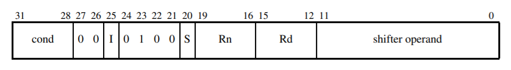
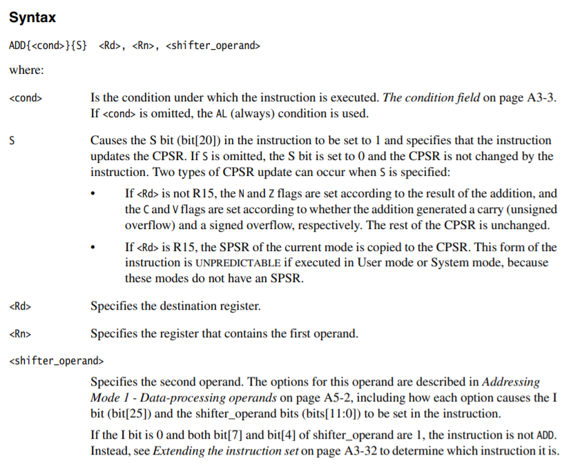
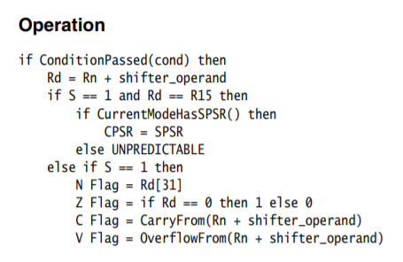
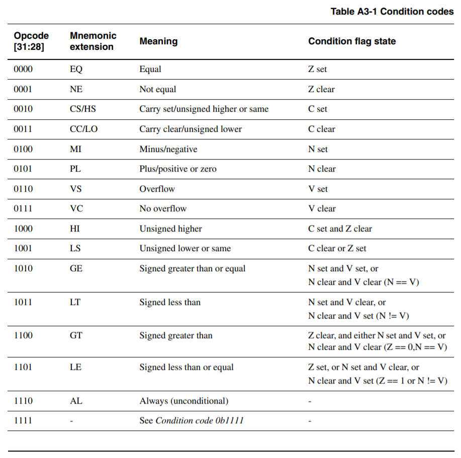
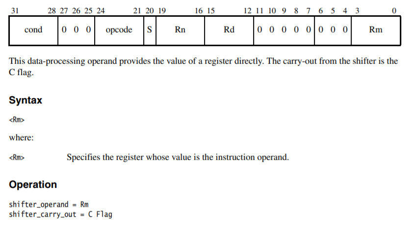

:::danger Incomplete

This document is not yet written.

:::

## Preface

This section is a primer on using the ARM Core [ARM926EJ-S](https://en.wikipedia.org/wiki/ARM9#ARM926EJ), which is based on the ARMv5TEJ architecture. This is the ARM core found in the Atmel AT91SAM9260 and the Atmel AT91SAM9G20. These architectures and chips are a bit dated (newer GCC compilers no longer support them), but there are a ton of different 32bit ARM processors and I wanted this material to give a flavor of "older" ARM to compare with "newer" ARM64 architectures (i.e. Aarch64/Aarch32).

Much of the documentation that you will still find on the internet is related to this older generation of ARM and you should be aware of what you're looking at when discovering the information you need.

## Overview

Some obligatory properties:

- 32 bit RISC Processor (32 bit registers and instructions)
- 3 instruction modes (32bit arm, 16bit thumb, java bytecode)
- 8, 16, 32 bit data types
- 7 execution modes (i.e. USR, FIQ, IRQ, SVC, ABT, SYS, UND)
- Bi-endian (i.e. can run big endian or little endian).
- Pipelined.

## Execution Modes

When the ARM core first starts up it runs some initialization code as instructed by the RESET exception vector defined at address `0x0`. When the system is initialized and begins to run its user level application process, its running in what is known as the USR execution mode. When the user process needs to perform a system call, a software interrupt (SWI) instruction is issued which passes control of the execution back to the kernel. There are also different execution modes for incoming interrupts and error handling exceptions. All told there are 7 different execution modes in the ARMv5TEJ:

- USR - The _user_ mode is the mode that most applications will run in.
- FIQ - The _fast interrupt_ mode is the highest priority interrupt handler.
- IRQ - The _interrupt_ mode is the general purpose interrupt handler.
- SVC - The _supervisor_ mode is the for the kernel (i.e. operating system).
- ABT - The _abort_ mode is entered after pre-fetch abort exception.
- SYS - The _system_ mode is for the kernel (i.e. operating system).
- UND - The _undefined_ mode is entered when an undefined instruction is executed.

Each of the modes have their own stack and status registers that need to be context switched when entering or exiting the mode.

## Registers

As with every commercial CPU, there are a set of registers to interact with the instruction set. In this instruction set there are 31 _general purpose_ registers (even though several of them have specific purposes!):

- R0-R12 - (For real) General Purpose Registers
- SP (R13) - Stack Pointer
- LR (R14) - Link Register
- PC (R15) - Program Counter

_Where are the other 17?_ Different execution modes get their own instances of the registers:

- FIQ mode gets its own R8 - R12. (5 registers)
- FIQ, IRQ, SVC, ABT, SYS, UND modes get their own SP/R13 and LR/R14. (12 registers)

There are also 6 status registers:

- CPSR - Current Program Status Register, responsible for keeping critical state of the CPU.
- SPSR - Saved Program Status Registers for storing the CSPR while switched out of a mode.

Note: FIQ, IRQ, SVC, ABT, SYS, UND modes get their own SPSR registers.

Registers accessibility is dependent on the execution mode. CSPR is readonly in user mode, but can be directly written to by all other modes. All instructions can always access R0 - R14 (within the relevant context).

<!-- TODO: Show banked registers table. A2-5 (p43) -->

The CSPR state bits can be broken down as:

```text
[31] - N=1 - Negative Result
[30] - Z=1 - Zero Result
[29] - C=1 - Carry Result
[28] - V=1 - Overflow Result
[27] - Q=1 - Stickey Overflow
[26:9] - Reserved
[8] - I=1 - Interrupt Disabled
[7] - F=1 - FIQ Disabled
[6] - T=1 - Thumb Mode
[5:0] - Mode: USR(10000b), FIQ(10001b), IRQ(10010b), SVC(10011b), ABT(10111b), UND(11011b), SYS(11111b)
```

Note: Sticky overflow is related to multiplication and fractional instructions: `qadd`, `qdadd`, `qsub`, `qdsub`, `smlaxy`, `smlawy`.

## Instruction Encoding

Each instruction is encoded as a 32-bit word. Based on the RISC model, accesses to memory are based on load and store instructions (i.e. memory to memory transactions are not allowed, instead the code must use registers as middle man to transfer memory from one location to another). All ARM instructions are encoded with a condition that dictates whether it's executed. Most instruction bits can be broken down into:

```text
[31:28] - Condition
[27:20] - Opcode
[19:16] - Rn Register Parameter (i.e. operand for arithmetic)
[15:12] - Rd Register Parameter (i.e. _destination_ register)
[11:4] - Instruction Specific
[3:0] - Rm Register Parameter (i.e. operand for arithmetic)
```

<!-- TODO: Finish this. -->

Some ARM terminology to understand:

- Immediate
- Branching

<!-- Instructions with "Ra" parameter are registers to be used with _accumulator_. -->

The specific encoding rules for each instruction can be seen in the [ARM Instruction Set Reference](./ARM926EJ-S/armv5tej-architecture-reference-manual.pdf). As an example, lets walk through determining how to encode an ADD instruction.

Page A4-6 (p156), of the reference contains the description for the ADD instruction.

- The encoding pattern:

  <details>
  <summary>Click To See Encoding Pattern</summary>

  

  </details>

- The assembler syntax:

  <details>
  <summary>Click To See assembler syntax</summary>

  

  </details>

- The instruction behavior:

  <details>
  <summary>Click To See instruction behavior</summary>

  

  </details>

- Page A3-3 (p112) contains the `cond` codes:

  <details>
  <summary>Click To See condition codes</summary>

  

  </details>

- Page A5-8 (p448) contains the `shift operand` codes for using a register (without shifting):

  <details>
  <summary>Click To See shift operand codes</summary>

  

  </details>

Based on this information, we can manually encode an instruction ourselves. Try encoding the following instruction: `ADDS r0, r1, r2 ; r0 = r1 + r2`.

<details>
<summary>Click To See Answer</summary>

1. Start with the base encoding.:

```text
  | 31:28 | 27 26 | 25 | 24 23 22 21 | 20 | 19:16 | 15:12 | 11:0          |
  | ----- | ----- | -- | ----------- | -- | ----- | ----- | ------------- |
  | cond  |  0  0 |  0 |  0  1  0  0 |  S |  Rn   |  Rd   | shift operand |
```

Note: bit 25 is an `I`, not the number one. This value is `0` if we're using a register for second addition operand and `1` if we're using an immediate. This detail can be found on page A3-2 (p110) of the reference manual.

2. Set the S bit so we know if there was a overflow flag after the operation.:

```text
  | 31:28 | 27 26 | 25 | 24 23 22 21 | 20 | 19:16 | 15:12 | 11:0          |
  | ----- | ----- | -- | ----------- | -- | ----- | ----- | ------------- |
  | cond  |  0  0 |  0 |  0  1  0  0 |  1 |  Rn   |  Rd   | shift operand |
```

3. Add an _Always_ condition:

```text
  | 31:28 | 27 26 | 25 | 24 23 22 21 | 20 | 19:16 | 15:12 | 11:0          |
  | ----- | ----- | -- | ----------- | -- | ----- | ----- | ------------- |
  | 1110  |  0  0 |  0 |  0  1  0  0 |  1 |  Rn   |  Rd   | shift operand |
```

4. Set the destination register (r0):

```text
  | 31:28 | 27 26 | 25 | 24 23 22 21 | 20 | 19:16 | 15:12 | 11:0          |
  | ----- | ----- | -- | ----------- | -- | ----- | ----- | ------------- |
  | 1110  |  0  0 |  0 |  0  1  0  0 |  1 |  Rn   | 0000  | shift operand |
```

5. Set the first addition operand:

```text
  | 31:28 | 27 26 | 25 | 24 23 22 21 | 20 | 19:16 | 15:12 | 11:0          |
  | ----- | ----- | -- | ----------- | -- | ----- | ----- | ------------- |
  | 1110  |  0  0 |  0 |  0  1  0  0 |  1 | 0001  | 0000  | shift operand |
```

5. Finally, set the shift operand so there is no shifting:

```text
  | 31:28 | 27 26 | 25 | 24 23 22 21 | 20 | 19:16 | 15:12 | 11:0          |
  | ----- | ----- | -- | ----------- | -- | ----- | ----- | ------------- |
  | 1110  |  0  0 |  0 |  0  1  0  0 |  1 | 0001  | 0000  | 00000000 0010 |
```

After its all calculated, the instruction becomes:

```text
11100000100100010000000000000010b = e0910002h
```

Note: You can often pick out ARMv5 code in a stream of binary because the _Always_ condition code is used a lot and it always comes out as a hex `0xE`. If you see a whole bunch of 32bit, 4byte aligned words that start with `0xE` in hex, you can bet that you can run it through a disassembler.

The same processed used here can be done for all of the ARM instructions in the instruction set. You just have to look them up in the reference manuals. While knowing how to do this is a great academic exercise, when you deal with multiple different architecture types it can often be significantly more effective to use the tools at hand to encode these instructions. For example, dropping the ADD instruction into an assembly file and having that output the encoding is usually much less labor intensive.

```sh
echo 'adds r0, r1, r2' | arm-linux-gnueabi-as -o /tmp/a.out ; arm-linux-gnueabi-objdump -d /tmp/a.out
```

The above command outputs:

```text
Disassembly of section .text:

00000000 <.text>:
   0:   e0910002        adds    r0, r1, r2
```

</details>

## Load and Store Instructions

As previously mentioned, ARM processors don't allow memory to memory transfers. All memory movement must first find itself in a register and then the value of the register can move back into another memory address. This pulling data into a register is known as a _load_ and the pushing of data into memory is known as a _store_.

The synopsis for the load (LDR) and store (STR) instructions are:

```text
LDR|STR{<cond>}{B}{T} Rd, <addressing_mode>
```

```text
LDR|STR{<cond>}D|H|SH|SB Rd, <addressing_mode>
```

The addressing mode is surrounded by brackets `[]`. The register in the brackets is treated like a pointer in C. The brackets indicate that we want to dereference the pointer. For example:

```c
// Assume we have the following (in C)
uint32_t a = 10, b = 20, c = 30;
uint32_t *r0 = &a;
uint32_t *r1 = &b;
uint32_t *r2 = &c;

// We can move that value in r1 into r0 with:
*r0 = *r1;
```

In ARM assembly, the same thing as `*r1 = *r0` would be `STR r0, [r1]`. This makes `r1` equal to 10.

If we wanted to load that value of whats at `r1` into `r2`, in C it would be `*r2 = *r1`. In assembler it would be `LDR r2, [r1]`. This makes `r2` equal to 20.

The datatype (i.e. size of word) that is stored or copied is dependent on the suffix added to the instruction:

- LDR/STR - 32 bits
- LDRH/STRH - 16 bits
- LDRB/STDB - 8 bits

## Calling Conventions

The calling convention of software is often at the discretion of the compiler. You would do well to identify a firmware's calling convention and stick with it when performing analysis and updates. That aside, a common calling convention is to use the store multiple and load multiple instructions. As a function loads, if it wants to play well with others (i.e. return to the caller in a sane state), it'll store the existing register values that it intends to clobber to the stack. This can be done in a single instruction, also known as a function prologue:

```text
STMFD SP!, {R3-R5, LR}
```

The above instruction is telling the CPU to push registers R3, R4, R5, and LR to the stack. The `!` after the `SP` indicates that the SP should be updated to the memory address after the last written register to the stack.

After the function is done executing and wants to return to the caller, it can run a matching function epilogue:

```text
LDMFD SP!, {R3-R5, PC}
```

Notice that instead of restoring LR, its value is restored into PC. This allows the CPU to immediately branch back to the caller's return address instead of wasting cycles setting LR and then branching to LR.

### Calling Convention Lab

As an exercise, using a C compiler, determine what the calling convention is for handling parameter passing for different numbers of parameters. What happens when there are 1, 2, 3, 4, or 5 parameters? How is the return value handled?

<details><summary>Calling Convention Lab Questions</summary>

- Examine the output of objdump and see how variables are passed into a function.
- Increase the number of parameters passed into a function and determine what the maximum number of parameters that can be passed before the mechanism for passing the parameters changes.
- Determine how the return value is given back to the calling convention.
- Extra: How are values larger than 32bits returned to a calling function?
- Extra: How does ARM calling convention differ from other architectures?

</details>

<!-- TODO: Do calling convention lab to determine when r0-r3 are used as parameters and how other parameters are handled. -->

## Pipelines

The ARM code implements what is known as a pipeline to save time. The CPU is always attempting to fetch an instruction, decode an instruction, and execute an instruction at the same time. The pipeline for ARMv5TEJ is 12 bytes (4 bytes for FETCH, DECODE, and EXEC). This means that the value of PC is 12 bytes off from where the instruction thought it was when it was fetched. When operating on `PC`, `PC` is the fetched PC. It's more likely you want `PC-8`.

|                   |     | PC=0x0 | PC=0x4 | PC=0x8 | PC=0xC |
| ----------------- | --- | ------ | ------ | ------ | ------ |
| 0x0: MOV r0,0x04  | 0x0 | FETCH  | DECODE | EXEC   |        |
| 0x4: AND r0,r0,r1 | 0x4 |        | FETCH  | DECODE | EXEC   |
| 0x8: OR r0,r0,r2  | 0x8 |        |        | FETCH  | DECODE |
| 0xC: B label      | 0xC |        |        |        | FETCH  |

Different architecture versions have different sized pipelines. This means that if there is code that assumes that PC is 12 bytes off in one program, it won't work when running on an ARM architecture with a different pipeline size. For example, many will assume ARMv5 code should work on ARMv7, but this isn't true in all conditions because of assumptions and constraints like the pipeline size.

## Branching

Branching is ARM's term for jumping or calling other locations/functions/labels in code. You can branch to a relative offset or a register value. The _Branch and Link_ instruction can additionally set the LR register to the address following the branch instruction. This essentially sets a return address for the callee to branch back to when it ready to return.

When branching to an address, its expressed as a relative offset within a 32 MiB offset from the current position. The actual value given to the branch instruction is 4 byte aligned, so in reality its within a 24-bit instruction offset. Sometimes you want to update an address in a running debugger or JTAG session from its current address.

The encoding for branching is:

```text
  | 31:28 | 27:25    | 24 | 23:0                    |
  | ----- | -------- | -- | ----------------------- |
  | cond  |  1  0  1 |  L | signed 24 bit immediate |
```

The equation to determine the signed 24 bit immediate is:

```text
Signed 24 bit immediate = (Absolute_Destination_Addr - Absolute_Branch_Addr - 8) >> 2
```

If you want to branch and link, set L=1, otherwise L=0.

<details><summary>Arm Branch Exercise</summary>

You need to calculate the binary for some branch instructions.

Given the address of the branch instruction and the destination address of the jump, hand assemble the following branch instructions:

Address of branch: `0x00000000`
Address of Destination: `0x00000000`
Condition: `AL`
Link: `No`
Answer:

```text
    AL + B +  link(No) + OFFSET
    1110 101  0          1111 1111 1111 1111 1111 1110
0x  E    A               F    F    F    F    F    E
```

Address of branch: `0xdeadbeef`
Address of Destination: `0xbadcafe4`
Condition: `LT`
Link: `Yes`
Answer:

```text
    Can't directly jump, the displacement is > 24 bits.              
```

Address of branch: `0x08250624`
Address of Destination: `0x08088284`
Condition: `EQ`
Link: `No`
Answer:

```text
    EQ + B +  link(No) + OFFSET
    0000 101  0          1111 1000 1101 1111 0001 0110
0x  0    A               F    8    D    F    1    6
```

Address of branch: `0x000f00f0`
Address of Destination: `0x00000000`
Condition: `NE`
Link: `Yes`
Answer:

```text
    NE + B +  link(Yes) + OFFSET
    0001 101  1           1111 1100 0011 1111 1100 0010
0x  1    B                F    C    3    F    C    2
```

</details>

Note: To simply return from a branch and link you can simply: `MOV PC, LR`.

## Thumb Mode

<!-- TODO: Clarify this. -->

Add 1 to branch address to switch to thumb mode.

## Exception Handlers

Exception/Interrupts are generated by internal and external sources. Exceptions/interrupts suspend normal execution and jumps to defined location. ARM supports 7 types of execution. The jump locations for the execution modes are defined in the Exception Vector Table. In ARMv5 its addresses 0x0 - 0x20. In ARMv6 is in high memory: 0xFFFF0000 - 0xFFFF0020.

When exception occurs, it copies CPSR into `SPSR_<mode>`, sets CPSR bits, maps banked registers, stores `LR_<mode>`, sets PC to vector address.
When returning from exception, handler must restore CPSR from `SPSR_<mode>` and restore PC from `LR_<mode>`.

```text
MOV r0, #0
LDMIA r2!,{r4,r5,r6}
LDMIA r1!,{r8,r9,r10} ; --- interrupt ---
SUBS r3,r3,#8
QSUB r3,r0,#8
CMP r3,#'a'-'A'
```

```text
IVT:
B ISR1
;...
ISR1:
SUB lr,lr,#4
STMFD r13!,{r0-r3,lr}
;...
LDMFD r13!,{r0-r3,pc}^
```

Note: We subtract 4 from LR because the IRQ is taken only after the current instruction is executed, so the return address has to point to the next instruction, of LR-4. The `^` tells the CPU to restore the CPSR from SPSR.

## Resources

https://en.wikichip.org/wiki/arm_holdings/microarchitectures/arm6
