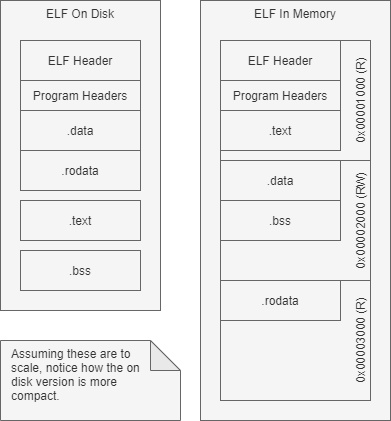

:::danger Incomplete

This document is not yet written.

:::

## Review - What is a linker?

- Resolves relocation references between .o files.
- Determines the layout of an executable.
- Writes metadata and sections to an ELF file.

Let's suppose we built a _do nothing_ C source file into a binary:

`donothing.c` Source:

```c
int main(){}
```

Build:

```sh
gcc -o donothing donothing.c
```

- _What size is the resulting file?_
- _Why? What kinds of things are in there?_

There is a lot of stuff that gets shoved into even the simplest binaries.

- _But where does it come from?_
- _What is required to operate a C environment?_

### ELF Review

The Executable and Linking Format (ELF) format is a header and an array of sections that contain the data we need to load, initialize, and run the program. When an ELF is loaded, it doesn't just load it byte for byte into memory, it loads sections into what are called segments in memory. The mapping of section to segment is stored in the program headers of the ELF. You can view the program headers of an ELF with:

```sh
readelf --program-headers <path/to/elf>
```

<details>
<summary>Click to see an example of program headers for /bin/ls</summary>

```text
Elf file type is DYN (Shared object file)
Entry point 0x67d0
There are 13 program headers, starting at offset 64

Program Headers:
  Type           Offset             VirtAddr           PhysAddr
                 FileSiz            MemSiz              Flags  Align
  PHDR           0x0000000000000040 0x0000000000000040 0x0000000000000040
                 0x00000000000002d8 0x00000000000002d8  R      0x8
  INTERP         0x0000000000000318 0x0000000000000318 0x0000000000000318
                 0x000000000000001c 0x000000000000001c  R      0x1
      [Requesting program interpreter: /lib64/ld-linux-x86-64.so.2]
  LOAD           0x0000000000000000 0x0000000000000000 0x0000000000000000
                 0x00000000000036a8 0x00000000000036a8  R      0x1000
  LOAD           0x0000000000004000 0x0000000000004000 0x0000000000004000
                 0x0000000000013581 0x0000000000013581  R E    0x1000
  LOAD           0x0000000000018000 0x0000000000018000 0x0000000000018000
                 0x0000000000008b50 0x0000000000008b50  R      0x1000
  LOAD           0x0000000000021010 0x0000000000022010 0x0000000000022010
                 0x0000000000001258 0x0000000000002548  RW     0x1000
  DYNAMIC        0x0000000000021a58 0x0000000000022a58 0x0000000000022a58
                 0x0000000000000200 0x0000000000000200  RW     0x8
  NOTE           0x0000000000000338 0x0000000000000338 0x0000000000000338
                 0x0000000000000020 0x0000000000000020  R      0x8
  NOTE           0x0000000000000358 0x0000000000000358 0x0000000000000358
                 0x0000000000000044 0x0000000000000044  R      0x4
  GNU_PROPERTY   0x0000000000000338 0x0000000000000338 0x0000000000000338
                 0x0000000000000020 0x0000000000000020  R      0x8
  GNU_EH_FRAME   0x000000000001d24c 0x000000000001d24c 0x000000000001d24c
                 0x000000000000092c 0x000000000000092c  R      0x4
  GNU_STACK      0x0000000000000000 0x0000000000000000 0x0000000000000000
                 0x0000000000000000 0x0000000000000000  RW     0x10
  GNU_RELRO      0x0000000000021010 0x0000000000022010 0x0000000000022010
                 0x0000000000000ff0 0x0000000000000ff0  R      0x1

 Section to Segment mapping:
  Segment Sections...
   00
   01     .interp
   02     .interp .note.gnu.property .note.gnu.build-id .note.ABI-tag .gnu.hash .dynsym .dynstr .gnu.version .gnu.version_r .rela.dyn .rela.plt
   03     .init .plt .plt.got .plt.sec .text .fini
   04     .rodata .eh_frame_hdr .eh_frame
   05     .init_array .fini_array .data.rel.ro .dynamic .got .data .bss
   06     .dynamic
   07     .note.gnu.property
   08     .note.gnu.build-id .note.ABI-tag
   09     .note.gnu.property
   10     .eh_frame_hdr
   11
   12     .init_array .fini_array .data.rel.ro .dynamic .got
```

</details>
<br />
A memory segment usually has properties like whether its readable, writeable, or executable. Therefore, you can have data that you don't want executed put in one segment, instructions in another executable but readonly segment, and then constant values in a read only segment.



The key takeaway is that sections and segments are **not** the same. Sections often have small byte alignments (e.g. 4 bytes) in ELF, whereas segments are usually going to be at least page aligned (e.g. 4KiB).

## The C Runtime

For an executable on disk to run (or execute) it goes through a process. At a minimum, it must:

1. Copy the read/write `.data` (initialized) section to memory.
2. Copy the read/write `.bss` (uninitialized) section to memory.
3. Set the stack pointer.
4. Setup the code that main() will return to.
5. Call main() and enjoy the world of C.

Toolchains usually provide this bit of boilerplate functionality as the crt0.s (C runtime initialization). The standard crt0.s usually depends on a bunch of OS specific assumptions.

When you want to build a binary for bare metal, you have to handle all of these steps yourself. For example, the linux kernel performs these various steps as part of its `arch` setup before it can call into its C `init()` function.

_But how does the kernel code know where to look?_

<!-- TODO: Do the lab to write code to initialize C land (i.e. stack, main return, call main.). -->

## Linker Scripts

When the linker runs it follows a script. This script is in a special _linker script_ format that guides the linker with how to layout an ELF in a deterministic way. You can see the default linker script for a given GNU toolchain by running:

```sh
gcc -o /dev/null -x c /dev/null -Wl,--verbose
```

You'll find it just after the bit about `using internal linker script:`:

<details>
<summary>Click to see the resulting linker script.</summary>

```lds
==================================================
/* Script for -pie -z combreloc -z separate-code -z relro -z now */
/* Copyright (C) 2014-2020 Free Software Foundation, Inc.
   Copying and distribution of this script, with or without modification,
   are permitted in any medium without royalty provided the copyright
   notice and this notice are preserved.  */
OUTPUT_FORMAT("elf64-x86-64", "elf64-x86-64",
              "elf64-x86-64")
OUTPUT_ARCH(i386:x86-64)
ENTRY(_start)
SEARCH_DIR("=/usr/local/lib/x86_64-linux-gnu"); SEARCH_DIR("=/lib/x86_64-linux-gnu"); SEARCH_DIR("=/usr/lib/x86_64-linux-gnu"); SEARCH_DIR("=/usr/lib/x86_64-linux-gnu64"); SEARCH_DIR("=/usr/local/lib64"); SEARCH_DIR("=/lib64"); SEARCH_DIR("=/usr/lib64"); SEARCH_DIR("=/usr/local/lib"); SEARCH_DIR("=/lib"); SEARCH_DIR("=/usr/lib"); SEARCH_DIR("=/usr/x86_64-linux-gnu/lib64"); SEARCH_DIR("=/usr/x86_64-linux-gnu/lib");
SECTIONS
{
  PROVIDE (__executable_start = SEGMENT_START("text-segment", 0)); . = SEGMENT_START("text-segment", 0) + SIZEOF_HEADERS;
  .interp         : { *(.interp) }
  .note.gnu.build-id  : { *(.note.gnu.build-id) }
  .hash           : { *(.hash) }
  .gnu.hash       : { *(.gnu.hash) }
  .dynsym         : { *(.dynsym) }
  .dynstr         : { *(.dynstr) }
  .gnu.version    : { *(.gnu.version) }
  .gnu.version_d  : { *(.gnu.version_d) }
  .gnu.version_r  : { *(.gnu.version_r) }
  .rela.dyn       :
    {
      *(.rela.init)
      *(.rela.text .rela.text.* .rela.gnu.linkonce.t.*)
      *(.rela.fini)
      *(.rela.rodata .rela.rodata.* .rela.gnu.linkonce.r.*)
      *(.rela.data .rela.data.* .rela.gnu.linkonce.d.*)
      *(.rela.tdata .rela.tdata.* .rela.gnu.linkonce.td.*)
      *(.rela.tbss .rela.tbss.* .rela.gnu.linkonce.tb.*)
      *(.rela.ctors)
      *(.rela.dtors)
      *(.rela.got)
      *(.rela.bss .rela.bss.* .rela.gnu.linkonce.b.*)
      *(.rela.ldata .rela.ldata.* .rela.gnu.linkonce.l.*)
      *(.rela.lbss .rela.lbss.* .rela.gnu.linkonce.lb.*)
      *(.rela.lrodata .rela.lrodata.* .rela.gnu.linkonce.lr.*)
      *(.rela.ifunc)
    }
  .rela.plt       :
    {
      *(.rela.plt)
      *(.rela.iplt)
    }
  . = ALIGN(CONSTANT (MAXPAGESIZE));
  .init           :
  {
    KEEP (*(SORT_NONE(.init)))
  }
  .plt            : { *(.plt) *(.iplt) }
.plt.got        : { *(.plt.got) }
.plt.sec        : { *(.plt.sec) }
  .text           :
  {
    *(.text.unlikely .text.*_unlikely .text.unlikely.*)
    *(.text.exit .text.exit.*)
    *(.text.startup .text.startup.*)
    *(.text.hot .text.hot.*)
    *(SORT(.text.sorted.*))
    *(.text .stub .text.* .gnu.linkonce.t.*)
    /* .gnu.warning sections are handled specially by elf.em.  */
    *(.gnu.warning)
  }
  .fini           :
  {
    KEEP (*(SORT_NONE(.fini)))
  }
  PROVIDE (__etext = .);
  PROVIDE (_etext = .);
  PROVIDE (etext = .);
  . = ALIGN(CONSTANT (MAXPAGESIZE));
  /* Adjust the address for the rodata segment.  We want to adjust up to
     the same address within the page on the next page up.  */
  . = SEGMENT_START("rodata-segment", ALIGN(CONSTANT (MAXPAGESIZE)) + (. & (CONSTANT (MAXPAGESIZE) - 1)));
  .rodata         : { *(.rodata .rodata.* .gnu.linkonce.r.*) }
  .rodata1        : { *(.rodata1) }
  .eh_frame_hdr   : { *(.eh_frame_hdr) *(.eh_frame_entry .eh_frame_entry.*) }
  .eh_frame       : ONLY_IF_RO { KEEP (*(.eh_frame)) *(.eh_frame.*) }
  .gcc_except_table   : ONLY_IF_RO { *(.gcc_except_table .gcc_except_table.*) }
  .gnu_extab   : ONLY_IF_RO { *(.gnu_extab*) }
  /* These sections are generated by the Sun/Oracle C++ compiler.  */
  .exception_ranges   : ONLY_IF_RO { *(.exception_ranges*) }
  /* Adjust the address for the data segment.  We want to adjust up to
     the same address within the page on the next page up.  */
  . = DATA_SEGMENT_ALIGN (CONSTANT (MAXPAGESIZE), CONSTANT (COMMONPAGESIZE));
  /* Exception handling  */
  .eh_frame       : ONLY_IF_RW { KEEP (*(.eh_frame)) *(.eh_frame.*) }
  .gnu_extab      : ONLY_IF_RW { *(.gnu_extab) }
  .gcc_except_table   : ONLY_IF_RW { *(.gcc_except_table .gcc_except_table.*) }
  .exception_ranges   : ONLY_IF_RW { *(.exception_ranges*) }
  /* Thread Local Storage sections  */
  .tdata          :
   {
     PROVIDE_HIDDEN (__tdata_start = .);
     *(.tdata .tdata.* .gnu.linkonce.td.*)
   }
  .tbss           : { *(.tbss .tbss.* .gnu.linkonce.tb.*) *(.tcommon) }
  .preinit_array    :
  {
    PROVIDE_HIDDEN (__preinit_array_start = .);
    KEEP (*(.preinit_array))
    PROVIDE_HIDDEN (__preinit_array_end = .);
  }
  .init_array    :
  {
    PROVIDE_HIDDEN (__init_array_start = .);
    KEEP (*(SORT_BY_INIT_PRIORITY(.init_array.*) SORT_BY_INIT_PRIORITY(.ctors.*)))
    KEEP (*(.init_array EXCLUDE_FILE (*crtbegin.o *crtbegin?.o *crtend.o *crtend?.o ) .ctors))
    PROVIDE_HIDDEN (__init_array_end = .);
  }
  .fini_array    :
  {
    PROVIDE_HIDDEN (__fini_array_start = .);
    KEEP (*(SORT_BY_INIT_PRIORITY(.fini_array.*) SORT_BY_INIT_PRIORITY(.dtors.*)))
    KEEP (*(.fini_array EXCLUDE_FILE (*crtbegin.o *crtbegin?.o *crtend.o *crtend?.o ) .dtors))
    PROVIDE_HIDDEN (__fini_array_end = .);
  }
  .ctors          :
  {
    /* gcc uses crtbegin.o to find the start of
       the constructors, so we make sure it is
       first.  Because this is a wildcard, it
       doesn't matter if the user does not
       actually link against crtbegin.o; the
       linker won't look for a file to match a
       wildcard.  The wildcard also means that it
       doesn't matter which directory crtbegin.o
       is in.  */
    KEEP (*crtbegin.o(.ctors))
    KEEP (*crtbegin?.o(.ctors))
    /* We don't want to include the .ctor section from
       the crtend.o file until after the sorted ctors.
       The .ctor section from the crtend file contains the
       end of ctors marker and it must be last */
    KEEP (*(EXCLUDE_FILE (*crtend.o *crtend?.o ) .ctors))
    KEEP (*(SORT(.ctors.*)))
    KEEP (*(.ctors))
  }
  .dtors          :
  {
    KEEP (*crtbegin.o(.dtors))
    KEEP (*crtbegin?.o(.dtors))
    KEEP (*(EXCLUDE_FILE (*crtend.o *crtend?.o ) .dtors))
    KEEP (*(SORT(.dtors.*)))
    KEEP (*(.dtors))
  }
  .jcr            : { KEEP (*(.jcr)) }
  .data.rel.ro : { *(.data.rel.ro.local* .gnu.linkonce.d.rel.ro.local.*) *(.data.rel.ro .data.rel.ro.* .gnu.linkonce.d.rel.ro.*) }
  .dynamic        : { *(.dynamic) }
  .got            : { *(.got.plt) *(.igot.plt) *(.got) *(.igot) }
  . = DATA_SEGMENT_RELRO_END (0, .);
  .data           :
  {
    *(.data .data.* .gnu.linkonce.d.*)
    SORT(CONSTRUCTORS)
  }
  .data1          : { *(.data1) }
  _edata = .; PROVIDE (edata = .);
  . = .;
  __bss_start = .;
  .bss            :
  {
   *(.dynbss)
   *(.bss .bss.* .gnu.linkonce.b.*)
   *(COMMON)
   /* Align here to ensure that the .bss section occupies space up to
      _end.  Align after .bss to ensure correct alignment even if the
      .bss section disappears because there are no input sections.
      FIXME: Why do we need it? When there is no .bss section, we do not
      pad the .data section.  */
   . = ALIGN(. != 0 ? 64 / 8 : 1);
  }
  .lbss   :
  {
    *(.dynlbss)
    *(.lbss .lbss.* .gnu.linkonce.lb.*)
    *(LARGE_COMMON)
  }
  . = ALIGN(64 / 8);
  . = SEGMENT_START("ldata-segment", .);
  .lrodata   ALIGN(CONSTANT (MAXPAGESIZE)) + (. & (CONSTANT (MAXPAGESIZE) - 1)) :
  {
    *(.lrodata .lrodata.* .gnu.linkonce.lr.*)
  }
  .ldata   ALIGN(CONSTANT (MAXPAGESIZE)) + (. & (CONSTANT (MAXPAGESIZE) - 1)) :
  {
    *(.ldata .ldata.* .gnu.linkonce.l.*)
    . = ALIGN(. != 0 ? 64 / 8 : 1);
  }
  . = ALIGN(64 / 8);
  _end = .; PROVIDE (end = .);
  . = DATA_SEGMENT_END (.);
  /* Stabs debugging sections.  */
  .stab          0 : { *(.stab) }
  .stabstr       0 : { *(.stabstr) }
  .stab.excl     0 : { *(.stab.excl) }
  .stab.exclstr  0 : { *(.stab.exclstr) }
  .stab.index    0 : { *(.stab.index) }
  .stab.indexstr 0 : { *(.stab.indexstr) }
  .comment       0 : { *(.comment) }
  .gnu.build.attributes : { *(.gnu.build.attributes .gnu.build.attributes.*) }
  /* DWARF debug sections.
     Symbols in the DWARF debugging sections are relative to the beginning
     of the section so we begin them at 0.  */
  /* DWARF 1 */
  .debug          0 : { *(.debug) }
  .line           0 : { *(.line) }
  /* GNU DWARF 1 extensions */
  .debug_srcinfo  0 : { *(.debug_srcinfo) }
  .debug_sfnames  0 : { *(.debug_sfnames) }
  /* DWARF 1.1 and DWARF 2 */
  .debug_aranges  0 : { *(.debug_aranges) }
  .debug_pubnames 0 : { *(.debug_pubnames) }
  /* DWARF 2 */
  .debug_info     0 : { *(.debug_info .gnu.linkonce.wi.*) }
  .debug_abbrev   0 : { *(.debug_abbrev) }
  .debug_line     0 : { *(.debug_line .debug_line.* .debug_line_end) }
  .debug_frame    0 : { *(.debug_frame) }
  .debug_str      0 : { *(.debug_str) }
  .debug_loc      0 : { *(.debug_loc) }
  .debug_macinfo  0 : { *(.debug_macinfo) }
  /* SGI/MIPS DWARF 2 extensions */
  .debug_weaknames 0 : { *(.debug_weaknames) }
  .debug_funcnames 0 : { *(.debug_funcnames) }
  .debug_typenames 0 : { *(.debug_typenames) }
  .debug_varnames  0 : { *(.debug_varnames) }
  /* DWARF 3 */
  .debug_pubtypes 0 : { *(.debug_pubtypes) }
  .debug_ranges   0 : { *(.debug_ranges) }
  /* DWARF Extension.  */
  .debug_macro    0 : { *(.debug_macro) }
  .debug_addr     0 : { *(.debug_addr) }
  .gnu.attributes 0 : { KEEP (*(.gnu.attributes)) }
  /DISCARD/ : { *(.note.GNU-stack) *(.gnu_debuglink) *(.gnu.lto_*) }
}
```

</details>

Let's walk through some of this to get an idea of what its doing:

```lds
OUTPUT_FORMAT("elf64-x86-64", "elf64-x86-64", "elf64-x86-64")
OUTPUT_ARCH(i386:x86-64)
ENTRY(_start)
```

The above code is indicating that we're building for x86_64 and that the entry point is `_start`. The entrypoint is the symbol where the ELF will begin executing. Notice that the entry point is not `main()`.

```lds
SECTIONS {
  /* ... */

  .text           :
  {
    *(.text.unlikely .text.*_unlikely .text.unlikely.*)
    *(.text.exit .text.exit.*)
    *(.text.startup .text.startup.*)
    *(.text.hot .text.hot.*)
    *(SORT(.text.sorted.*))
    *(.text .stub .text.* .gnu.linkonce.t.*)
    /* .gnu.warning sections are handled specially by elf.em.  */
    *(.gnu.warning)
  }
  PROVIDE (__etext = .);

  /* ... */
}
```

Further down you'll see lots of different sections being declared. The one singled out above is the executable `.text` section. This snippet of code is directing the linker to construct the `.text` section from all files (`*`) that contain the sections within the parens. It does it in the order its stated, although `SORT()` can influence the order the source sections are applied.

Notice the `__etext = .`. The `.` is what is called the cursor. This is an expression of the offset into the output (linked) file. The the above example, the linker is actually creating a symbol and giving it the value of the offset address just past the executable code. This symbol can be used in initialization code to know where to stop copying code, if required.

To access the symbol from C, you only need to declare the extern:

```c
extern unsigned long __etext;
```

For more information on linker scripts, take a look at `info ld`.

<!-- TODO: Show the kernel linker scripts. -->

### VMA and LMA

One aspect of Linker Scripts that isn't apparently obvious is the Virtual Memory Address vs the Logical Memory Address. When object code is assigned fix-ups, the linker will _usually_ resolve them with virtual addresses that are conventional because it can assume that the virtual address can be mapped (i.e. it assumes it has access to most of the address space.) In embedded bare metal environments (like the linux kernel or a boot loader), this is not the case.

For a bare metal execution environment, you must instruct the linker to use specific addresses. Assume that you have a binary in ROM at address 0x0. For the binary to execute, it needs to copy its `.data` to RAM (at address 0x08004000) so it can read/write to the data. The linker needs to know what the address of the data should be at the time of execution so that all fix-ups are resolved with the correct `.data` base address.

A trivial linker `SECTIONS {}` definition that achieves this may look something like:

```lds
SECTIONS {
    .text 0x0 : {
        _s_text = .;
        *(.text);
        _e_text = .;
    }
    .data 0x08004000 : AT (_e_text) {
        _s_data = .;
        *(.data);
        _e_data = .;
    }
}
```

The above script marks the end of the `.text` section with `_e_text` and continues on to write `.data` into the file. When the linker performs the actual resolutions, it now assumes that anything in `.data` will be located explicitly from base address `0x08004000` (instead of any ole address the linker thinks is best).

<!-- TODO: Show the animation. -->

<!-- TODO: Do the lab to move data from ROM to RAM -->

<!-- ## Objectives To Describe

Build a bare metal binary with C.

Bootstrap Code:

- Usually named crt.s or CStartup.s
- Defines: ARM interrupt vectors, low level init, IRQ/FIQ handling

## Notes:

PLT - procedural linkage table

different relocation types from arch to arch

Linker scripts influence global variable initialization.

Linux is lazy about looking up symbols. PLT patches global lookup on first call

LD_BIND_NOW=1 and `-Wl,-znow` / ldd and LD_DEBUG=all / LD_PRELOAD

LTO takes intermediate representation from compiler, lays out the output, passes back to compiler for futher optimization and compilation.

-->

## Tools

objcopy, dd

## Resources

[AArch64 exception table](https://developer.arm.com/documentation/den0024/a/CHDEEDDC)
[exception vector addresses in u-boot](https://stackoverflow.com/questions/36933343/exception-vector-addresses-in-u-boot)
[The Bits Between the Bits: How We Get to main()](https://www.youtube.com/watch?v=dOfucXtyEsU)
[Compilers/Math Blog](https://hubicka.blogspot.com/)
