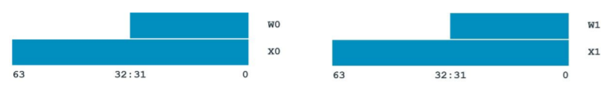
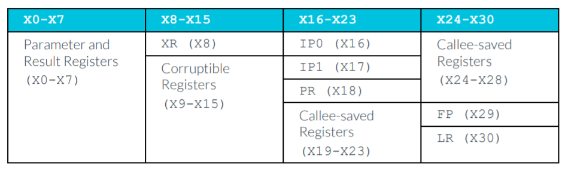
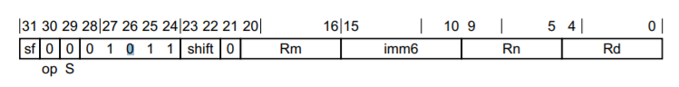
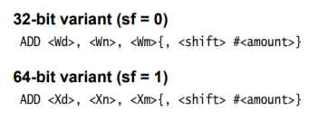
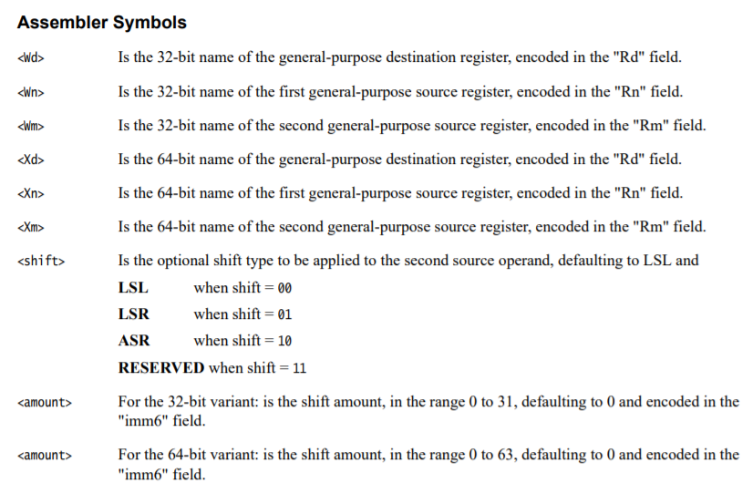
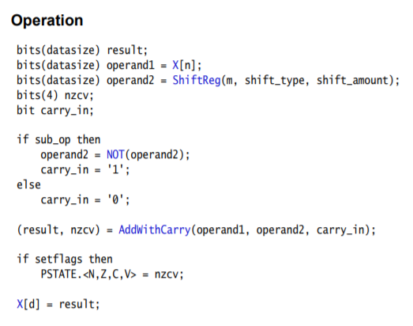
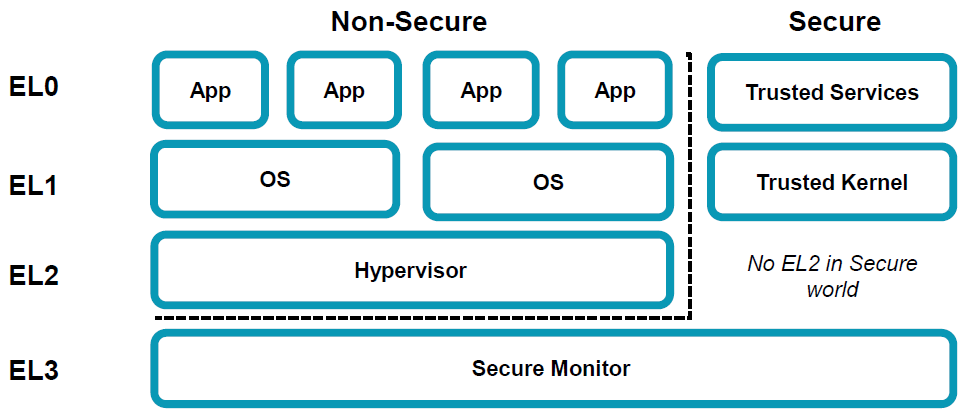
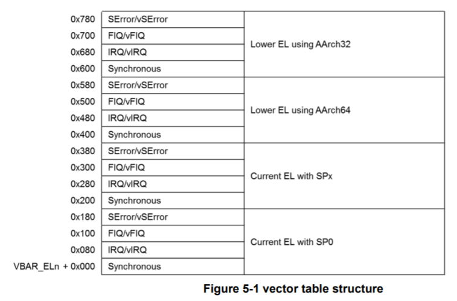

:::danger Incomplete

This document is not yet written.

:::

## Overview

The RaspberryPi 4's primary MCU is the Broadcom BCM2711. The BCM2711 has a ARM Cortex-A72 core and is based on the ARMv8a architecture. The Cortex-A72 is a 64 bit architecture. The 64bit ARM instruction set is referred to in different ways including: `aarch64`, `a64`, `arm64`.

Some obligatory properties:

- The reference manual is 5158 pages. (Yes, five thousand one hundred fifty eight.)
- Bi-endian Data (instructions are always little endian).
- 2 instruction states: Aarch64 and Aarch32
- **All** instructions are 32 bits.
- Supports 8, 16, 32, 64, 128 data types.
- New Exception Model (from ARMv7) and Privilege Levels

## Registers

In 32 bit ARM, "general" purpose registers were referred to with an `r` and there were 16 of them. There are now 31 general purpose registers in ARMv8a. There are also a large number of different ways to access the registers with differently sized register aliases.



The standard general purpose 64 bit registers now start with an `x` (x0-x30). The 32 bit aliases for these registers start with a `w` (w0-w30). In ARMv8a, the stack pointer (`SP`) and program counter (`PC`) are given their own specific registers (they no longer have a GPR aliases). The CSPR register is now gone. To query the system state you should use `NZCV` for condition flags.

### Register Conventions

The ARMv8a reference manual does have several stated conventions for how some these registers are used, which should be preserved during a branch, and when are corrupted/clobbered during a branch. In summary:

<!-- page 59 -->

- X0-X29 - 64 bit general purpose.
  - X0-X7 - Parameters/Result
  - X8 (XR) - Indirect result register (i.e. used to pass memory pointer allocated by caller.)
  - X16/X17 (IP0/IP1) - Used by linkers for branch extensions.
  - X18 (PR) - Platform Register
  - X29 (FP) - Frame Pointer
  - X30 (LR) - Link Register
- PC - 64 bit program counter.
- SP - 64 bit stack pointer.
- NZCV - Condition Flags

From the reference manual:



### Other Registers

- Floating Point support is required in ARMv8a

  - V0-V31 - 128 bit FP/vector registers.
  - Q0-Q31/D0-D31/S0-S31/H0-H31/B0-B31 - Variant width access of V0-V31 register data, respectively 128, 64, 32, 16, and 8 bits.
  - FPCR - Floating Point Control Register
  - FPSR - Floating Point Status Register

- TPIDR_EL0 - Register used for thread local storage point (TLS) in Linux Kernel. An unofficial convention is to use X28 for TLS in user mode since TPIDR_EL0 is not accessible in user mode.

- Many other _system registers_. System registers end with `_ELx` where `x` is the privilege level 0-3.

- ZXR => always returns 0 (i.e. /dev/zero)

- WZR => always ignores input (i.e. /dev/null)

## Instructions

- Instructions are word aligned.
- A64 instructions are always little endian.

### Encoding

The encoding for A64 instructions is very different than A32. For starters, the `cond` bits in front of every instruction are now gone. Typically, conditions are now only used on branching operations. As before, you should be able to use the reference manual ([relevant pages for ADD (shifted register)](./CortexA72/a64-adds-instruction.pdf)) to determine the encoding of various instructions. The following show the relevant data for `ADD x0, x1, x2 ; x0 = x1 + x2`.

- The encoding pattern:

  <details>
  <summary>Click To See Encoding Pattern</summary>

  

  </details>

- The assembler syntax:

  <details>
  <summary>Click To See Encoding Pattern</summary>

  

  </details>

- The instruction syntax symbols:

  <details>
  <summary>Click To See Encoding Pattern</summary>

  

  </details>

- The instruction behavior:

  <details>
  <summary>Click To See Encoding Pattern</summary>

  

  </details>

<details>
<summary>Click To See Encoding Answer</summary>

```text
  | 31 | 30 | 29 | 28:24     | 23:22 | 21 | 20:16     | 15:10       | 9:5       | 4:0       |
  | -- | -- | -- | --------- | ----- | -- | --------- | ----------- | --------- | --------- |
  | sf | op | S  |           | shift |    | Rm        | imm16       | Rn        | Rd        |
  | 1  | 0  | 0  | 0 1 0 1 1 | 0 0   | 0  | 0 0 0 1 0 | 0 0 0 0 0 0 | 0 0 0 0 1 | 0 0 0 0 0 |

10001011000000100000000000100000b = 8B020020h (or "0x20 0x00 0x02 0x8b" in little endian)
```

Ok, lets check ourselves with an assembler:

```sh
echo 'add x0, x1, x2' | aarch64-linux-gnu-as -o /tmp/a.out ; aarch64-linux-gnu-objdump -d
 /tmp/a.out
```

The result is:

```text
Disassembly of section .text:

0000000000000000 <.text>:
   0:   8b020020        add     x0, x1, x2
```

</details>

<!-- - a64 adds on page 402 -->

### Branching

When branching to an address, its expressed as a relative offset within a 128 MiB offset from the current position. The actual value given to the branch instruction is 4 byte aligned (instruction aligned), so in reality its within a 26-bit instruction offset. This is valuable because sometimes you want to update an address in a running debugger or JTAG session from its current address.

The encoding for an unconditional branch in A64:

```text
  | 31 | 30:26     | 25:0           |
  | -- | --------- | -------------- |
  | op | 0 0 1 0 1 | imm26 (signed) |

If op=1, X30=PC+4 (i.e. CALL)
```

<!-- TODO: Verify this is still correct given the difference in pipelines. -->

```text
Signed 26 bit immediate = (Absolute_Destination_Addr - Absolute_Branch_Addr - 8) >> 2
```

## Load and Store

Loads and stores operate the same way in A64 as they do in A32 except for one notable exception: There is no `PUSH` or `POP` in A64. Instead, use of load multiple (LDM), store multiple (STM), load pair (LDP), store pair (STP) are used in nearly every case that `PUSH` or `POP` was previously used.

## Exception Model

<!-- TODO: Does this whole thing belong in a ARMv8a boot process page? -->

Aarch32/ARMv5/ARMv6/ARMv7 used an older exception model where the privilege level was dependent on the exception being run, but effectively 2 privilege levels (i.e. privileged and not-privileged). The new exception model includes 4 different privilege levels. As before, there is not-privileged (EL0), but now the privileged is broken into 3 new levels (EL1, EL2, EL3). The higher the number the more privilege the level has. _But what are these intended for?_ Virtualization.



In the above diagram, you'll notice that:

- EL0 - Intended for user mode (unprivileged).
- EL1 - Intended for end user OSes.
- EL2 - (Optional) Intended for hypervisors.
- EL3 - (Optional) Intended for secure and trusted application monitoring.

### Exception Vector Table (EVT)

In previous architectures, the exception/interrupt vector table was an array of 4 byte immediate branches that each represented an execution mode, including the reset vector. In the ARMv8a model, there is:

- An exception vector table for each privilege level.
- Only 4 exception types (SError, IRQ, FIQ, Synchronous)
- Each exception type entry is 128 bytes, allowing up to 32 instructions. (This is in contrast to the 4 bytes for 32 bit ARM).
- The reset vector is no longer in the EVT. The reset vector is defined by hardware signals or implementation defined by the device vendor. You can read the reset vector from `RVBAR_EL3`.

Each exception vector table includes 4 different ways to be called depending on intended privilege level transition required. Within each of these are the 4 different exception types: SError, FIQ, IRQ, and Synchronous:

- SError - Something unexpected happened.
- IRQ - Normal interrupt handler.
- FIQ - High priority interrupt handler.
- Synchronous - Intended interrupt (e.g. system call).

  

EVTs are initialized during boot up by the reset vector. Their locations are stored in `VBAR_ELx` where _x_ is the privilege level. Each EVT must be 2KiB aligned.

<!-- TODO: Double check this and break this down more. -->

In a very simple example:

1. boot code that initializes the system so that there is just a kernel (EL1) and user space (EL0).
2. When user code makes a system call, the synchronous exception is called (`VBAR_EL1` + `0x400`):

   1. Saves condition state into SPSR
   2. Sets the link register ELR_EL1 to the instruction following the system call.
   3. PSTATE.{D, A, I, F} is set to 1
   4. Synchronous exceptions set ESR_EL1 that indicates the reason for the exception.
   5. The code in the EVT is called.

3. When the kernel is complete, it returns execution to using ELR_EL1.

<details>
<summary>Click to see example Exception Vector Table code</summary>

```asm
// Typical exception vector table code.
.balign 0x800
Vector_table_el3:
curr_el_sp0_sync:        // The exception handler for a synchronous
                         // exception from the current EL using SP0.
.balign 0x80
curr_el_sp0_irq:         // The exception handler for an IRQ exception
                         // from the current EL using SP0.
.balign 0x80
curr_el_sp0_fiq:         // The exception handler for an FIQ exception
                         // from the current EL using SP0.
.balign 0x80
curr_el_sp0_serror:      // The exception handler for a System Error
                         // exception from the current EL using SP0.
.balign 0x80
curr_el_spx_sync:        // The exception handler for a synchrous
                         // exception from the current EL using the
                         // current SP.
.balign 0x80
curr_el_spx_irq:         // The exception handler for an IRQ exception from
                         // the current EL using the current SP.

.balign 0x80
curr_el_spx_fiq:         // The exception handler for an FIQ from
                         // the current EL using the current SP.

.balign 0x80
curr_el_spx_serror:      // The exception handler for a System Error
                         // exception from the current EL using the
                         // current SP.

 .balign 0x80
lower_el_aarch64_sync:   // The exception handler for a synchronous
                         // exception from a lower EL (AArch64).

.balign 0x80
lower_el_aarch64_irq:    // The exception handler for an IRQ from a lower EL
                         // (AArch64).

.balign 0x80
lower_el_aarch64_fiq:    // The exception handler for an FIQ from a lower EL
                         // (AArch64).

.balign 0x80
lower_el_aarch64_serror: // The exception handler for a System Error
                         // exception from a lower EL(AArch64).

.balign 0x80
lower_el_aarch32_sync:   // The exception handler for a synchronous
                         // exception from a lower EL(AArch32).
.balign 0x80
lower_el_aarch32_irq:    // The exception handler for an IRQ exception
                         // from a lower EL (AArch32).
.balign 0x80
lower_el_aarch32_fiq:    // The exception handler for an FIQ exception from
                         // a lower EL (AArch32).
.balign 0x80
lower_el_aarch32_serror: // The exception handler for a System Error
                         // exception from a lower EL(AArch32).
```

</details>

<!-- - Exception Level Model
  - EL stands for Exception Level
    - User (EL0) -> SVC to call kernel (EL1).
    - Kernel -> HVC to call hypervisor (EL2).
    - Hypervisor -> SMC to call _secure_ state (EL3).
  - Each EL has its own SP, LR, SPSR.
  - Exception process:
    1. save state into SPSR
    2. set the link register ELR_ELx
    3. PSTATE.{D, A, I, F} is set to 1
    4. synchronous exceptions set reason in ESR_ELx
    5. execution moves to ELx
  - Exception Vector Table
    - EL1-3 gets its own. The base addresses of which are VBAR_ELx.
    - Each entry is 16 instructions long (i.e. 4 \* 32 = 128 bytes)
    - Table must be 2KiB aligned

Exceptions:

- Synchronous
- IRQ
  FIQ
  SError

- Reset vector is no longer part of the exception vector table. The reset address is _implementation defined_ and defined by the hardware input RVBARADDR and can be read by RVBAR_EL3 register. Boot code is executed from this address.

  -->

<!-- TODO: Do the lab to build EVT binary and spin. -->

## Resources

- [ARMv8 exception vectors and handling](https://stackoverflow.com/questions/44991264/armv8-exception-vectors-and-handling)
- [AArch64 Interrupt and Exception handling](https://krinkinmu.github.io/2021/01/10/aarch64-interrupt-handling.html)
- [DynamoRIO](https://dynamorio.org/page_aarch64_far.html)
