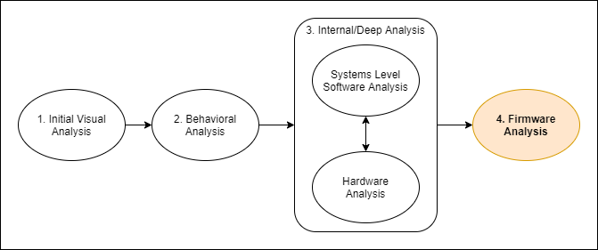

:::danger Incomplete

This document is not yet written.

:::

## Overview

- Analysis
  - Unpacking via sasquatch, binwalk, hex editors, file, etc. (1 hours)
  - IVT / EVT
  - Booter/BareMetal Binary Construction (stack pointer, crti, Linker Scripts)
- Assembly - Repacking via Firmware Mod Toolkit, uboot tools (4 hours)
- Testing - u-boot tftp, JTAG in-memory loading (2 hours)

When I first started learning embedded systems, I always thought that firmware was very hardware specific and was always built as a static blob of executable code. While in some situations this can be true, there are many standards and conventions in use, such as common architectures (e.g armv5) and common baseline software libraries (e.g. kernels) that make firmware analysis much more understandable out of the gate.

Firmware is software that is intended to drive hardware. Assuming you can acquire the firmware for a device, it will elude to all of the functionality of the hardware that the firmware supports. Depending on the method of acquisition, you can often change or update the firmware and apply it back to the target device for big fixes, enhancements, or all together new functionality and application.

This section of this material is broken down roughly into:

- **Boot Architecture** - These are the conventions and processes used to start up some target devices and their software. This can be key to understanding the initialization procedure and state of a target device during analysis.

- **Analysis** - The stage in which we peel back the layers of firmware captures or updates to gain an understanding of its internals.

- **Assembly** - When applying updates to a firmware, special care must be taken to reconstruct the firmware to match the expected target device's conventions.

- **Testing** - If you intend to flash a firmware update into a device, it can be very important that you do it correctly the first time. There are some methods for testing new firmwares without committing to a Flash or EEPROM on your first go.
