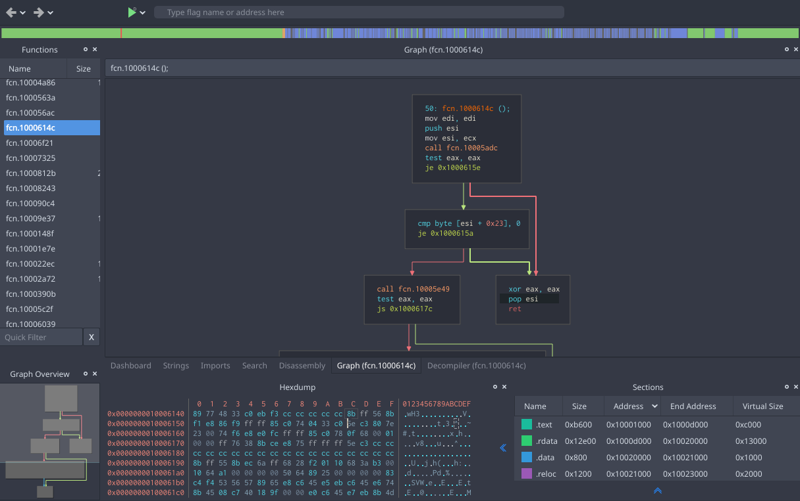
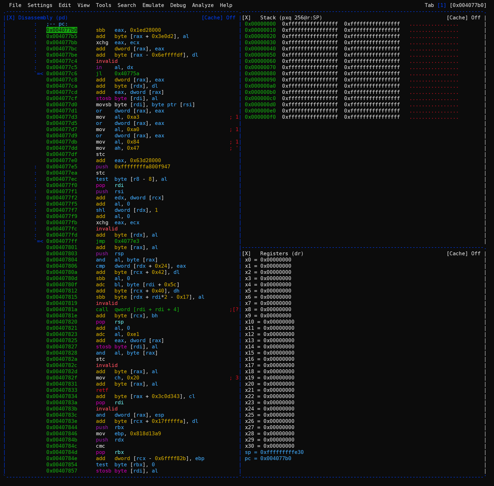
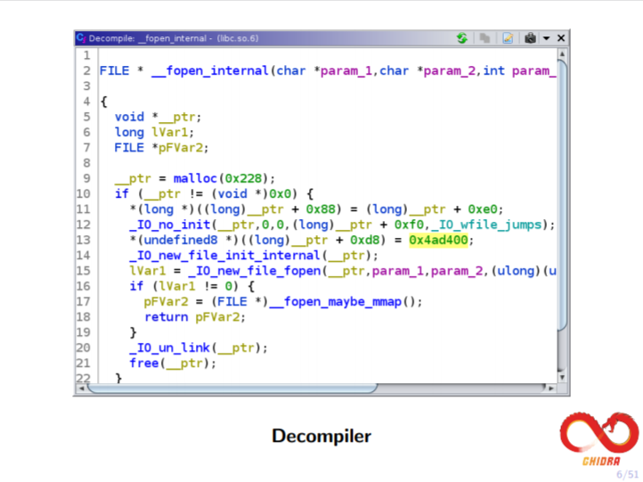
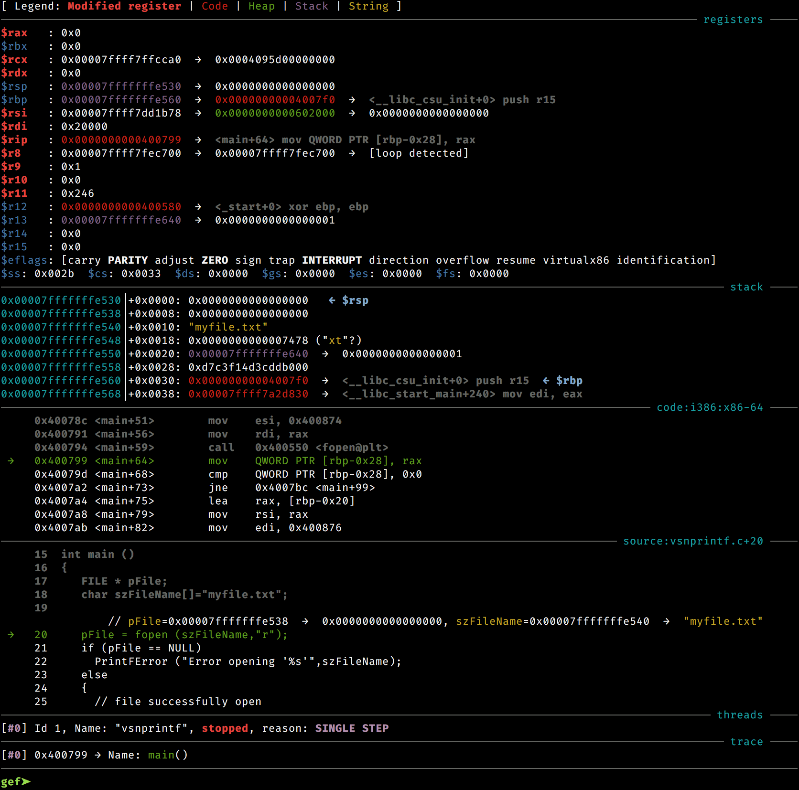

## Overview

When learning embedded development, its a good prerequisite to _really_ understand how software is assembled and behaves during execution. I'm not talking about knowing the behavior of `if`, `when`, `goto`, and other high level constructs. When learning how software behaves you should understand the expectations of the instruction set you are using, such as:

- Is memory partitioned between code and data?
- Does the stack grow towards zero or does it grow up?
- What is the bit size of the address bus?
- What is the bit size of the general purpose registers?

<!--truncate-->

In addition to instruction set expectations, you also will want to know what the software assembly assumptions and contraints:

- What is the calling convention of the system?
- Is the code position dependent or independent?
- Is the code statically linked or dynamically linked?
- What is the format of the binary on disk?
- What is the binary layout loaded into memory?

I've found that these are relatively niche topics that many developers either never had a reason to learn, gave up after CE/EE school, or simply don't know they don't know. Its kind of like owning houses for 20 years and never caring to know that the white wire in the wall is common and the black wire in the wall is hot.

Due to the rarity of experience with the previously mentioned topics, when teaching new comers, its paramount that students get a complete visual representation of what is happening when software is running. As developers and engineers, we can intuitively see the patterns and expected states of what we're working with over time, thereby allowing us to find paths of less arduous ways to achieve our goals. But to get to that point we should start with an unfiltered pleathra of information to gleen what is important to fill the knowledge gap.

## Debuggers

The tools used to visualize the behaviors I am talking about are debuggers. I would hope that most developers at some point in their learning have experienced a debugger of some sort ... something beyond the age old `print()` debugging anyway. Many IDE debuggers are built with the assumption that they'll have full access to symbols and source code. This allows the IDEs to cross reference the built code with the code and provide useful relationships between the code and breakpoints (e.g. current line numer, variable values).

When debugging embedded systems, you don't always have the luxry of having symbols automatically loaded, and if you're executing or patching third party binaries, you may not have the luxury of any source code. Analyzing the behavior and state of these kinds of binaries takes a bit more functionality than a typical IDE debugger. The functionality I'm talking about includes:

- Dumps of memory (virtual and/or physical).
- Stack dumps (complete stack frames, not just back trace)
- General and special purpose register states.
- Code disassembly / decompilation.
- Remote execution (you don't want to debug a kernel you're running the debugger from).
- Step-In/Over a single instruction (**not** source line).
- (Ideally) Ability to mutate memory and/or registers.

## GDB

[GDB (aka The GNU Debugger)](https://www.gnu.org/software/gdb/) is the king of debuggers on \*nix based systems. GDB is the standard for capability and usability of debuggers in the industry. If any other system level debugger isn't working, I always fall back to GDB to determine if its what I'm doing or a faulty configuration in the non-GDB debugger.

GDB has a server component that can be attached to processes and start processes over serial ports or a TCP connection. Many other non-GDB debuggers will themselves talk the gdbserver protocol, but almost none of them provide a gdbserver like service themselves. Therefore, its almost always desirable to have both a GDB executable for any target platform as well as a _statically linked_ gdbserver for all target platforms.

I highly recommend that all \*nix developers get a grasp of the fundamentals of GDB from both a source level debugger and a instruction set debugger. This includes things like:

- Connecting GDB to a gdbserver
- Stepping in and over source lines
- Stepping in and over single instructions
- Setting breakpoints
- Printing memory and registers
- Continuing execution

If you can do all of that, you'll be miles better than the crude `print` debugging. That said, I still use `print` debugging for the first 5 minutes of any obscure issue I run into. Sometime getting the debugger setup can take longer than it'll take me to snuff out a stacksmash or buffer overrun.

## Windows Specific Debuggers

**I am not a Windows developer.**

There are a bunch of debuggers for Windows just like there are many debuggers for \*nix based systems. I am very rarely a Windows developer, but in my time I have come across a number of debuggers that'll give you the instruction level debugging I've been discussing. The two I know best are Microsoft's WinDBG (aka "win bag") and OllyDBG. WinDbg allows remote debugging similar to how GDB and GDB server work. This can be useful for troubleshooting or analyzing system state contained within a Virtual Machine.

For source level debugging I would recommend sticking with [Visual Studio](https://visualstudio.microsoft.com/) or using GDB with [MinGW](https://sourceforge.net/projects/mingw/). Also worth noting, if you are emulating execution of windows binaries (PE files) on a \*nix based system, you may be able to debug in this environment with [WineDbg](https://wiki.winehq.org/Winedbg). I've never ran into this use case so I have no experience with it.

## LLDB

[LLVM](https://llvm.org/) has developed their own debugger, [LLDB](https://lldb.llvm.org/). LLDB is capable of talking GDB protocol. LLDB is an amazing debugger that is highly recommended for any binaries that are built with LLVM or Clang (especially when built with debug stubs). IMHO, it has a nice expression of what is happening in the binaries and the information output is more clear than its more draconian peer GDB.

Beyond source level debugging, I've never really explored LLDB's capabilities as a instruction level debugger. It's likely your only option if you are working with LLVM bytecode.

## Radare2 / Rizin / Cutter

From the [Radare2 manual](https://book.rada.re/index.html):

> radare2 allows you to open a number of input/output sources as if they were simple, plain files, including disks, network connections, kernel drivers, processes under debugging, and so on.
>
> It implements an advanced command line interface for moving around a file, analyzing data, disassembling, binary patching, data comparison, searching, replacing, and visualizing. It can be scripted with a variety of languages, including Python, Ruby, JavaScript, Lua, and Perl.

From the [Rizin front page](https://rizin.re/):

> a free and open-source Reverse Engineering framework, providing a complete binary analysis experience with features like Disassembler, Hexadecimal editor, Emulation, Binary inspection, Debugger, and more.

In truth, [rizin](https://rizin.re/) is a fork of [radare2](https://rada.re/n/index.html). From what I've seen, it appears that the fork was largely due to [cultural shifts around being more inclusive (circa 2020)](https://news.ycombinator.com/item?id=25348224). Regardless of reason, I've put all my eggs in Rizin because I don't have infinite time to learn the differences (or planned differences) between the two.

Rizin is fundamentally a data analyzer. It just so happens that a good data anaylzer isn't far from a debugger. In fact, at some level a debugger is a data analyzer that happens to allow changing of the data. The rizin contributors recognized this as well and so rizin can be used as a debugger.

Rizin has an extremely extensive (and extensible) set of commands for analysis and debugging. It can run in what is called a visual mode (within a terminal window). This comes with some mouse support and enables new comers to more methodically learn the fundamentals and gradually learn more advanced or niche command sets. See [the manual](https://book.rizin.re/) for the deets.

**Note:** Rizin mouse support doesn't work well with tmux mouse support. I recommend not running Rizin within a tmux session that has mouse support enabled.

<!-- TODO: Inspect rizin staticability. -->

Taking visualization one step further, rizin has an "official" GUI called [Cutter](https://cutter.re/). Cutter is a Qt/C++ project that is built for Linux (AppImage), Windows (exe), and Mac OSX. Out of the box, Cutter includes an install of rizin and a number of other tools (e.g. The Ghidra decompiler.)

Although I am very excited to see Cutter grow and improve over the next few years, it really does feel like a product with an alpha or beta maturity level. One trick I learned while using its debugging feature is that you need to launch `cutter.exe` from a console for the internal console to be more effective and you need to click into various widgets and tabs to get updated state when using its internal console.

One other **major** draw back of rizin and Cutter debugging functionality at the moment is its inability to download symbols via gdbserver. When running gdbserver from a remote system, GDB has the capabiltiy to download the binaries and their symbols on the fly, whereas rizin and Cutter require you to pre-download all the binaries locally and you potentially have to manually map them into memory yourself.

## Ghidra

[Ghidra](https://ghidra-sre.org/) is a US National Security Agency provided open source tool aimed at improving software anaylsis. Ghidra seems to have completely changed the decompilation landscape. Cutter comes with the Ghidra decompiler by default "due to its quality".

As of Ghidra 9.2, there is no debugging capability provided. But as of Dec 2020, the Ghidra team has [announced](https://twitter.com/NSACyber/status/1339652646513291264) that there is a [debugger branch](https://github.com/NationalSecurityAgency/ghidra/tree/debugger) in their github repo that includes a debugging capability. I've not yet tried our this capability, but looking at some [other blog posts](https://wrongbaud.github.io/posts/ghidra-debugger/) on the subject, it appears to be a good instruction level debugger that connects to either a WinDBG pipe session or a GDB server session.

Ghidra runs on Java making it slightly more portable than many other debuggers, but the portability combined with its extensive analysis tools, and decompiler, its a force to be reckoned with. The one big complaint I have with Ghidra is its lack of focus on UX. Cutter is better when it comes to customizing my widgets and giving me the exact view I want out of the box, while Ghidra requires me to write all kinds of customization code to get it to look the way I want.

<!-- TODO: Say more. -->

## GDB Wrappers

So far, I've talked about GDB being the king but a bit draconian. GDB, out of the box, has what I can only describe as a complete lack of focus on UX. It has a visual mode called TUI, but that leads more than a lot to be desired. Most actual GDB GUIs, in my experience, are either very limited in functionality or customization options. The word on the street was that GDB has grown very organically over time and many of its systems are tightly coupled. This has made extensibility a bit of a nightmare. Luckily, around GDB version 7.11, GDB started including an API and integration of python in their builds. This basically created the ability to include GDB plugins written in python.

There are a number of GDB plugins that can be downloaded from the internets, but there are two I wanted to mention here: PwnDbg and Gef. These two products are a bit like siblings in that they seem to be very related but always bickering with each other. I would recommend not using or even learning both, just pick one and stick with it.

What both Gef and PwnDbg provide is a dump of memory, registers, disassembly, and source (when available) in a single view with complete GDB functionality via the GDB prompt.

### Gef

[Gef](https://github.com/hugsy/gef) is a all-in-one-py-file GDB plugin. This makes it easier to move around and install. Gef attempts to be more lean and portable than its sibling PwnDBG. This can make it ideal for anyone that needs to move their debugging environment from machine to machine and doesn't want to deal with lots of pitfalls during setup.

### PwnDbg

[PwnDBG](https://github.com/pwndbg/pwndbg) takes a bit more to setup but ends up being a bit more featureful and the code is a bit more maintainable. I've had to go in and patch some of the PwnDBG code in the past, but its simple one liners on something like source line 200. (Gef is over 10000 lines of code in its single file.)

<!-- TODO: Investigate PwnDBG and Rizin/R2 -->

One of the more exciting new [features of PwnDBG](https://github.com/pwndbg/pwndbg/blob/dev/FEATURES.md) (circa 2021), it its ability to integrate with Radare2. This happens via the "r2pipe" functionality. The end result is that PwnDbg is able to produce Ghidra decompilation output without sacrificing any of the power of GDB like Cutter does.

## Conclusion

This was just an over view of debugging options for the benefit of teaching and learning how software behaves at low levels. While GDB is king, tools like LLDB, Radare2, and Rizin are additional options that may be better suited to different analytical or reverse engineering use cases. I'm excited to see where Cutter and Ghidra go next, but I feel I'm a year too early to this party. For now, IMHO PwnDBG and Gef are probably the best of all worlds with their terminal focused experience without forgetting about the user experience.

I originally intended this article to step through a bunch of examples of using each of the debuggers through different use cases. After looking at the amount I've typed so far it looks like that'll have to be a series of follow up articles.

## References

- [Rizin Repo](https://github.com/rizinorg/rizin)
- [Radare2 Repo](https://github.com/radareorg/radare2)
- [Rizin Ghidra Plugin](https://github.com/rizinorg/rz-ghidra)
