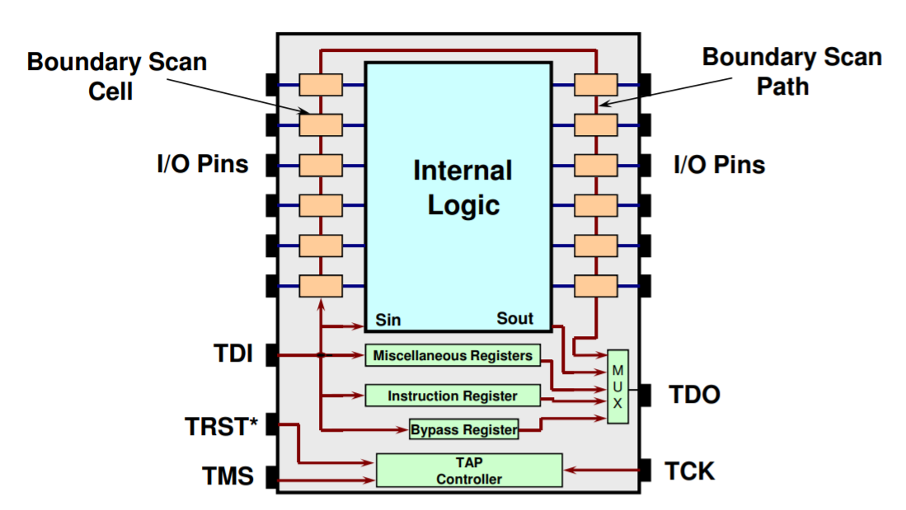
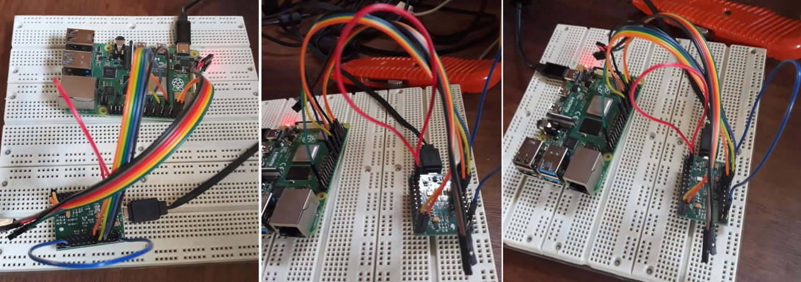
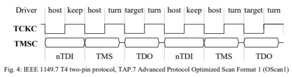
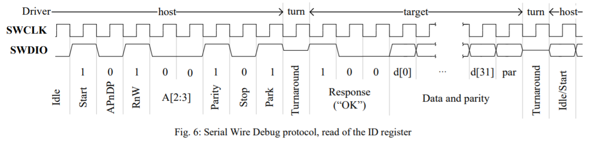

:::danger Incomplete

This document is not yet written.

:::

```text
- JTAG Access - More System Info via IDCODEs, Analyze Kernel/Booter, Memory Access (NOR/NAND) (120 mins)
  - WatchDog Timers
    - **Rpi4 WDT is at 7e100000, but there is no documentation!*
    - Turn on from config.txt with: `dtparam=watchdog=on`
    - More info at [Stackoverflow](https://raspberrypi.stackexchange.com/questions/108080/watchdog-on-the-rpi4)
  - JTAGulator / BlueTag
  - OpenOCD / FTDI MiniModule (Pico?)
```

## Overview

In laymen terms, JTAG allows engineers to test systems of integrated circuits (ICs) in a production form in a standard way. The functionality of JTAG includes being able to sample the JTAG connected pins of an IC, identify the components in a JTAG chain, and in some cases allow direct control over the CPU and peripherals.



Note: The red lines above are what JTAG may have access to. The orange blocks on the _boundary_ are the pin states that can be checked as part of the JTAg boundary scan. Sin/Sout represent the functionality that allows JTAG to monitor and control the core of the IC.

## The Standard

The JTAG acronym stands for the _Joint Test Action Group_. What folks often refer to when they mention JTAG is actually the [IEEE 1149.1 Std](./JtagAccess/JTAG_IEEE-Std-1149.1-2001.pdf), _IEEE Standard Test Access Port and Boundary-Scan Architecture_. But instead of verbalizing that garble, I'll just use "JTAG" to refer to the IEEE standard.

JTAG is a synchronous protocol that requires 4 wires/pins/signals:

- TCK - The _clock_ signal.
- TMS - Ths _mode select_ signal for changing the TAP controller state.
- TDI - The _data input_ line. Note: Input is from the context of the IC.
- TDO - The _data output_ line. Note: Output is from the context of the IC.
- TRST - (Optional) The _reset_ signal. When pulled low, resets the JTAG state machine.

Some other JTAG properties:

- Designed to allow daisy chaining of ICs. When daisy chaining, we simply connect an IC's TDO to the TDI of the next IC in the chain.
- Has the concept of a instruction register (IR). In a chain of devices, all the IRs are concatenated into a single IR shift register.
  - IR width and values are chip specific.
  - Required Instructions:
    - PRELOAD - load pin output values
    - SAMPLE - read boundary pin values
    - BYPASS - reduces registers to a single bit
  - Common Optional Instructions
    - IDCODE - for reading chip identification
    - EXTEST - for writing data to IC core
    - INTEST - for reading data from IC core
- Has the concept of a data register (DR). In a chain of devices, all the DRs are concatenated into a single DR shift register.
  - DR width is chip specific.
- All of the TMS signals in a chain are usually all tied together. (There are options for multiple TMS signals. See the standard for more information.)

### The State Machine

JTAG's TAP controllers operate through an elegant state machine. The TMS and TCK signals are what drives the current TAP controller state. The following is a state diagram that shows the states that JTAG can enter:


The way the states transition is dependent on the value of TMS on the rising edge of TCK. For example, if you wanted to transition from `TEST LOGIC RESET` to `SELECT-DR-SCAN`, you would set TMS to 0 on the first rizing clock edge and then set TMS to 1 on the second clock edge.

An interesting trait of this state machine is how simple it is to reset (i.e. return to `TEST LOGIC RESET`). To reset, all you have to do is pull TMS high and pulse TCK 5 times. In otherwords, sending five `1`s over TMS will always return the state to `TEST LOGIC RESET`, no matter what the current state is.

<!-- TODO: Walk the class through this on the board. -->
<!-- TODO: Consider using the Godot Jtagsim -->

### Input / Output

Data/Instruction words put into the JTAG chain must be shifted into place. Therefore all bits should be pushed onto the bus from least significant bit (LSB) to most significant bit (MSB). When transferring the last bit, pull TMS high to exist the shift state.

To read data from the chain, shift in an instruction in the `SHIFT-IR` state, then transition to the `SHIFT-DR` state and start shifting bits in. This will cause the current state of the DR to be shifted out of the TDO line were we can read the value. Remember, its coming off the wire LSB to MSB.

## OpenOCD

Ok, we've seen that JTAG can provide some powerful low level access, but having to think about the JTAG state machine just feels all to much to be effective. This is why we use JTAG software that manages all of this for us. Keep in mind that setting up JTAG software is a royal pain if you aren't familiar with the hardware. Understanding the JTAG state machine and using low level tools like [UrJTAG](http://urjtag.org/) can be a good fall back for troubleshooting the setup of more beefy tools.

Ideally, when you want to use JTAG for software debugging you'll either spend 100s to 1000s of dollars on a nice user experience or you'll grab the free and open source [OpenOCD](https://openocd.org/) ([github](http://sourceforge.net/p/openocd/code/)). OpenOCD stands for Open On-Chip Debugger. For more deets, please see the [documentation](./JtagAccess/openocd-0.11.0.pdf).

OpenOCD has an odd versioning scheme. All versions as of this writing start with a `0.` (e.g. `0.11.0`). Please keep in mind that they second value in the version tuple `11` is a major version number. In other words, you'll find major config breaking changes between `0.11.0`, `0.10.0`, and `0.9.0` of this product.

### The Setup

OpenOCD depends on a JTAG adapter to do its thing. These adapters usually connect to a developer workstation via USB or Ethernet. The adapter is itself connected to the target device's JTAG pins. The following is an example of a USB wire connected to a FTDI-2232H adapter that is in turn connected to a Raspberry Pi.



### Using OpenOCD

OpenOCD runs as a collection of network services. When starting OpenOCD on the command line, you feed it a number of configurations. You _may_ shove all relevant information into a single config file, but you can pass multiple configurations you can organize the relevant sections of the configurations into their own files for reuse. For example, you may be using an FTDI adapter with a RaspberryPi2 and a RaspberryPi4. In this example, if your adapter config was separated you could run these different setups.

For Rpi2:

```sh
openocd -f interface/ftdi-232h.cfg -f board/rpi2.cfg
```

For Rpi4

```sh
openocd -f interface/ftdi-232h.cfg -f board/rpi4.cfg
```

The openocd installation directory usually comes with a collection of configurations that are already organized into various folders (e.g. `interface`, `board`, `cpu`, `target`, etc).

### CLI Service

OpenOCD itself has a CLI that is useful for more JTAG/ICE functionality. This is where you can reliably HALT, RESET, grab registers, grab IDCODEs, and perform boundary scan operations. To access this service, you can telnet to localhost:4444.

Try `help` for a list of command. Keep in mind that the functionality provided by your target device may vary and therefore many of the commands may not operate as expected. OpenOCD is a _best effort_ analysis tool (and its free).

### gdb-server Service

A really handy feature of OpenOCD is its gdbserver implementation. You can connect to localhost:3333 with a multiarch gdb client and control the machine just like you would with a gdbserver that was running in a typical linux userspace. Except instead of monitoring a single process, you have control over the entire micro controller. Not even the kernel can stand in your way for access to all of the peripherals and the CPU states.

## Two Wire JTAG

There are a couple different standards that use functionality similar to JTAG over just two wires:

- cJTAG (i.e. IEEE 1149.7) - This is a _compact_ JTAG interface. It uses a TMSC signal as a serial data interface and a TCKC signal as the clock. TMSC is bi-directional, which is accomplished by alternating whether the target or host is driving TMSC based on the TCKC phase.

  

- ARM developer an alternative to cJTAG called _Serial Wire Debug_ (SWD). SWD is also 2 pins and is usually ganged with TMS and TCK as SWDIO and SWCLK respectively. The primary difference between SWD and cJTAG is that SWD is packet based. Chunking the directional data decreases the turnarounds that need to occur and increases efficiency. To learn more about SWD, please see the [ARM Debug Interface v5 Specification](./JtagAccess/adiv5-spec.pdf).

  

## Resources

- [JTAG Explained](https://blog.senr.io/blog/jtag-explained)
- [fpga4fun: JTAG](https://www.fpga4fun.com/JTAG.html)
