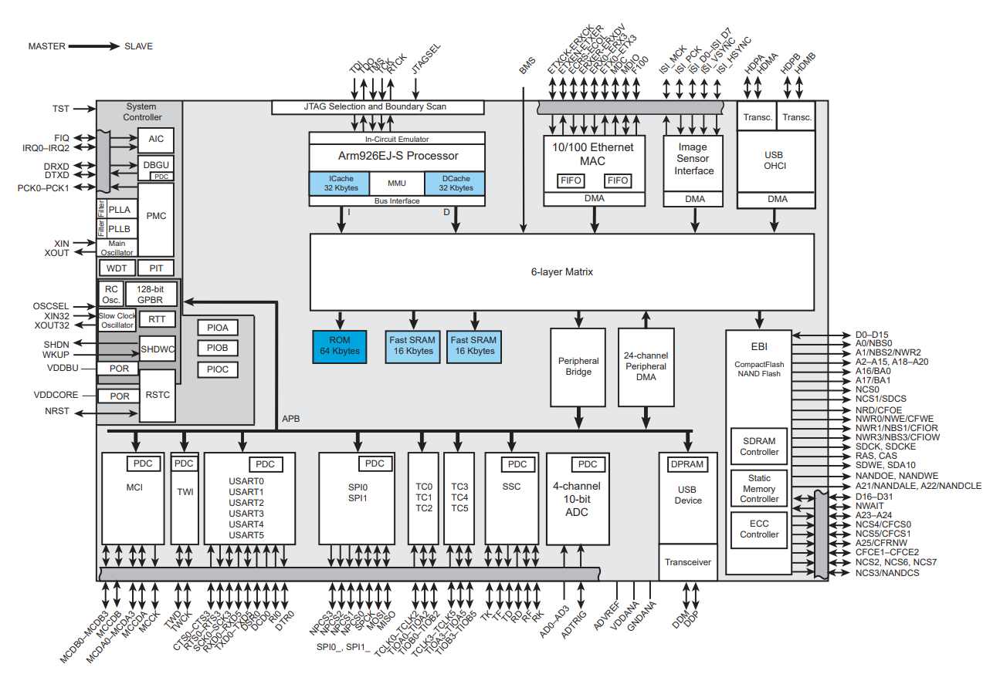
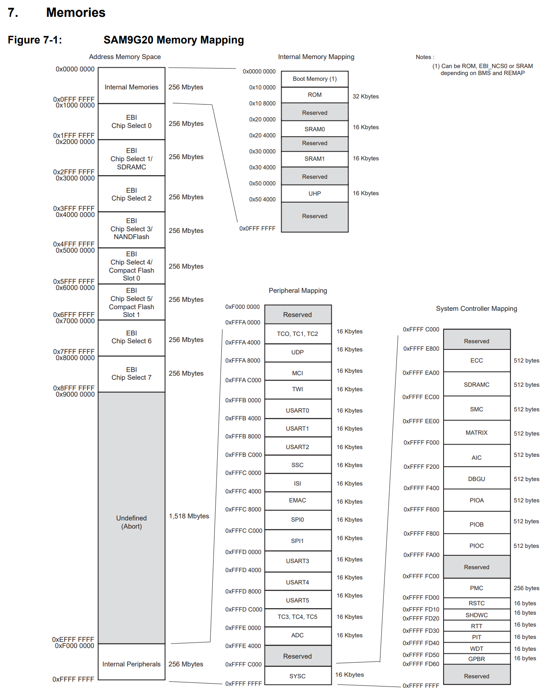
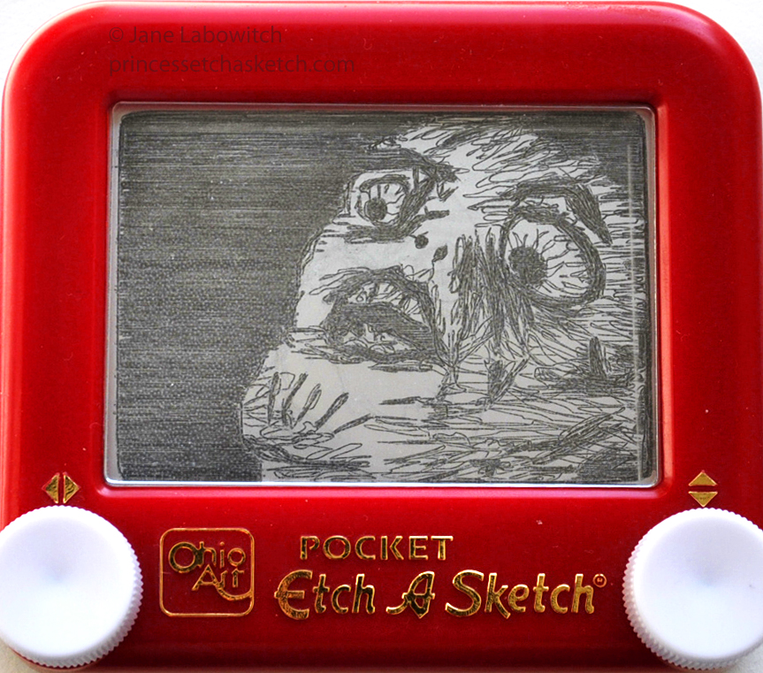
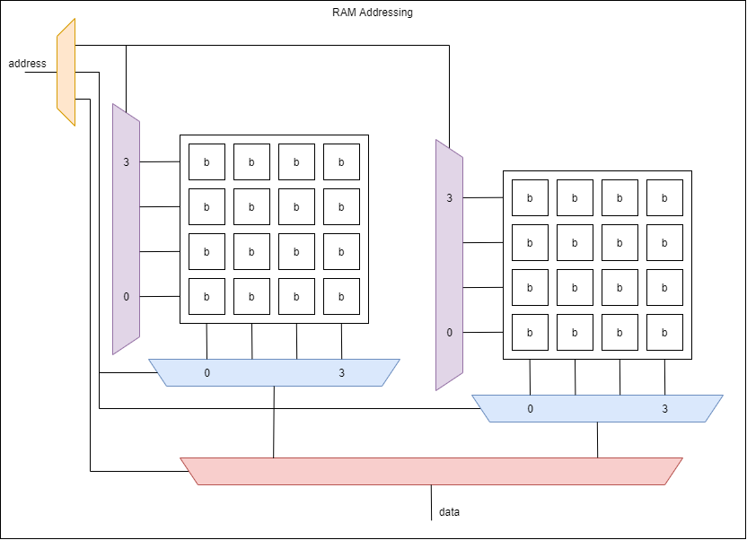

:::danger Incomplete

This document is not yet written.

:::

```text
  - Memories (45mins)
    - Volatile
      - Flip flops (transistors) / Latches (caps)
      - DRAM, SRAM, ??SDRAM ... other memories? DDR?
    - Nonvolatile
      - ROM, PROM, EPROM, EEPROM
      - Flash, NVRAM
    - Addressing Breakdown - chip select, rows/depth, columns/width
    - Calculating Memory Layouts
    - SPI (60mins)
      - In Circuit Analysis / Extraction
```

## Overview

What do you think about when you think about memory? As a software developer I usually think about read-write memory (RAM) and all the memory that is required to run my programs. As an embedded software developer I sometimes think about read only memory (ROM). Are there other types of memory that you might experience from a digital logic perspective?

## Some Types Of Memory Include:

- DRAM (1 cap, 1 transistor) - Dynamic RAM
- SRAM (6 transistors) - Static RAM
- SDRAM - Synchronous (with clock of CPU) Dynamic RAM
- DDR (SDRAM) - Double data rate by triggering on rise and fall of clock edge.
- Masked ROM - Hardcoded values in circuitry.
- PROM - Programmable ROM. One time programmable.
- EPROM - Erasable PROM. UV light that can erase entire chip.
- EEPROM - Electronically erasable PROM. A different voltage level triggers erasure of the entire chip.
- Flash ROM - An array of EEPROMs that allow erasing _blocks_ of a chip. Suffers from finite erase cycles.

## Generalized Memory Comparisons

- Cost from Cheapest to Pricey
  - Masked, DRAM, PROM, EPROM, FLASH, EEPROM, SRAM
- Density from least to most
  - Masked, PROM, EPROM, EEPROM, DRAM, SRAM, Flash
- Write Speed from slowest to fastest
  - EEPROM, Flash, DRAM, Masked, PROM, EPROM, SRAM
- Read speed from slowest to fastest
  - DRAM, Masked, PROM, EPROM, DRAM, SRAM, Flash

## Volatile vs Non-volatile

- **Volatile memory** is memory that disappears or fades when its not continually powered or re-charged (i.e. RAM).
- **Non-volatile memory** is memory that last a long period of time without continually being powered (i.e. flash).

## Block Diagrams

Block diagrams are visual representations of how sub-components of a system relate. These are invaluable when it comes to integrated circuits and micro controller units (MCUs) because it very quickly can show what the capabilities or a chip are and that capability's relationship to all the other functionality in the system. In the context of memory, this can show us how we can access a peripheral, memory, or some other control logic that may be multiple bus accesses away from the CPU.

Here is a block diagram of the Atmel AT91 SAM9G20 Micro Controller (from p4 of the datasheet):



Some quick observations tell us:

- The primary memory bus from the CPU is connected to 64K ROM, 32K of SRAM, and the APB (i.e. peripheral bridge).
- SPI, UART, and TWI (i.e. I2C) are all connected through the APB.
- SDRAM and Flash are accessed through the EBI (i.e. extended bus interface).

Now knowing this new information, lets take a second look at the memory map (p22):



- The ROM and SRAM on the primary bus interface is accessible from 0x100000 thru 0x304000
- The internal peripherals are mapped from 0xFFFFA000 thru 0xFFFE400.
- The SDRAM and Flash are mapped to the EBI which is accessible from 0x10000000 thru 0x8FFFFFFF. Note: It appears that the high 4 bits of the 32 bit address are the chip select of the EBI.

## ROMs and Flash

Read Only Memory (ROM), often is not truly _read-only_. The exception is masked ROM, readable memory that is burnt into the circuit and is closest to true _read-only_ memory. ROMs are usually are writable **with constraints**. For example, they may be write once, or may require erasing the entire chip to overwrite an already written byte. Write once per erase is not unlike an Etch-A-Sketch, where you draw an image and have to erase the entire image to undo a mistake. Modern flash usually requires erasing an entire 4k block of space to change a single byte. You can image a block erase model as an array of Etch-A-Sketches where you only need to shake a single Etch-A-Sketch when a mistake is made.



### Type Of ROMs

- Masked ROM - Hardcoded values in circuitry.
- PROM (Programmable ROM) - One time programmable.
- EPROM (Erasable PROM) - UV light that can erase entire chip.
- EEPROM (Electronically erasable PROM) - A different voltage level triggers erasure of the entire chip.
- Flash ROM - An array of EEPROM sections. Can erase individual sections of the chip. Commonly suffers from finite erase cycles.

### Flavors of Flash

- NAND - 4k erase blocks, sequential, higher density, faster erase/write
- NOR - large erase blocks (e.g. 128K blocks), random access, faster reads

### Wear Leveling

Flash file systems use wear leveling and bad block tables.

## RAM / Volatile Memory

Random Access Memory is the type of memory that most software developers are familiar with. But do you know how memory values are retrieved? Most RAM architectures are mapped into matrices that have an array of word-lines/rows and bit-lines/columns. Within RAM there are two major types: dynamic RAM (DRAM) and static RAM (SRAM).

What is the difference between dynamic RAM (DRAM) and static RAM (SRAM)?

- DRAM is a matrix of capacitors that represent the stored data. Due to the nature of capacitors, they slowly drain their charge and therefore have to be periodically recharged or they lose their state. DRAM takes less transistors and footprint but requires complex control logic. **Note:** _SDRAM_ is  DRAM who's reads and writes are synchronized with the system clock.
- SRAM is a matrix of transistors that does not drain and therefore doesn't need to be periodically refreshed. SRAM is a much simpler design but is much most costly than DRAM and has a larger footprint due to the transistor requirements.

### Addressing Memory (page 37-38)

Whether the memory is based on SRAM or DRAM, its broken down into a grid. This grid has a decoder and a multiplexer that selects the row and column to fetch from the grid. To get wider memory we simply add more grids and decoders/multiplexers to filter our output down to the single bit we've requested from our address. When addressing memory, the address value itself can usually be broken down into rows, columns, and chip selects. This is how the system knows how to get the data that is requested. Take a look at the following diagram:



This diagram shows an address at the top left (i.e. the input) and a data output at the bottom (i.e. the output). The address is 5 bits. These 5 bits are broken into 3 parts:

- The row selector - This _decoder_ tells all of the bits in a given row (for all chips simultaneously) to be output to the column selector multiplexer.
- The column selector - This _multiplexer_ tells the system which column value is going to be output (for all the chips simultaneously).
- The chip selector - This tells the bottom chip multiplexer which chip value is going to be output as data.

Assuming the chip on the left is `0`, the chip on the right is `1`, and the address break down is `[4 - chip select][3:2 - row][1:0 - col]`; if the address `10011b` (`13h`) is given, the last `11b` means we're reading the last column, the middle `00b` means we're reading the bottom row, and the first `1b` means we're reading the chip on the right.

<!-- TODO: Discuss why this is a 5 bit address? -->

Note: The break down of the address to rows/cols/chip-selects is completely arbitrary. That said, there are some advantages and disadvantages to the order that is selected. For example, using higher bits for more significant groupings can allow easier management of memory in software. Using the opposite ordering can spread memory access across the chips, allowing for faster DRAM performance because DRAM has refresh latencies from chip to chip.

<!-- TODO: Consider adding values to image? -->

<!-- TODO: Consider the memory bingo game? -->

## Registers

Registers are a very small type of memory that plays a critical role in a CPU architecture. While many NN-bit (e.g. 8, 16, 32, 64) architectures have a set of registers, some components have registers that are a single bit. Registers are basically an array of these single bit storage bins.

<!-- TODO: Include visual representation of arch registers and component registers. -->

## FIFO

FIFO stands for first-in-first-out. Its a buffer pattern and is good for different clock domains. Often, the physical layer of various protocols are timing sensitive whereas the high level software is not. Having FIFO buffers allows the timing sensitive operations in hardware to continue filing a buffer while it waits for software to service the buffer.

## CAM - Content Addressable Memory

CAMs are generally used for networking equipment to quickly search for values from packets for switching or routing. Binary CAM access requires a complete key to look up a value whereas a ternary CAM access allows wild card bits (i.e. don't care bits) to be in the query.

## LAB: Design Memory Architecture

- Boot code
- Main executable
- File Storage
- Working Memory

### Properties

- Depth - number of storage locations
- Width - size of each storage location = number of data lines out
- N = number of address lines = Depth = 2^N where N = log2(depth)

Example:

Depth = 1024
N = log2(1024) = 10
Width = 8
Size = 1024 x 8 = 8192 bits = 1024 bytes = 1kB

### Pin Outs

ROM:

- A0 - A9 - Address lines
- D0 - D7 - Data lines
- CS - Chip Select
- OE - Output Enable

RAM:

- A0-A9
- D0-D7
- CS - Chip select
- R/W~ - Read / Write

### Memory Mapping

Decoder Circuitry (MMU)

Memory Mapping (page 47)

Memory Ghosting
