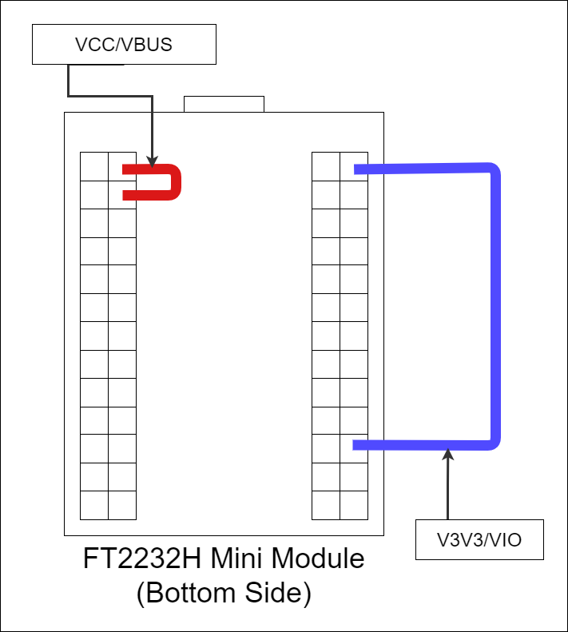
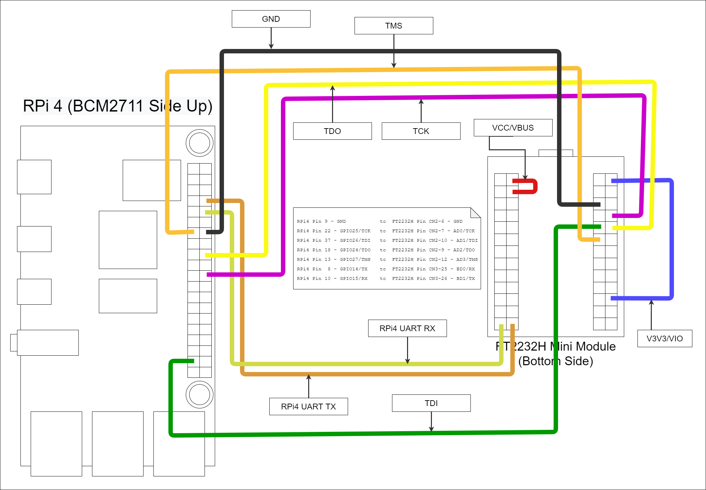
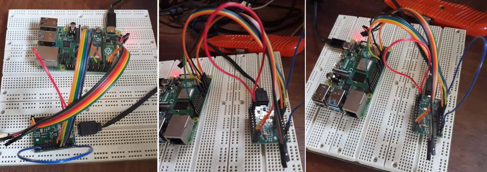

:::danger Incomplete

This document is not yet written.

:::

## Material List

- Get [FTDI FT2232H MiniModule](https://ftdichip.com/wp-content/uploads/2020/07/DS_FT2232H_Mini_Module.pdf) - ~\$40 - For communicating over UART and between OpenOCD host and the Raspberry Pi JTAG port.

- Get [6" F-F Jumper Wires](https://www.adafruit.com/product/1950) ~\$2 - For connecting FT232H to Raspberry Pi 4 JTAG port. You'll need roughly 10 connections for a complete setup.

- Get [USB-A to USB-Mini](https://www.digikey.com/en/products/detail/qualtek/3021009-06/1531292) ~\$5 - For connecting FT2232H to OpenOCD host.

- Get [Raspberry Pi 4 (w/ Storage & Power)](https://www.canakit.com/raspberry-pi-4-starter-kit.html) ~\$80 - This is the primary target.

<!-- TODO: Figure this out. -->

<!-- ## Software List

- Get OpenOCD [[Windows](https://github.com/xpack-dev-tools/openocd-xpack/releases)] [[GitHub](https://github.com/ntfreak/openocd)] _Free_ - For primary JTAG control and communicating between GDB and JTAG port. (**Highly Recommended**: Get the _xpack_ version of OpenOCD.)

- Get [Zadig](https://zadig.akeo.ie/) _Free_ - Required for proper USB IO control in Windows.

- Get [VirtualBox](https://www.virtualbox.org/) _Free_ - Optional Hypervisor for isolation of your embedded development or for enabling Linux capabilities on a Windows host. While this is my hypervisor of choice, using something like WSL2, HyperV, VMWare, KVM, or other hypervisors should work just as well.

- Get [Ubuntu](https://ubuntu.com/#download) _Free_ - Optional Linux distribution. I do nearly everything with Ubuntu, so that's what my instructions will be based on.

- Note: There is a bit of setup required for the Ubuntu base line. This write up assumes a basic knowledge with how to install a Linux distribution and install relevant software (e.g. docker). -->

<!-- ## Pre-requisite Environment Setup

Before doing anything hardware specific, you'll need to do several steps:

1. (Windows Hosts Only) Install Zadig and ensure WinUSB is the installed for the FTDI devices (Interface 0 and Interface 1).
2. Install Virtual Box
3. Install Virtual Box Extension Pack (no USB 2 without this.)
4. Install Ubuntu >= 18 in a Virtual Machine.
5. Install docker in the Ubuntu VM. See [Docker Setup Assistant](https://www.vinnie.work/20210317-docker-handholding/) for more information. -->

<!-- ## Docker Setup

Once docker is installed into the virtualized environment, you'll need to build a docker image that is capable of accomplishing everything we want to do. There are a bazillion way to organize your docker capabilities. Our strategy here is to be able to access OpenOCD Server, OpenOCD CLI, GDB, and the UART all from the same docker image.

For simplicity I've included some helper files that you should be able to use out of the box to generate an expected good image:

- [Dockerfile](/misc/OpenOCDWithRpi4/Dockerfile) - The primary Dockerfile
- [build.sh](/misc/OpenOCDWithRpi4/build.sh) - A script for running the build.
- [ftdi_env.sh](/misc/OpenOCDWithRpi4/ftdi_env.sh) - A template script for running a temporary container.

Download each of these into a single directory (e.g. `./docker/`). Then from within the directory simply run:

```sh
$ ./build.sh
```

When everything goes well, you should see the following line as the final line of the `build.sh`:

```sh
Successfully tagged chenz/openocd-dev:latest
```

To test the new image, you can run `./ftdi_env.sh bash` and you'll find yourself inside a container in a `/workspace` folder. This `/workspace` folder is mapped to whatever folder you ran `./ftdi_env.sh` from. I use this pattern to allow me to run the same docker images for multiples projects while only allowing each container a view of the specific project I'm working on. (Tip: I usually copy the \*\_env.sh scripts to the top level of relevant projects.)

Lastly, you'll want to verify that you can see the USB devices from host by running `./ftdi_env.sh lsusb`. When I run this, I get something like the following (although it will likely differ from system to system.):

```sh
$ ./ftdi_env.sh.sh lsusb
Bus 001 Device 002: ID 80ee:0021 VirtualBox USB Tablet
Bus 001 Device 001: ID 1d6b:0001
```

Note: If you really don't want to use sudo within the container, you can opt to add the user to the plugdev group in both the host and docker image. -->

<!-- ## VM USB Pass-Through

Once docker is running in the virtualized environment, now is a good time to verify you have access to real USB devices connected to the host. This can be done with any USB accessory, but I'll use the FT2232H in my example. Note: You can only access the USB device from one operating system at a time (i.e. do not try to simultaneously access from both or risk corruption).

First, to even get the host to recognize the MiniModule, we'll configure the module to be USB bus powered. You accomplish this by connecting pins CN3-1 to CN3-3 on the module. While we're at it, we also need to connect CN2-1 to CN2-11 as another pre-requisite for powering the IO pins. You can see the wiring in the diagram below:



Once the two connections have been made, you can plugin the FT2232H MiniModule to the host. Hopefully you'll see or hear an indication of the connection. If you don't, that doesn't necessarily mean anything is wrong yet, you may just have an unusual setup.

In Virtual Box there are two primary ways to connect USB host devices to the virtual machine: temporarily or persistently.

The former method is achieved by right clicking the USB icon in the bottom bar of the Virtual Machine window. This will reveal a dropdown menu where you can select the device that you want to be passed through to the virtual machine. You can see this happen if you first `watch lsusb` from the virtual machine and then connect the device.

The latter involves setting up USB device filters. The Virtual Box service will then monitor the state of the USB enumerations on the host and when it sees a device that matches its filters, it'll automatically connect it to the virtual machine.

You can add a USB device filter in Virtual Box by going into the Virtual Machine settings and selecting "USB". _If you only see a selection for "USB 1.1", you need to go back and install the Virtual Box extension that is provided by Oracle._ Depending on your setup, you should be able to create a filter from scratch or from an already connected device.

The settings I'm using for my FT2232H MiniModule are:

```text
Name: FTDI FT2232H MiniModule [0700]
Vendor ID: 0403
Product ID: 6010
Revision: 0700
Manufacturer: FTDI
Product: FT2232H MiniModule
```

Tip: You can put in less information is get a less specific filter. I recommend the `Vendor ID` and `Product ID` as a minimum. If you have multiple FT2232H devices connected to the same host, you'll want to include a `Serial No`. -->

## Wiring Up The Hardware

Once you have some confidence that the USB device is being passed from the host through to the virtual machine and subsequently the docker image, you are in an ideal position to start wiring up the JTAG and the UART connections.

The studious individual will find what to connect in the following texts:

- [FT2232H MiniModule Datasheet](https://ftdichip.com/wp-content/uploads/2020/07/DS_FT2232H_Mini_Module.pdf)
- [FT2232H IC Datasheet](https://ftdichip.com/wp-content/uploads/2020/08/DS_FT2232H.pdf)
- [Raspberry Pi 4 Module Datasheet](https://www.raspberrypi.org/documentation/hardware/raspberrypi/bcm2711/rpi_DATA_2711_1p0_preliminary.pdf)
- [BCM2711 IC Datasheet](https://datasheets.raspberrypi.org/bcm2711/bcm2711-peripherals.pdf)

I like to reference [pinout.xyz](https://pinout.xyz/) because its pretty and easy on my eyes.

- [Raspberry Pi UART Pinout](https://pinout.xyz/pinout/uart)
- [Raspberry Pi JTAG Pinout](https://pinout.xyz/pinout/jtag)

If you did it the same way I did, you'll end up with a mess of jumper wire connections that looks something like:



In real life it looks something like:



## Configuring OpenOCD

Configuring OpenOCD is probably the largest pain in this whole process. Don't get me wrong, what the OpenOCD developers have done is amazing. Until OpenOCD, I always just assumed that you'd spend hundreds if not thousands of dollars to get JTAG on an embedded system. Although with the decreased price, you inherently get decreased support and have to depend on the generosity of the OpenOCD community.

When configuring OpenOCD you have to have quite an intimate knowledge of the target you are working on. Going in blind, this means there is a large front in investment. But once you get things working, tweaking and adjusting various settings is quite simple. Understanding the JTAG state machine and tricks for troubleshooting JTAG is a whole other topic.

In any case, there are three things that get configured in a standard OpenOCD environment:

- **The interface** - In our case this is the FT2232H. Generally the interface is the device that is used to interface a developer machine with the embedded device that has JTAG access. Other interfaces that I've used are JLink, Abatron BDI, Xilinx, Flyswatter2, Olimex, and so forth.
- **The module** - This is the Raspberry Pi module in our case. By module I am referring to the printed circuit board that the integrated circuits (ICs) are stuck to and interconnected. The way that various ICs are connected on a PCB define the JTAG chain and therefore can vary from board to board.
- **The target(s)** - These are the various individual ICs that exist in the JTAG chain. The RPi4 uses a BCM2711 SoC micro controller. The BCM2711 is our target. Within this target exists 4 cores that we can control independently, so all of these are referenced in the target configuration.

Like I've already mentioned, understanding JTAG and the why/how of getting things setup is outside the scope of this article so for now I'll leave you with a configuration that includes the setup for the interface (FT2232H), module (RPi4), and target (BCM2711) all in one file.

  <details>
  <summary>Click To See ft2232h-to-rpi4.cfg</summary>

```text
adapter driver ftdi
adapter speed 1000

ftdi_vid_pid 0x0403 0x6010
ftdi_channel 0
transport select jtag

# Specifies the initial values of the FTDI GPIO data and direction registers.
# Each value is a 16-bit number corresponding to the concatenation of the
# high and low FTDI GPIO registers. The values should be selected based on
# the schematics of the adapter, such that all signals are set to safe levels
# with minimal impact on the target system. Avoid floating inputs,
# conflicting outputs and initially asserted reset signals.
ftdi_layout_init 0x0000 0x000b

set _CHIPNAME bcm2711
set _DAP_TAPID 0x4ba00477

transport select jtag
reset_config trst_and_srst

telnet_port 4444

jtag newtap auto0 tap -irlen 4 -expected-id $_DAP_TAPID

dap create auto0.dap -chain-position auto0.tap

set CTIBASE {0x80420000 0x80520000 0x80620000 0x80720000}
set DBGBASE {0x80410000 0x80510000 0x80610000 0x80710000}

set _cores 4

set _TARGETNAME $_CHIPNAME.a72
set _CTINAME $_CHIPNAME.cti
set _smp_command ""

for {set _core 0} {$_core < $_cores} { incr _core} {
  cti create $_CTINAME.$_core -dap auto0.dap -ap-num 0 -baseaddr [lindex $CTIBASE $_core]

  set _command "target create ${_TARGETNAME}.$_core aarch64 \
                  -dap auto0.dap  -dbgbase [lindex $DBGBASE $_core] \
                  -coreid $_core -cti $_CTINAME.$_core"
  if {$_core != 0} {
      set _smp_command "$_smp_command $_TARGETNAME.$_core"
  } else {
      set _smp_command "target smp $_TARGETNAME.$_core"
  }

  eval $_command
}

eval $_smp_command
targets $_TARGETNAME.0
```

</details>

## Configuring the Raspberry Pi 4

A critical part of setting everything up is getting the RPi4 boot up setting correct. This bit me when I first get started because I am used to embedded systems where the default reset state is to have JTAG and UART enabled. This is not the case with RPi4. I'm guessing this is because most folks can just monitor and keyboard into the system.

On the SDCard of the RPi4 there is a file in the `BOOT` partition called `config.txt`. This is the file that the RPi4 boot loader reads to setup various peripherals before the kernel is kicked off. For us to use the JTAG and UART, we at a minimum the following lines added to the `config.txt` file:

```text
gpio=22-27=np
enable_jtag_gpio=1
enable_uart=1
```

Once added, save and reboot.

## Running Everything

Before powering on the Raspberry Pi 4, ensure that all the wiring is correct and that the device isn't sitting on anything that may cause an unintentional short. (e.g. a metal bench or table is a bad idea).

You'll eventually need to open a number of terminals, so if you are familiar with tmux, I recommended starting a session now.

### Terminal 1 - Serial Console

The first thing to do is get a serial console to the RPi4 over UART. This will allow you to see kernel boot up messages, console only messages, and have access to the RPi4 without connecting to a monitor or network connection. I use minicom to connect to the RPi4. Using the docker image you can run minicom with:

```sh
./ftdi_env.sh sudo minicom usb1
```

If you want to avoid using root, you can give the user `dialout` group permissions. Otherwise, minicom needs root to access the `/dev/ttyUSB1` device. The `usb1` parameter is referencing a minicom configuration in `/etc/minicom/minirc.usb1`. Unfortunately these files are not considered stable API, but here is what minicom created with the given configuration.

The configuration in minicom:

```text
+-----------------------------------------------------------------------+
| A -    Serial Device      : /dev/ttyUSB1                              |
| B - Lockfile Location     : /var/lock                                 |
| C -   Callin Program      :                                           |
| D -  Callout Program      :                                           |
| E -    Bps/Par/Bits       : 115200 8N1                                |
| F - Hardware Flow Control : No                                        |
| G - Software Flow Control : No                                        |
|                                                                       |
|    Change which setting?                                              |
+-----------------------------------------------------------------------+
```

The configuration file generated (`/etc/minicom/minirc.usb1`):

```text
# Machine-generated file - use "minicom -s" to change parameters.
pu port             /dev/ttyUSB1
pu rtscts           No
```

Once you have minicom up and running you should get a login prompt from the terminal (Tip: You may have to hit enter for a prompt to show up if the RPi4 has already finished booting up.):

```text
Welcome to minicom 2.7.1

OPTIONS: I18n
Compiled on Dec 23 2019, 02:06:26.
Port /dev/ttyUSB1, 01:09:45

Press CTRL-A Z for help on special keys


raspberrypi login:
```

Note: The default username is `pi` and the default password is `raspberry`.

### Terminal 2 - OpenOCD Server

Once you have a serial console up, you should setup the OpenOCD server.

```sh
./ftdi_env.sh openocd -f ft2232h-module.cfg
```

This results in the following output:

```text
xPack OpenOCD, x86_64 Open On-Chip Debugger 0.11.0-00155-ge392e485e (2021-03-15-16:43)
Licensed under GNU GPL v2
For bug reports, read
        http://openocd.org/doc/doxygen/bugs.html
Warn : Transport "jtag" was already selected
Info : Listening on port 6666 for tcl connections
Info : Listening on port 4444 for telnet connections
Info : clock speed 1000 kHz
Info : JTAG tap: auto0.tap tap/device found: 0x4ba00477 (mfg: 0x23b (ARM Ltd), part: 0xba00, ver: 0x4)
Info : bcm2711.a72.0: hardware has 6 breakpoints, 4 watchpoints
Info : bcm2711.a72.1: hardware has 6 breakpoints, 4 watchpoints
Info : bcm2711.a72.2: hardware has 6 breakpoints, 4 watchpoints
Info : bcm2711.a72.3: hardware has 6 breakpoints, 4 watchpoints
Info : starting gdb server for bcm2711.a72.0 on 3333
Info : Listening on port 3333 for gdb connection
```

As you should be able to see in the above output, there are 3 different service that you can use:

- Port 6666 allows you to drive complex TCL procedures in the OpenOCD environment.
- Port 4444 allows the user to use a more restricted shell for running typical JTAG and ICE commands (e.g. run, halt, continue).
- Port 3333 allows the user to attach a gdb debugger and debug the processor cores state.

### Terminal 3 - GDB With OpenOCD

While usage of GDB itself is outside the scope of this article, you can start up a gdb session by running:

```sh
./ftdi_env.sh gdb-multiarch -ex "target ext :3333"
```

This will result in output that looks similar to:

```text
GNU gdb (Ubuntu 9.2-0ubuntu1~20.04) 9.2
Copyright (C) 2020 Free Software Foundation, Inc.
License GPLv3+: GNU GPL version 3 or later <http://gnu.org/licenses/gpl.html>
This is free software: you are free to change and redistribute it.
There is NO WARRANTY, to the extent permitted by law.
Type "show copying" and "show warranty" for details.
This GDB was configured as "x86_64-linux-gnu".
Type "show configuration" for configuration details.
For bug reporting instructions, please see:
<http://www.gnu.org/software/gdb/bugs/>.
Find the GDB manual and other documentation resources online at:
    <http://www.gnu.org/software/gdb/documentation/>.

For help, type "help".
Type "apropos word" to search for commands related to "word".
pwndbg: loaded 183 commands. Type pwndbg [filter] for a list.
pwndbg: created $rebase, $ida gdb functions (can be used with print/break)
Remote debugging using :3333
```

Note: I have `pwndbg` installed in my gdb environment and you may not see this in your setup.

**Tips:**

- Ctrl-C in GDB to break RPi4.
- `c` in GDB to continue from break.
- Ctrl-C in OpenOCD to stop debugging.

## Conclusion

Well, there you go. A setup from FT2232H to RPi4 that enables UART and JTAG access.

<!-- Additionally, everything is encapsulated in a Virtual Machine and docker container for maximum portability.  -->

Hopefully this information can help some others with getting started in low level development with the RPi4 or a FT2232H based interface.

Where to continue?

- Checkout [pwndbg](https://github.com/pwndbg/pwndbg). Its a suite of additional goodies for gdb. I love to use pwndbg because its portable (i.e. works in a terminal) and provides a full visualization of the code, assembler, and memory in a single screen. Also, its fully customizable and has some support for decompilation with [Ghidra](https://ghidra-sre.org/) with [radare](https://rada.re/n/)/[rizin](https://rizin.re/).

- Learn [aarch64](https://developer.arm.com/documentation/102374/latest/) instruction set.

## Other Links

- [Getting Started with OPENOCD Using FT2232H Adapter for SWD Debugging](https://www.allaboutcircuits.com/technical-articles/getting-started-with-openocd-using-ft2232h-adapter-for-swd-debugging/)
- [OpenOCD FT2232H based JTAG Adapter(s) with UART](https://techwithdave.davevw.com/2013/07/openocd-ft2232h-based-jtag-adapters.html)
- [Getting started with OpenOCD](https://techwithdave.davevw.com/2013/07/getting-started-with-openocd.html)
- [FT232H Pinouts](https://learn.adafruit.com/assets/88382)

## Some Troubleshooting

If you find the serial interface is missing lots of characters and feels slow. This could be due to interference being captured by the unshielded jumper wires between the FT2232H and the RPi4. It can also occur due to a long USB cable (>6feet) or unshielded USB cable.

Ways to resolve the interference issue is to move the setup far from things that are oscillating (e.g. fans, compressors, motors, CRTs, microwaves, radio enabled devices). If possible, its also advised to keep the exposed RPi4 on a static resistent matte and/or grounded to prevent interference or damage from static discharge. (Wool socks on the rug are a bad idea.)

OpenOCD error when interface not setup correctly:

```text
xPack OpenOCD, x86_64 Open On-Chip Debugger 0.11.0-00155-ge392e485e (2021-03-15-16:43)
Licensed under GNU GPL v2
For bug reports, read
        http://openocd.org/doc/doxygen/bugs.html
Warn : Transport "jtag" was already selected
Info : Listening on port 6666 for tcl connections
Info : Listening on port 4444 for telnet connections
Info : clock speed 1000 kHz
Error: JTAG scan chain interrogation failed: all ones
Error: Check JTAG interface, timings, target power, etc.
Error: Trying to use configured scan chain anyway...
Error: auto0.tap: IR capture error; saw 0x0f not 0x01
Warn : Bypassing JTAG setup events due to errors
Error: Invalid ACK (7) in DAP response
Error: JTAG-DP STICKY ERROR
```

Notice the **`Error: JTAG scan chain interrogation failed: all ones`**

OpenOCD when interface setup without board or target configuration:

```text
Open On-Chip Debugger 0.10.0
Licensed under GNU GPL v2
For bug reports, read
        http://openocd.org/doc/doxygen/bugs.html
adapter speed: 1000 kHz
Warn : Transport "jtag" was already selected
trst_and_srst separate srst_gates_jtag trst_push_pull srst_open_drain connect_deassert_srst
Info : clock speed 1000 kHz
Info : JTAG tap: auto0.tap tap/device found: 0x4ba00477 (mfg: 0x23b (ARM Ltd.), part: 0xba00, ver: 0x4)
Warn : gdb services need one or more targets defined
```
