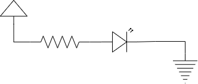
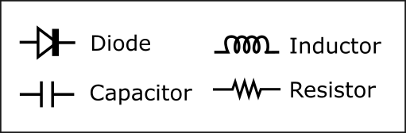
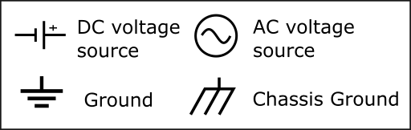
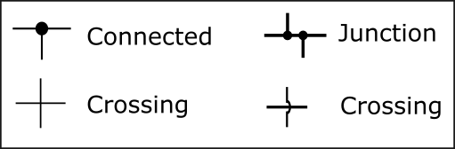
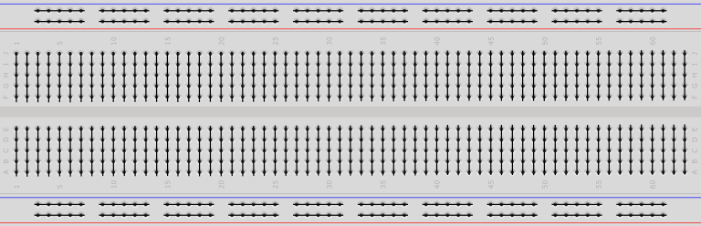
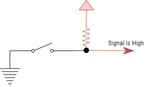
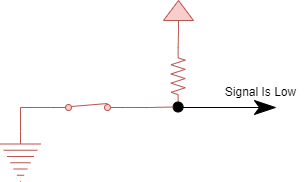
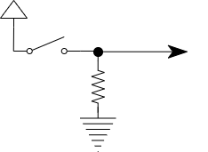
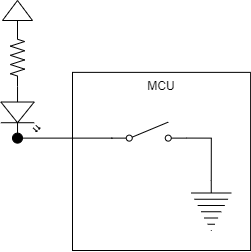

:::danger Incomplete

This document is not yet written.

:::

```text
- Practical EE
  - Schematics - Analog Circuits (e.g. source, switch, load, drain) (15mins)
  - Prototyping (e.g. schematic -> breadboard) (60 mins)
  - Datasheets - Determine packaging, resets, inputs, voltage, current, temperature, timing (30mins)
  - Pull Ups / Pull Downs  ... useful for white wiring (15mins)
  - Controlling LED ... useful for debugging (15min)
```

## Schematics

The standard way for describing an electrical circuit is through the use of a schematic. Schematics can clearly and concisely express the relationships between all of the components in a circuit. Here is an example of a circuit with a source, resistor, led, and a ground:



Schematics are made up of interconnected symbols that are standardized by bodies like IEEE and ANSI. There are three common categories for schematic symbols:

- **Passive** - These components consume or react to energy but do not produce any energy (e.g. capacitors, resistors, inductors).

  

- **Power** - Sources of voltage and ground.

  

<!-- TODO: Consider moving these somewhere else? -->

<!-- - **Logical** - Represent boolean operations (e.g. AND, OR, NOR).

   -->

All of these components are interconnected with traces or lines. Dots at the intersection of these lines represent a connection. Intersecting lines without a dot are not connected.



<!-- TODO: Drop example schematic here and describe it. -->

## Breadboard

Breadboards are commonly used to prototype a circuit or parts of a circuit. Breadboards use friction to keep the components connected. Other prototyping techniques include using a _perf board_ which is a board with a bunch of unused solder points. Soldering the prototype can make it more durable but less flexible for reconfiguration.


Breadboards are composed of a grid of holes that you shove leads into. Each line of 5 holes are usually connected. In the middle of the breadboard is a _ditch_. Through-hold integrated circuits (ICs) usually straddle this ditch in the middle of the board.



Great care must be taken when using breadboards. Wires can get messy and be pulled out from the slightest catch on of a moving hand or other article of clothing. Because breadboards use friction to hold leads in place, they can also become worn out and not have as good of a connection for some of the 5-hole lines. Also, long wires poking up and wrapping around each other can effect their performance. Pulsing clock lines can effect readings on adjacent wires that aren't shielded. In some cases you may need to ensure these noisy lines are kept at a distance from any data lines.

The key takeaway when working with breadboards is to be gentle and keep it as neat and clean as reasonable.

<!-- TODO: Have students draw a breadboard implementations from a given set of schematics. -->

<!-- TODO: Show pictures of the solutions. -->

## Datasheets

<!-- TODO: Focus on packaging, inverted inputs, resets, control inputs, voltage specs, current output, temperature specs, timing diagrams, block diagrams. -->

<!-- TODO: Given a timesheet, answer questions about the described components.

- 8-bit serial to parallel converter means?
- What part?
- Voltage?
- How to reset?

More information available in FCC database. -->

## Pull Ups / Pull Downs

<!-- TODO: Use "on" and "off" instead of activating. -->

Previously we discussed active high signals and active low signals. To recap, an active high signal is one that is _on_ when its _high_. An active low signal is one that is _on_ when its _low_. Whether a signal is biased high or low can be defined in a schematic by "pull ups" or "pull downs".

<!-- Attrib: Word for word from old ATNO4272. -->

Logic circuits will often take input from the physical world via some input such as a switch. The circuit designer must ensure that whatever device is being read from always maintains a steady state. That is, it always should output a logical zero or one. If it does not than we refer to the input as floating and we cannot know what the logical state of the input will be.

<!-- Attrib: Word for word from old ATNO4272. -->

To prevent a signal from floating, the circuit designer can tie the signal to a desired steady state. In the following schematic, we have inserted a resistor between the inputs and a voltage called a pull-up resistor (because they pull the input up to a known value.) When the switch is open, the resistors will ensure that the input is high. A small current will flow through the resistor to the input to ensure it maintains a high state.



<!-- Attrib: Word for word from old ATNO4272. -->

When the switch is closed, the ground will be much stronger than the pull-up because the input is connected directly to ground. The pull-down to ground will overpower the pull-up and we will end up with a zero on the input. Think about it as two pipes with different diameters. The pullup resistor provides a very small pipe for current to flow through. The short circuit to ground created by the closed switch create a very, large pipe to ground for current to flow through. The larger pipe will never fill up with just a trickle of current from the pull-up resistor and thus will maintain a low state.



As an exercise, try drawing a schematic with pull down resistors.

<details>
<summary>Click To See Answer</summary>



</details>

## Controlling Small Loads (e.g. LED)

<!-- Attrib: Word for word from old ATNO4272. -->

Often we want to power some small load, such as an LED from the output pin of a micro controller. Such a circuit can be configured in two ways, with the micro controller output as a current drain or current source. Here the pin is the current drain. When the output is cleared to low it is tied to ground and current can flow from an external source through the LED ground. This is often the best configuration for powering some small load.



<!-- Attrib: Word for word from old ATNO4272. -->

Remember that an LED is a diode and only allows current to flow in one direction. Be sure to get polarity (or direction) of the LED correct in your circuit or it will not light up. The resistor in this circuit is important to prevent damage to the LED. The LED has a maximum current it can handle before it burns out. The amount of current pushed through the LED will also effect the brightness of the LED (lower the resistance, the brighter the light).

## Resources

- [Wikipedia: Electronic Symbol](https://en.wikipedia.org/wiki/Electronic_symbol)
- [Circuit Symbols for all Electronic Components](http://www.talkingelectronics.com/CctSymbols/Circuit_Symbols.html)
- [Wikipedia: IC Power Supply Pin](https://en.wikipedia.org/wiki/IC_power-supply_pin)
