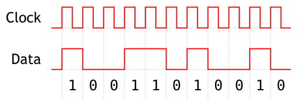

:::danger Incomplete

This document is not yet written.

:::

## Overview

Ok, so _What is a digital signal?_. A digital signal is a signal that is usually represented by a high value or low value for a given amount of time. Here is a conceptual view of what a digital signal could look like. The vertical axis is the voltage and the horizontal axis is the time.:

Because of the noise in the voltage level there is usually defined thresholds that determine what is considered _high_ and what is considered _low_. Note: I refer to the values as high/low and **not** 1/0. *We'll explain why in a moment.*

Shown above, the high level of this TTL input signal is one where the voltage is greater than 2V and less than 5V. The low value of this TTL input signal is one where the voltage level is greater than zero and less than 8V. Note: The low value isn't always aligned with zero. Sometimes it can be negative and the high value is zero or sometime both are higher/lower than zero on the vertical axis.

<!-- TODO: Consider removing the following paragraph? -->

Naturally, many engineers will assume that a high value is equal to a logical `1` and a low value is equal to a logical `0`. Keep in mind that the state of a signal can be logically _interpreted_ differently for different components and their configurations. These interpretations can be arbitrary so you should consult the component data sheet to know which is which. The takeaway is that when left with experimentation, do not assume logical `1` is > logical `0` in terms of voltage. 

**Note:** For the remainder of this material, we'll assume that a logical `1` is high voltage and a logical `0` is zero voltage.

## Timing Diagrams

Let's take a look at a _digital timing diagram_:

1. Low Value (within given low range thresholds)
2. High value (within given high range thresholds)
3. Rising Edge
4. Falling Edge

Pictured in the above diagram are the levels and edges of a signal. The levels are the horizontal lines and the edges are the transitions between the levels. (A rising edge voltage goes up over time and a falling edge voltage goes down over time.) The width of an edges indicates the range of time that is takes for a power value to transition from low to high or from high to low.

## Clock Signals

<!-- TODO: Consider re-defining a clock signal agnostic of the data signal? -->

Clock signals are a sort of digital heart pulse. Clock signals can be used for data sampling, or triggering a regular action. When clock signals are combined with digital data signals, the clock signal can indicate when a component should measure or read the state of the data signal. Just like digital signals, clock signals are usually defined by high levels, low levels, rising edges, falling edges, and relevant thresholds therein. Usually the clock signal is periodic based on a regular time interval (or fixed period), but this doesn't have to be the case. Sometimes clock signals can follow irregular periods, allowing software to bit bang protocols across them.

In the above example, the clock's falling edge is when the data level value is read.

<!-- TODO: Note there can be multiple clocks in a single system, labeled clock domains -->

## Active High / Active Low

<!-- ! TODO: Consider rewrite. -->

Whether a signal is "on" or "off" is defined by its state and whether its "active high" or "active low". In words, when a signal is "active high" and its logic level is 1, the signal is considered "on". In contrast, when a signal is "active low" and the logic level is 0, the signal is considered "on". Here is a table to provide a visual representation:

| Activation  | Logic | Voltage | State |
|-------------|-------|---------|-------|
| Active High | 0     | low     | off   |
| Active High | 1     | high    | on    |
| Active Low  | 0     | low     | on    |
| Active Low  | 1     | high    | off   |

<!-- Whether a signal is active high or active low is determined by _how_ it is activated. In other words, an active low signal will be high when not activated. This means that to activate this signal it should be connected to ground to drain it to a low voltage. In contrast, an active high pin has a low voltage value and to activate it, it should be changed to a high voltage. -->

In schematics or diagrams with PIN names, pins that are active low are usually indicated with special annotations. [Wikipedia](https://en.wikipedia.org/wiki/Logic_level) states these as:

<!-- Overline: ̅ -->

> The conventions commonly used are:
>
> - a bar above (Q̅)
> - a leading slash (/Q)
> - a lower-case n prefix or suffix (nQ or Q_n)
> - a trailing # (Q#), or
> - an "_B" or "_L" suffix (Q_B or Q_L).

<!-- TODO: Mention line over PIN name means pin is active low. -->

<!-- TODO: This paragraph sucks as written. Should all this wait until we dig into schematics? -->

<!-- The automatic bias of these signals is usually performed by what is referred to as a pull up or pull down resistor. A pull up resistor allows a voltage bias into the signal but not enough to prevent the signal to be pulled down when connected to ground. A pull down resistor is the exact opposite. A pull down adds a resistor from the signal to ground to bias the signal low, but not enough to cause the signal to be kept low if connected to a voltage supply.

Signals that have no bias up or down are considered floating. This means that they may float in and out of the threshold. The value of such a signal is considered undefined. -->

<!-- TODO: Consider mentioning bouncing? -->

## Datasheets

<!-- TODO: This whole section needs to be better thought out and moved to its own page. -->

Once again, datasheets are our friends. We previously discussed datasheet discovery in [Internal Visual Inspection](/docs/EmbeddedSystemsAnalysis/InitialVisualAnalysis/InternalVisualInspection#datasheets). When you begin to dig deeper into the analysis of your target device, you'll also dig deeper into the datasheet content. There are several areas of datasheets that should be considered:

- **Mechanical** - This is where the physical attributes of a part are described. This information is valuable for identifying exact part numbers for a particular package type. Its also valuable for those who are actually building circuits (e.g. finding a functionally equivalent chip that'll work in a bread board.)

- **Environmental** - Components usually have environmental contraints. Datasheets may describe things like operating temperature specifications and other environmental conditions (e.g. pressure, moisture, and so forth).

- **Electrical** - This is content that will assist engineers with understanding the electrical properties of the circuit. This includes things like the supply voltage, the pin outs, schematics, and so forth.

- **Digital Logic** - As a subset of the electrical properties, in a decent datasheet, you'll find extensive descriptions of the digital logic parameters and functionality to operator the circuit. This includes things like logic level values, timing diagrams, inputs/outputs.

### LAB: SN74LS164

Let's take a moment to study an example datasheet of a component:

[SN74LS164 Datasheet](./DigitalSignals/sn54ls164-sp.pdf)

- What does it do?
  - What does the 8-bit serial to parallel converter do?
- What is the min/max supply voltage?
  - Depends what part. 4.75V to 5.25V
- What is the output voltage for a logic 0?
  - Less than 0.4V.
- How do we clear the outputs?
  - Set CLEAR for tw (width of clock input pulse)
  - Set CLEAR for at least 20ns (tw minimum).

## Resources

- http://www.righto.com/2012/10/a-dozen-usb-chargers-in-lab-apple-is.html
- https://www.nutsvolts.com/magazine/article/July2015_Bogatin
