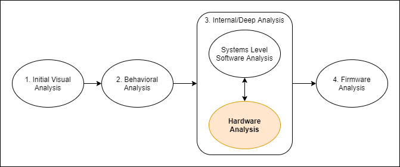

:::danger Incomplete

This document is not yet written.

:::

## Overview

Total time ~ 1.5 days.

<!-- - What is a digital signal?
  - What is voltage?
  - Reference Ground
    - Multimeter
  - Dirty Power
  - Digital Signals
  - Clock Signals

- Serial Access
  - UART, RS232/TTL
  - Find UART, manually measure baud rate.
  - Uboot, more logging and information.

- Practical EE
  - Schematics - Analog Circuits (e.g. source, switch, load, drain) (15mins)
  - Prototyping (e.g. schematic -> breadboard) (60 mins)
  - Datasheets - Determine packaging, resets, inputs, voltage, current, temperature, timing (30mins)
  - Pull Ups / Pull Downs  ... useful for white wiring (15mins)
  - Controlling LED ... useful for debugging (15min)

- Analyzing Logical Circuits
  - Logical Components (30mins)
    - Schematic symbols
    - truth tables
    - (Combinatorial / Sequential)
    - (state machines?)
  - Bus Concept - Schematic Expression, Serial v Parallel (60 mins)
    - I2C Bus - Clocks
    - Intro to Logic Analyzer (v OScope) (15mins)
  - Datasheets
    - Block diagrams (for architecture) (15mins)
  
  - Memories (45mins)
    - Volatile
      - Flip flops (transistors) / Latches (caps)
      - DRAM, SRAM, ??SDRAM ... other memories? DDR?
    - Nonvolatile
      - ROM, PROM, EPROM, EEPROM
      - Flash, NVRAM
    - Addressing Breakdown - chip select, rows/depth, columns/width
    - Calculating Memory Layouts
    - SPI (60mins)
      - In Circuit Analysis / Extraction  

- JTAG Access - More System Info via IDCODEs, Analyze Kernel/Booter, Memory Access (NOR/NAND) (120 mins)
  - WatchDog Timers
    - **Rpi4 WDT is at 7e100000, but there is no documentation!*
    - Turn on from config.txt with: `dtparam=watchdog=on`
    - More info at [Stackoverflow](https://raspberrypi.stackexchange.com/questions/108080/watchdog-on-the-rpi4)
  - JTAGulator / BlueTag
  - OpenOCD / FTDI MiniModule (Pico?) -->
