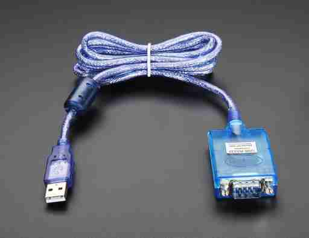
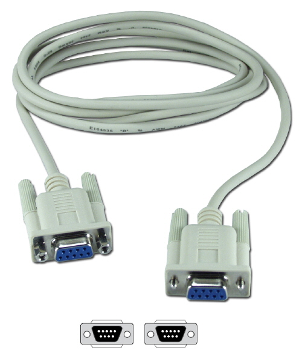
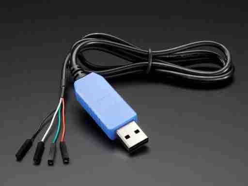
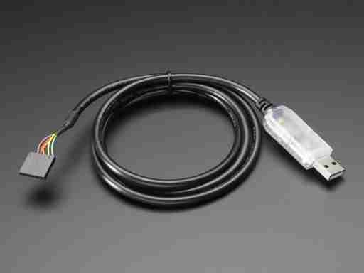
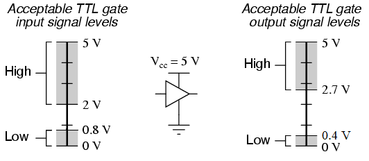

:::danger Incomplete

This document is not yet written.

:::

## Introduction

When accessing a headless system (i.e. a system not intended for normal human interaction), there is usually a serial console port. This port is usually engineered into the system for development, debugging, testing, and maintenance purposes. Often this serial interface is some variant of the Universal Asynchronous Receiver Transmitter (UART).

## Adapters and Cables

### RS232 to USB

You may sometimes hear folks refer to serial connections as RS232 and throw in terms like DTE (i.e. terminal) and DCE (i.e. modem). RS232 ports are often exposed to the end user. When connecting from a modern PC to a RS232 port, you'll often need a RS232 to USB adapter. When plugging in this adapter it'll often show up as a new COMx port on Windows or a /dev/ttyUSBx port in Linux.

While you may find an old RS232/Modem setup in some legacy cases, generally RS232 is connected without a modem by using something called a _null modem_. This is typically a DB9 cable where the transmit and receive lines have been swapped on one end. This type of cable is also referred to as a _cross over cable_. You'll then connect this cable from the RS232 adapter to the target device.

<!-- TODO: Example of setting up RS232. -->

### TTL to USB

When connecting to TTL serial interfaces internally, you'll want to get yourself a TTL to USB adapter.

In the above picture, the adapter brings out female leads (from left ot right) for GND, VCC, Rx/Tx.

Some boards implement the standardized FTDI cable header. The cable for this looks like the following image:

## Internal UART

When connecting to UART on a board that isn't exposed to the end user, its most likely going to be using transistor-transistor logic (TTL). TTL synchronously transmits 1 bit at a time at a given frequency. Typical TTL usually operates between 2.7V and 5V.

Internal TTL/UART connections may be on the board but not populated or labeled. This often leads us to having to guess where the UART ports are. UART only needs 1 pin for Rx and 1 pin for Tx so they'll often show up as a pair on the board. Some tricks for identifying UART/TTL connections:

- If there is a header, it is a good guess that'll you'll find serial UART somewhere there.
- If there are two unpopulated through hole connections next to each other (near the edge of the board or close to the MCU), these may be UART as well.

A cheap and slow way to find the UART is to first ensure that the pins to the potential UART don't exceed the expected voltage of the UART to USB adapter. Once the lines are deemed safe, you simply start guessing which one is Rx. For each connection that you assume is Rx and is outputting data, you'll need to guess the baud rate. I would try, from left to right: 115200, 9600, and 38400. All of these should be connected with 8-N-1 (8 bits, no parity, 1 stop bit) and use software flow control.

## Resources

- https://en.wikipedia.org/wiki/RS-232
- https://en.wikipedia.org/wiki/Null_modem
- https://en.wikipedia.org/wiki/Transistor%E2%80%93transistor_logic
