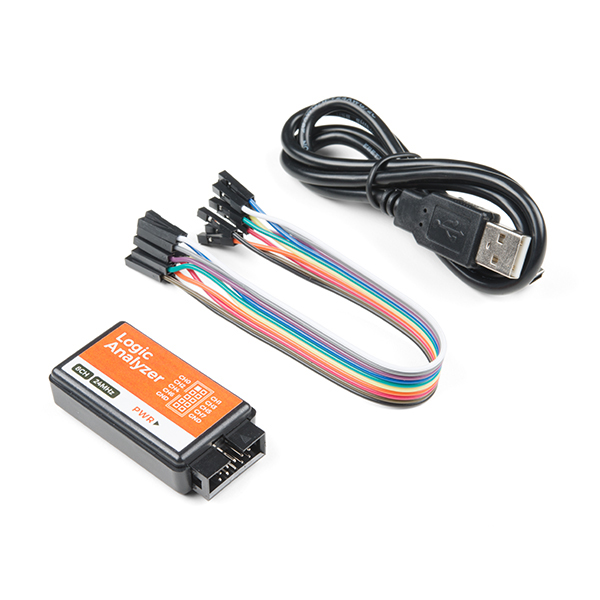
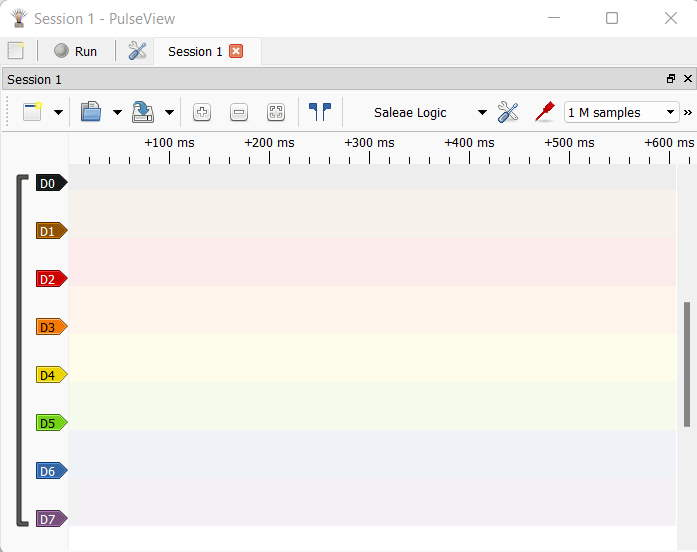
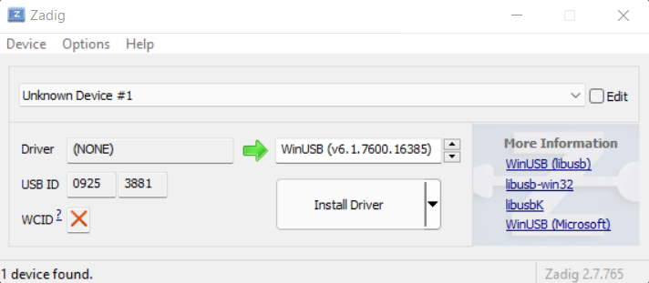
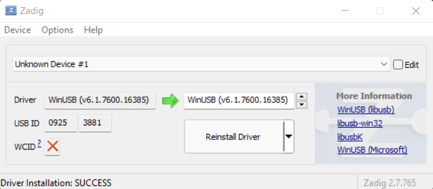
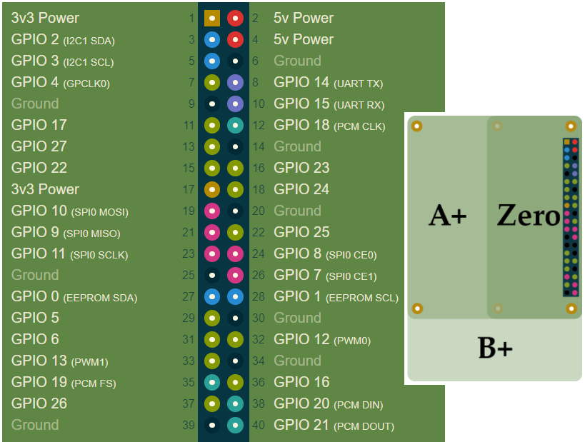
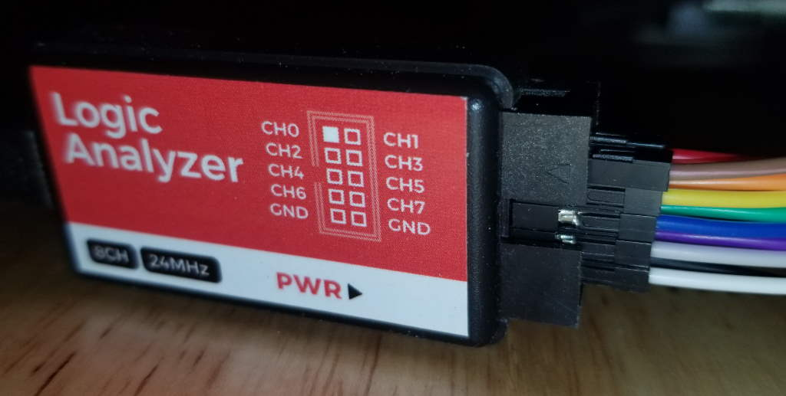
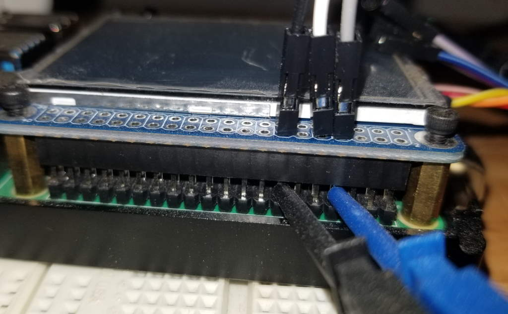
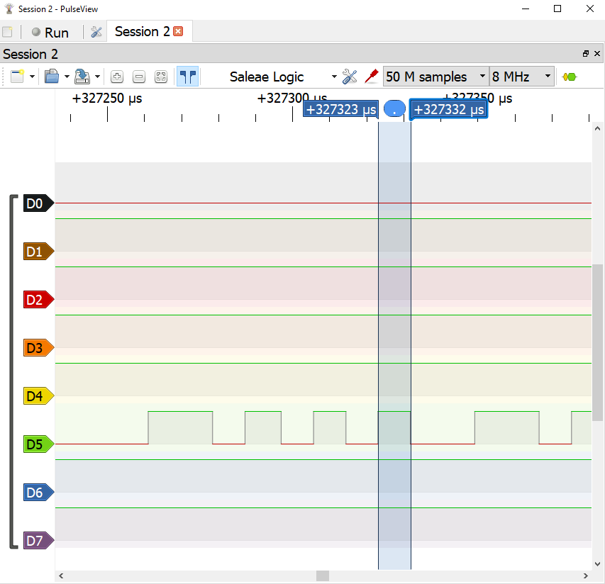

import ReactPlayer from 'react-player'

:::danger Incomplete

This document is not yet written.

:::

## Purpose

In this lab you'll be using a logic analyzer to measure and estimate the baud rate of the UART on the target device. Once you have a _good enough_ measurement of the baud rate, you'll use the FTDI MiniModule to verify the results by setting up a full UART connection to the target device.

## Overview

The *baud rate* of a signal is the number of times a signal can change state per second (i.e. the speed of the signal). Example: 1 baud is one signal pulse per second.

<details><summary>Click to compare baud and bits per second (bps).</summary><br />

:::note

Often you'll see that bits per second (i.e. bps) is used interchangeably with baud. You can sometimes get away with this in casual conversation, but its an incorrect assumption and must be considered whenever documenting observations or fact of. A baud is related to the speed at which a signal can change. A bit is a single bit of logical information. 

*Ok, so whats the difference in a signal pulse and a bit?*

A single signal pulse can represent multiple bits. For example, the protocol can include two bit values in a single pulse if there are four possible voltage levels for an activated pulse. This would allow a device transmitting at 1200 to communicate at 2400 bps. There are also more advanced techniques to perform bit *packing* that include things like quadrature amplitude modulation (QAM), but that exceeds the scope of this material.

The general idea: `bps = baud * number of bits per baud.`

In summary, baud does not always mean bits per second. That said, all of the serial protocols we'll study in the remainder of this material will be 1 bit per signal pulse.

:::

</details><br />

A logic analyzer is a device that takes samples of a number of connected data lines at a given frequency. These samples allow us to capture, visualize, and interpret digital signals. Using the logic analyzer and open source software called PulseView (by sigrok), we can estimate the actual baud rate based on observations made by the logic analyzer.



<!-- TODO: Show professional logic analyzer. -->

The gist is that given the microseconds (µs) of a single bit as X:

```text
baud = (1/X) * 1000000
```

## Acquire & Install Software

We'll be using PulseView as the driver for our 8 channel USB Logic Analyzer.



:::note

**Windows Prerequisite**: Before running PulseView, Windows users will need to install special USB drivers. In brief, Zadig is a tool that installs and registers WinUSB with specific types of USB devices. WinUSB allows software to control the USB device directly from an application instead of depending on a kernel mode driver.

1. Plug the USB side of the Logic Analyzer into the Windows machine.
2. Download and run a tool called [Zadig](https://zadig.akeo.ie/).

   

3. Once running, Zadig will allow you to register the WinUSB driver with the Logic Analyzer (identified by its vendor/device id `0925:3881`).
4. Click the Install Driver button. The driver installation can take a few minutes.
5. Once complete, you should see a window similar to the following (the driver version may vary):

   

PulseView also documents this same process on their [sigrok wiki](https://sigrok.org/wiki/Windows#Drivers).

:::

:::note

**Access Prerequisite**: Regardless of whether you are using Windows, Linux, or another PulseView supported platform, you are going to need to have direct access to the USB interface and device from the operating system. The simplest way to ensure PulseView has the required access is to execute PulseView with `sudo` in Linux/Mac. (Windows users likely have installed PulseView with *Administrator* so they can run PulseView normally.)

:::

The PulseView software can be downloaded from the [sigrok download site](https://sigrok.org/wiki/Downloads). At the time of this writing, PulseView 0.4.2 is the most recently released version. If you are using Microsoft Windows, you may be required to install as an *Administrator*. For linux users, download the AppImage file, `chown +x` the AppImage file, and then run it with `sudo` (i.e. no install necessary for AppImages).

At this point you should have the PulseView software installed. At this point, ensure the logic analyzer is disconnected from the PC until you have the correct connections on the Raspberry Pi. *Tip*: When interfacing with bare hardware you want to be cognizant of ESD sources and unexpected shorts. Keeping everything powered down (i.e. disconnected from USB) while fiddling with connections is a good practice.

## Connecting Logic Analyzer To Raspberry Pi

We're going to be connecting a single channel of the logic analyzer to the Raspberry Pi. Below is a pin out image of the Raspberry Pi's main header.



Given the above information:

- Can you determine the correct orientation of the header compared to the pin out information?
- Once you determine the correct orientation, do you see any difference between pin 1 (on the physical device) and the other "corner" pins?
- What is the ground pin?
- What pin is the receive pin for the UART interface?
- What pin is the transmit pin for the UART interface?

The logic analyzer that you are using will generally have ground (GND) pins and signal pins. The signal pins will be indexed, CH0, CH1, CH2, and so forth.

1. Connect one of the Analyzer channel pins to the Raspberry Pi UART receive pin.
2. Connect one of the Analyzer ground pins to a Raspberry Pi ground pin.

<details><summary>Click to see an example setup.</summary><br />

Here is an example setup:



In the above image, I've used CH5 (green) and GND (black) for my TTL connection.

Connect the logic analyzer to the clips. You can connect the clips to the Raspberry Pi without removing the TFT board like the following:



Note: The blue clip (connected to Rx) above is connected to CH5 (green) logic analyzer wire. The black clip (connected to RPi GND) is connected to the analyzer GND (black).

</details>

## Running PulseView

Once everything is securely hooked up (within reason):

1. Plug the logic analyzer into the PC.
2. Fire up the PulseView software. You'll know that the PulseView was able to detect the logic analyzer because it'll register the device as "Saleae Logic".
3. We're going to only capture a few seconds of data, so its a good idea to zoom out the PulseView signal view so that the visible units along the top are in seconds (between 0-10 seconds should suffice).
4. Also, the PulseView software has defaulted to capturing samples at 20khz. UART can operate at much higher frequencies, so to get an accurate estimate, we'll need to capture at no less than 8Mhz. Also, 8 Mhz is 400 times faster than 20khz, therefore we'll need to capture many more samples to even capture a few seconds. Set the sample count to 20M or more to allow yourself to capture enough data for analysis.
5. At the same time, turn on the RaspberryPi and click the Run button in PulseView to begin a capture.
6. At this point you can watch the output of the UART on the screen as little gray boxes popping up. After no more than 5 seconds, click the PulseView Stop button (located where the Run button was).
7. Zoom into an area of the capture where there is a noticeable about of data. *Tip*: I usually put my mouse cursor directly over the area I want to zoom and wheel forward.
8. While observing the signal pulses, identify the smallest common signal pulse width.

   - How wide is it?
   - What is the time duration from the time the signal goes up to the time the signal goes down?
   - What is your estimated baud rate given this information?

9. You can check the sanity of your calculations by clicking the *Add Protocol Decoder* button (to the right of the frequency setting.)
10. In the protocol decoder window, search for `UART` and double click the UART decoder that shows up. This'll add a UART0 channel in the signal viewer of the software.
11. Left click the UART0 symbol in the signal view, select the channel you listened to the UART receive data on for the RX drop down. Update the baud rate to the calculated baud rate. Click outside of dialog to apply changes.
12. Lastly, click the down arrow next to the "New View" button and select "Binary Decoder Output View".

You should at this point be able to see the decoded data in the Decoder Output view on the right of the window.

- Is the output most if not all printable characters?
- Does the output look like real *human readable* output?
- If you do a longer capture, what happens to the output over time?

<details><summary>Click to see video demonstration.</summary>

<ReactPlayer playing={false} controls url='/video/baud-uart-lab-html5.mp4' />

[Download MP4](/video/baud-uart-lab-html5.mp4)

</details>

## TTL via FTDI MiniModule

Now that we have a feel for the baud rate of the UART device, lets connect to the UART device with the FTDI MiniModule. This device is designed to allow engineers connected to various protocols (e.g. I2C, UART, JTAG) over USB.

### Setup FTDI MiniModule

### Connect with Minicom

Start `minicom` in setup mode by running: `sudo minicom -s`

Enter the `Serial port setup` screen from the menu below:

```text
            +-----[configuration]------+
            | Filenames and paths      |
            | File transfer protocols  |
            | Serial port setup        |
            | Modem and dialing        |
            | Screen and keyboard      |
            | Save setup as dfl        |
            | Save setup as..          |
            | Exit                     |
            | Exit from Minicom        |
            +--------------------------+
```

The defaults will likely look something like:

```text
    +-----------------------------------------------------------------------+
    | A -    Serial Device      : /dev/modem                                |
    | B - Lockfile Location     : /var/lock                                 |
    | C -   Callin Program      :                                           |
    | D -  Callout Program      :                                           |
    | E -    Bps/Par/Bits       : 115200 8N1                                |
    | F - Hardware Flow Control : Yes                                       |
    | G - Software Flow Control : No                                        |
    |                                                                       |
    |    Change which setting?                                              |
    +-----------------------------------------------------------------------+
            | Screen and keyboard      |
            | Save setup as dfl        |
            | Save setup as..          |
            | Exit                     |
            | Exit from Minicom        |
            +--------------------------+
```

Change the settings so that they look like this:

```text
    +-----------------------------------------------------------------------+
    | A -    Serial Device      : /dev/ttyUSB1                              |
    | B - Lockfile Location     : /var/lock                                 |
    | C -   Callin Program      :                                           |
    | D -  Callout Program      :                                           |
    | E -    Bps/Par/Bits       : 115200 8N1                                |
    | F - Hardware Flow Control : No                                        |
    | G - Software Flow Control : No                                        |
    |                                                                       |
    |    Change which setting?                                              |
    +-----------------------------------------------------------------------+
            | Screen and keyboard      |
            | Save setup as dfl        |
            | Save setup as..          |
            | Exit                     |
            | Exit from Minicom        |
            +--------------------------+
```

Go back to the previous menu and select `Exit` (not `Exit from Minicom`).

```text
            +-----[configuration]------+
            | Filenames and paths      |
            | File transfer protocols  |
            | Serial port setup        |
            | Modem and dialing        |
            | Screen and keyboard      |
            | Save setup as dfl        |
            | Save setup as..          |
            | Exit                     |
            | Exit from Minicom        |
            +--------------------------+
```

If everything was done correctly you'll see a window with the following output:

```text
Welcome to minicom 2.7.1

OPTIONS: I18n
Compiled on Dec 23 2019, 02:06:26.
Port /dev/ttyUSB1, 10:20:35

Press CTRL-A Z for help on special keys
```

Turn on the target device (i.e. Raspberry Pi) and wait a few seconds.

```text
PM_RSTS: 0x00001000
RPi: BOOTLOADER release VERSION:f8d1dc69 DATE: Jul 31 2020 TIME: 14:43:42 BOOTMODE: 0x00000006 pa: 0 BUILD_1
uSD volte 3.3V
Initialising SDRAM 'Micron' 16Gb x1 total-size: 16 Gbit 3200
XHCI-STOP
xHC ver: 256 HCS: 05000420 fc000031 00e70004 HCC: 002841eb
xHC ports 5 slots 32 intr4
Reset USB port-power 1000 ms
Boot mode: SD (01) order f4
SD HOST: 250000000 CTL0: 0x00000000 BUS: 100000 Hz actual: 100000 HZ div: 00 (1250) status: 0x1fff0000 dela0
SD HOST: 250000000 CTL0: 0x00000f00 BUS: 100000 Hz actual: 100000 HZ div: 25001250) status: 0x1fff0000 dela0
CID: 00035344534c31364780f4a811c00116
CSD: 400e00325b590000767f800a404000
SD: bus-width: 4 spec: 2 SCR: 0x02358003 0x00000000
SD HOST: 250000000 CTL0: 0x00000f04 BUS: 50000000 Hz actu: 41666666 HZ div: 6 (3) status: 0x1fff0000 delay:2
MBR: 0x002000,  524288 type: 0x0c
MBR: 0x00082000,30583808 type: 0x83
MBR: 00000000,       0 type: 0x00
MBR: 0x00000000,       0 type: 00
lba: 8192 oem: 'mkfs.fat' volume: ' boot       '
rsc 32 fat-sectors 4033 c-count 516190 c-size 1 r-dir 2 r-sec 0
PM_RSTS: 0x00001000
Partition: 0
lba: 8192 oem: 'mkfs.fat' vume: ' boot       '
rsc 32 fat-sectors 4033 c-count 516190 c-size 1 rir 2 r-sec 0
Read config.txt bytes     2602 hnd 0x00002e47 hash '24a097e7948fa675'
recover4.elf not found (6)
recovery.elf not found (6)
...
```

### Screen

Startup screen with: `$ sudo screen /dev/ttyUSB1 115200`

### cat/echo

Minicom and screen have a lot of terminal emulation features and are the best way to proceed. In situations where you aren't able to fire up something like minicom or screen, you aren't immediately stuck. You can get away with a lot by using just `cat` and `echo`.

For example, you can setup the UART device in linux so that it'll output to STDOUT via the following command:

`sudo cat /dev/ttyUSB1 &`

Then whenever you `echo` something to `/dev/ttyUSB1`, the response will pop up in the current terminal as if you just ran the command locally.

<details><summary>See information about issues with `-bash: /dev/ttyUSB1: Permission denied`</summary><br />

Add yourself to `dialout` group or `sudo chmod 666 /dev/ttyUSB1`.

</details>

With a little linux foo, you can throw together a script that'll act as a lightweight (and very limited) terminal program (like screen/minicom).

<details><summary>Click to see and example bash script.</summary><br />

```text
#!/usr/bin/bash

DEV_PATH=/dev/ttyUSB1

trap ctrl_c INT

cat $DEV_PATH &
CAT_PID=$!

function ctrl_c() {
  kill $CAT_PID
  stty icanon echo
  echo ""
  exit 0
}

read_char() {
  stty -icanon -echo
  eval "$1=\$(dd bs=1 count=1 2>/dev/null)"
  stty icanon echo
}

read_char char

while true; do
  read_char CMD_CHAR
  #read -sn1 CMD_CHAR
  if [ "$CMD_CHAR" == "" ]; then
    echo > $DEV_PATH
  else
    echo -n "$CMD_CHAR" > $DEV_PATH
  fi
done
```

</details>



In the above screenshot, channel `D5` is the Rx pin of the UART. When we measure the timing of a single bit, it's measure in at 8.75 µs. Plugging this into our equation, we get `(1/8.75) * 1000000` or 114285 baud. If we attempt to use this baud rate, it'll work for a little bit, but it'll eventually drift off the clock cycle and lose bits. Either way, it gives us a good indication of where to start.

<!-- TODO: Show some fruits of serial access labor. -->

## Serial Terminal

## Booter Output


## Resource

- https://www.youtube.com/watch?v=IyGwvGzrqp8