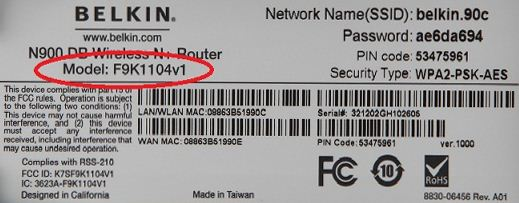
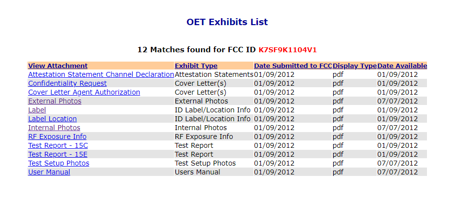

Ok, so we've been asked to get all the information we can about a Belkin that we intend to perform some deep analysis on. Without any tear down, what information can we glean?

All the information we're initially given is the following picture:

## End User Information

Starting with the End User information, we've got:

- Make: Belkin
- Family: N900 DB Wireless N Router
- Model: F9K1104v1
- Default SSID: belkin.90c
- Default Password: ae6da694
- PIN Code: 53475961
- Security Type: WPA-PSK-AES

## Networking Information

Anyone who knows about networking and the OSI model should recognize the value of a MAC Addresses:

- LAN/WLAN MAC: 09:96:3B:51:99:0C
- WAN MAN: 08:86:3B:51:99:CE

We can sometimes infer some more information from these MAC addresses based on a OUI lookup. In contrast to _operating under the influence_, OUI in this context refers to [Organizationally Unique Identifier](https://en.wikipedia.org/wiki/Organizationally_unique_identifier). When searching for the WAN MAC address with Wireshark.org's [OUI Lookup tool](https://www.wireshark.org/tools/oui-lookup.html), Wireshark.org confirms that `08:86:3B` is registered to Belkin International Inc.

Also, when we later perform some runtime analysis of the device, we now know we can potentially filter on this MAC address when doing a packet capture.

## Other Vendor Identifications

- Version: 1000 (also, V1 in FCC ID)
- Serial #: 321202GH102505

The version usually refers to the hardware revision. Whenever a part is replaced, a new board layout, or schematic update is used, this number _may_ change, **but not always**!

The serial number should uniquely define the device, but for additional purposes, vendors may sometimes encode feature specific identifiers into the serial number. For example, the GH is likely a demarcation of the serial number to signify something.

## Certifications

When commercial devices, like this Belkin router are sold in countries like the US or Canada, there are always FCC IDs and IC IDs. Our device has:

- IC ID: 3623A-F9K1104V1
- FCC ID: K7SF9K1104V1
- RoHS: 8830-06456 Rev A01

### Industry Canada (IC)

The IC ID, when looked up with the [Radio Equipment Search](https://sms-sgs.ic.gc.ca/equipmentSearch/searchRadioEquipments?execution=e1s1&lang=en) in Industry Canada's site get us:

- Approval Date: Wed Feb 15 00:00:00 EST 2012
- Type of Radio: Spread Spectrum or Digital Device (2400-2483.5 MHz) & Spread Spectrum or Digital Device (5725-5850 MHz)
- [Emission Details are provided across the bands](https://sms-sgs.ic.gc.ca/equipmentSearch/searchRadioEquipments?execution=e1s5&index=0).

While this doesn't provide immediate value add, if this wasn't a device will well known frequency ranges, this could be used as a starting point for dialing in on a spectrum analyzer and other related RF capturing equipment.

### Federal Communications Commission (FCC)

The FCC ID, when looked up with the [FCC ID Search](https://www.fcc.gov/oet/ea/fccid) nets us all kinds of nice information. For starters, when we search we need to break up the FCC ID into the first three characters and then the rest (likely a model number):

`K7SF9K1104V1` becomes `K7S` (grantee) and `F9K1104V1` (product)

Once you dial that into the [FCC ID Search](https://www.fcc.gov/oet/ea/fccid), you be met with a table of the different radios or emitting devices in the Belkin. If you simply click the details and click through to the exhibits, you'll see a table similar to:

First thing we'll want to look at is the _Confidentiality Request_. This document is likely to list the most valuable to look at right at the get go. Looking at this document, it shows that there are semi-sensitive items that were held confidential for 180 days. This is likely to protect the company's brand before a device release:

- External Photos
- Internal Photos
- Test Setup Photos
- User's Manual

Clicking on the external photos will get you a [document with some profile pictures](./Initial_Analysis/FCC-K7SF9K1104V1-external-photo-belkin.pdf) of the device. From only a picture of the Belkin label, we now have an idea of what the device looks like and the dimensions of the device. Notice the last photo provides us with power input (something we've been ignorant of up to now.):

- Dimensions: ~ 20cm H x 20cm D
- Device Input Power: 12V / 3.3A / 39.6W max

Clicking on the internal photos will get you a [document with some pictures from the inside of the device](./Initial_Analysis/FCC-K7SF9K1104V1-internal-photos.pdf). This document is essentially a tear down of the device that can be used as an un-narrated instruction manual for disassembly. On page 9 of this document, there is a nice zoom in with the radio chips used:

- [Nanya NTSCB64M160P-CF](https://www.jotrin.com/product/parts/NT5CB64M160P-CF): DRAM Chip, 64000k, 16bits [datasheet](./Initial_Analysis/NT5CB64M16DP-CF-datasheet-DigChip.pdf)
- Ubicom - IP8000A0 (couldn't find more info)
- IDT 85HP85570 (couldn't find more info)

Other internal photos of interest include the pictures of the daughter cards:

- A2HP02, S/N: 117402679, MAC: 08863B51694D
- 112321016141, P/N: 5816A0474020
- 113421036045, P/N: 5816A0475020

In general, we also get a good look at the cans around the radio components. These cans can sometimes be pried off, but usually need a little heat to release the solder that holds them to the ground plane of the board.

Finally, clicking on the user's manual link with get you, you guessed it, [a user's manual](./Initial_Analysis/belkin-user-manual.pdf). This is useful for getting a knowledge base of the services that the router provides for the end user. From the user manual alone we can glean:

- Services: HTTP, WPS, USB, Backup, UPnP, DLNA, Guest Access
- 802.11n, QoS, VPN, VoIP, NAT, Belkin Monitor?, Gig ports
- DDNS, WAN Ping Blocking, Logging, WEP supported
- Default Address: `http://192.168.2.1`
- Self Update Process
- Firmware Version (in Manual): F5DB232-4_WW_1.00.03
- Firmware To Be Loaded: F5DB232-4_WW_1.00.15.bin
- Factory Reset (config or firmware restored?)

When you begin static software analysis, you can use this firmware identification to identify other attributes about the system (e.g. architecture, primary flash size, file system, boot loader).

## Conclusion

The information that we discovered above is quite a bit of information for a device that we haven't even seen, much less opened up and visually analyzed outselves.

While results may very from device to device, you should now have an idea of how valuable those noisy labels can be on the back of devices you intend to tear down.

Just remember, if there is a screw or lock under the sticker, capture all the information in a safe place before destroying the label to get into the case.
