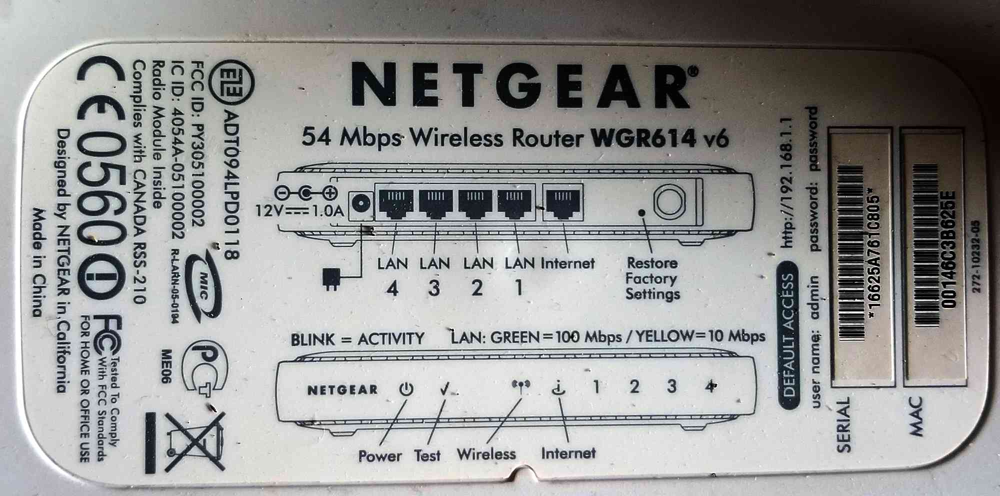
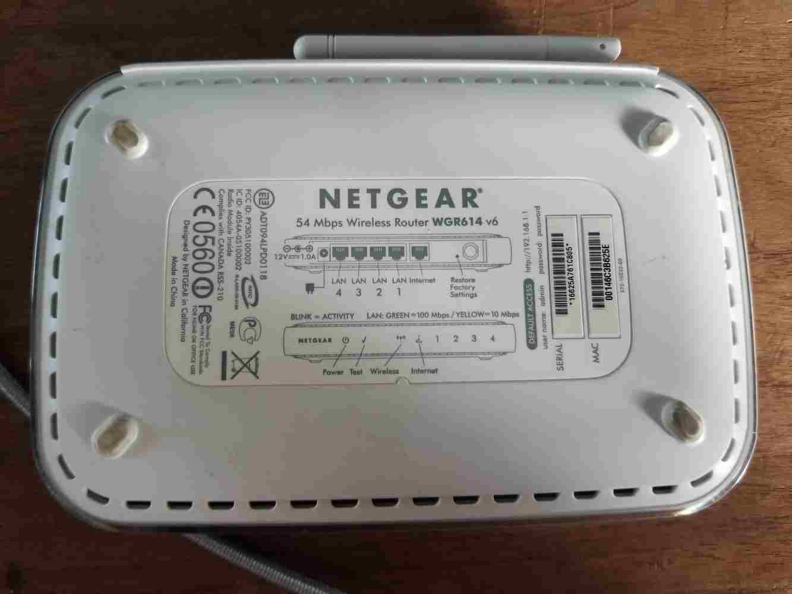
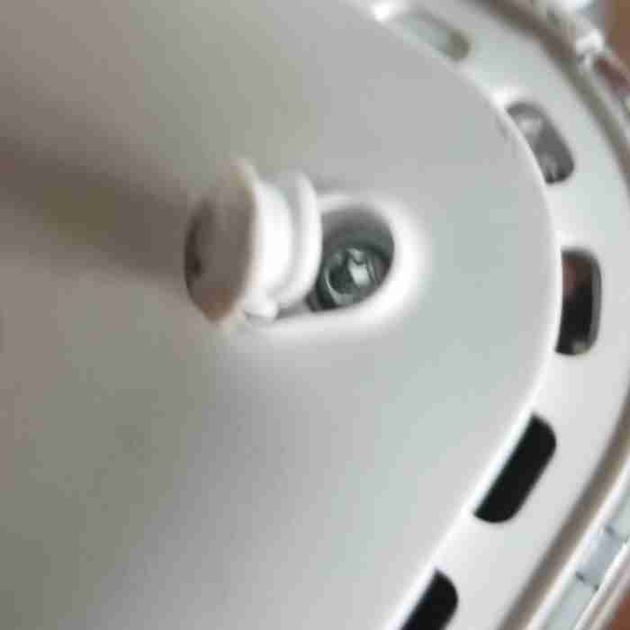
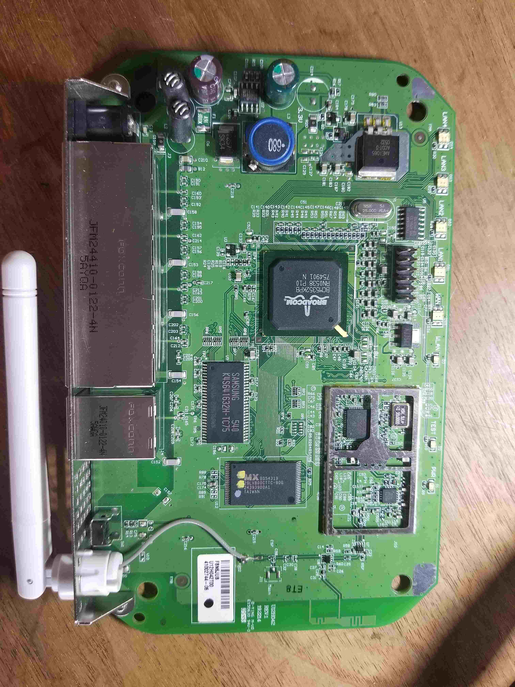
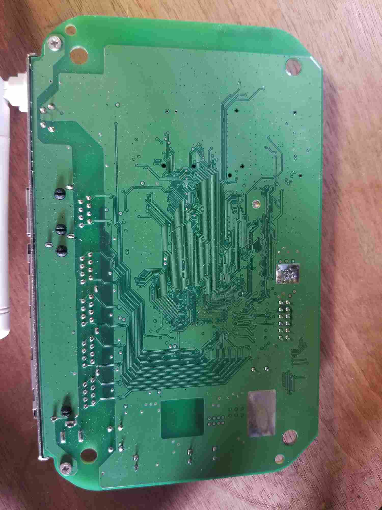

## Overview

We've just been handed an old Netgear WGR614 Router and asked to profile the device for some potential reverse engineering. The approach will be to:

1. Perform external analysis, capturing what we can without popping the case.
2. Perform internal analysis, capturing what we can on whats under the case.
3. Identify device components and locate datasheets.

## External Analysis

The first observable bit of information about this router is the label on the bottom of the case:

To summarize the contents:

- **Make:** Netgear
- **Model:** 54 Mbps Wireless Router WGR614 v6
- **Power:** 12VDC / 1.0A (barrel connector)
- **Default Access:** http://192.168.1.1
- **user name:** admin
- **password:** password
- **Serial:** 16625A761C805
- **MAC:** 00146C3B625E
- **Netgear Spec:** 272-10232-05
- **EZE:** ADT094LPD0118
- **FCC ID:** PY305100002
- **IC ID:** 4054A-05100002

Other Misc Notes:

- Has "Restore Factory Settings" button. \_Is this firmware restore or only config restore?
- 4 LAN ports, 1 WAN port.

### Discovered Certification Resources

- [IC ID Info](./NetgearTeardown/IC-ID-Info.pdf)
- [FCC External Photos](./NetgearTeardown/fcc-netgear-external-photos.pdf)
- [FCC Internal Photos](./NetgearTeardown/fcc-netgear-internal-photos.pdf)
- [FCC Manual #1](./NetgearTeardown/fcc-netgear-manual-1.pdf)
- [FCC Manual #2](./NetgearTeardown/fcc-netgear-manual-2.pdf)
- [FCC Manual #3](./NetgearTeardown/fcc-netgear-manual-3.pdf)

### FCC / IC Findings

- SoC based on Broadcom BCM5352
- Wifi based on Broadcom BCM2050
- 802.11g wireless, WPA-PSK, WEP
- Firewall / NAT
- 10/100 Mbps Ethernet w/ Auto-negotiation
- Flash memory and upgradable
- Logging
- DHCP, PPPoE, DNS Proxy (Caching?)
- Power: 12VDC / 1A / **22W max**
- UPnP
- Other stuff!
- [BCM5352 Product Brief](./NetgearTeardown/bcm5352-product-brief.pdf)

## Internal Analysis

Once again, just doing external analysis nets us an amazing amount of information and we haven't even opened the device yet. But enough of that, time to crack this bad boy open. Where are the screws?

First I push against the label to see if there are any hidden screw holes under the sticker. In the middle there is what you might think is a shallow hole, but this is just a impression left by the injection molding process of the case. Lets pick at those feet and see if there are screws under them.

There are 4 screws (one for each foot). Once they come out, the case comes right apart (i.e. no need for prying cantilever snaps). In fact, the case holds the board in place, so once the case is in two pieces, the internal PCB slides right out. Here is a snapshot of the board from the top and bottom:

### Catalog Parts

With what I see, I immediately start writing down part numbers to start to make sense of the device.

**Outside EMI Shield:**

- Broadcom BCM5352KPB - Integrated 802.11G ROUTER WITH BROADRANGE SoC
  - [[product-brief](./NetgearTeardown/bcm5352-product-brief.pdf)]
  - [[picture](./NetgearTeardown/broadcom-mcu.jpg)]
- Samsung K4S641632H-TC75 - 64Mb SDRAM
  - [[datasheet](./NetgearTeardown/K4S-64163.pdf)]
  - [[washed out picture](./NetgearTeardown/samsung-k4s641632h-tc75-washedout.jpg)] - Original Picture
  - [[painted label picture](./NetgearTeardown/painted-id-plus80contrast.jpg)] - 80% Contrast
  - [[etched label picture](./NetgearTeardown/etched-id-plus50contrast.jpg)] - Angled Light + 50% Contrast
- MX 29LV800CTTC-90G - 8M-bit[1Mx8/512K x16] CMOS Single Voltage 3V Only Flash Memory
  - [[datasheet](./NetgearTeardown/29LV800CBTC-90G_MacronixInternational.pdf)]
  - [[picture](./NetgearTeardown/mx-29LV800CTTC-90G.jpg)]
- 74LVC04AD - Nexperia Hex Inverter
  - [[datasheet](./NetgearTeardown/74LVC04A-nexperia.pdf)]
  - [[picture](./NetgearTeardown/74LVC04AD-next-to-header.jpg)] - 100% Contrast

**In EMI Shield:**

- Broadcom BCM2050KML - 2.4 GHz Radio Single Chip System on a Chip
- SiGe 2525L 5273R
  - ?? Single Crystal Semiconductor Silicon-Germanium (SiGe) ??

### Observation: Ground Point with Screws

The simplest way to find ground traces is to start with screws. If we look at the following screw, by itself it isn't obvious that the screw has any connectivity the ground plane.

But if we flip the board over we see the rear metal casing is held to the board by the same metal screw. What happens if we remove the screws?

As you can see, the screw _has_ led us to a ground through its conductive connection to the metal casing and then to the exposed pad beneath the case's mount point.

### Observation: Ground Points With _crosses_

It is common to connect ground pins with cross connections to ensure strong conductivity. These appear at small crosses over the pin.

### Observation: Not All Thick Traces Are Ground

Its never safe to assume that a large or thick trace is ground. Case in point, in the following image, you can see the silk screen labeling a large trace on the board as the 3.3v plane. Note: The image above is the bottom of C114 and C115 pictured below.

#### Observation: Ground Points with EMI Shielding

Because of the EMI shielding's need for a strong ground plane connection, we can immediately deduce that the ground plane is where the EMI shield frame is soldered to the board:

### Observation: Header Pin With Ground

Its nice to find a common ground on a header because then we can use jumper cables or clips instead of having to solder wires to the board. In the following image, each side of a mirror of the other in regards to the pin outs. The top inner pins are the ground because we can see the via beneath that header pin is connected to ground with a "cross" looking connection.

### Observation: Built-in Internal Antenna

The following is an image of the circuit that connects the radio to the external antenna as well as an internal antenna that is manufactured into the board. While this internal antenna likely has a lower distance and lower quality filtering characteristics, it is there.

### Observation: More Convenient Probe Points

The following image shows that in one small area we can find probe points for ground in the screw, the crossed through hole via, and possible in the small exposed hole between the two.

<!-- Make: Netgear
Family: 54 Mbps Wireless Router
Model: WGR614 v6

User: admin
Password: admin
Serial: 16625A761C805
MAC: 00:14:6C:3B:62:5E
MAC OUI: 00:14:6C Netgear
Default Access: http://192.168.1.1
Power: 12V / 1A

EZE?: ADT 094LPD0118

Note: ADT likely means Advanced Data Technology Corporation (ADT) of Taiwan (from FCC Power of Attorney document).

FCC ID: PY305100002
IC ID: 4054A-05100002
MIC: R-LARN-05-0194
PCT ME06
CE 0560

Netgear Specification #: 272-10232-05
Note: Label sample from FCC shows a "Netgear Spec" as 270-10001-01.

Note: FCC Label Sample different than real label.

Google: filetype:pdf BCM5352

CE (formerly EC) stands for “Conformité Européenne", the French for European conformity. ... its an EU thing. There is a very similar logo where the CE stands for Chinese Export or China Export – this has nothing to do with European conformity. CE mark must be at least 5 mm high.

[RAPEX](https://ec.europa.eu/safety-gate-alerts/screen/webReport#weeklyReports) - Alert system for non-CE compliant products.

https://www.netgear.com/support/product/WGR614v6.aspx

https://embeddedbits.org/2020-02-20-extracting-firmware-from-devices-using-jtag/

https://infodepot.fandom.com/wiki/Netgear_WGR614_v6.0

https://forum.dd-wrt.com/phpBB2/viewtopic.php?t=44439

https://infodepot.fandom.com/wiki/Network

https://community.netgear.com/t5/General-WiFi-Routers-Non/Guide-How-to-quot-unbrick-quot-your-WGR614v9-after-a-bad/td-p/153385

-->
