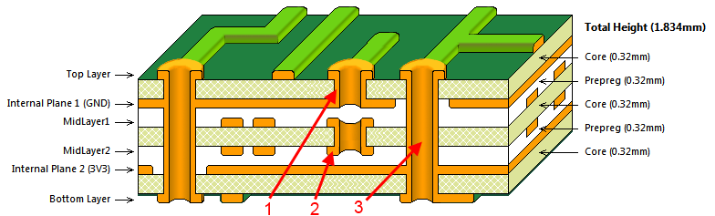
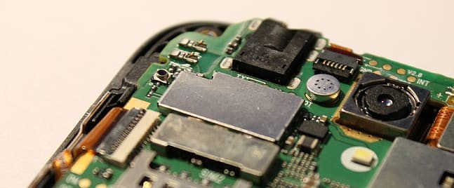
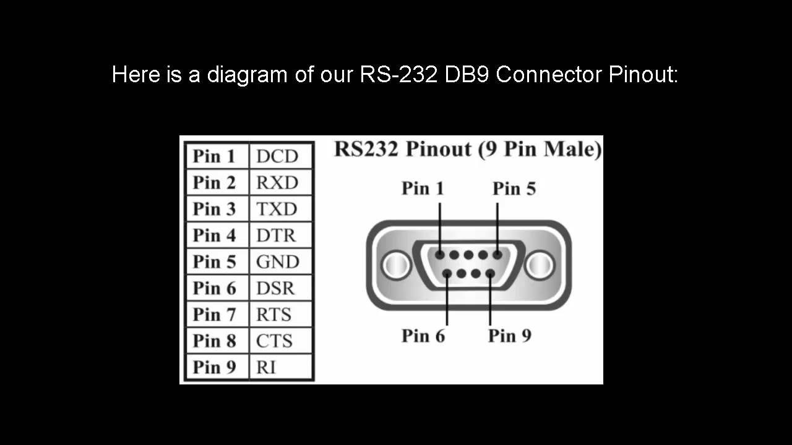
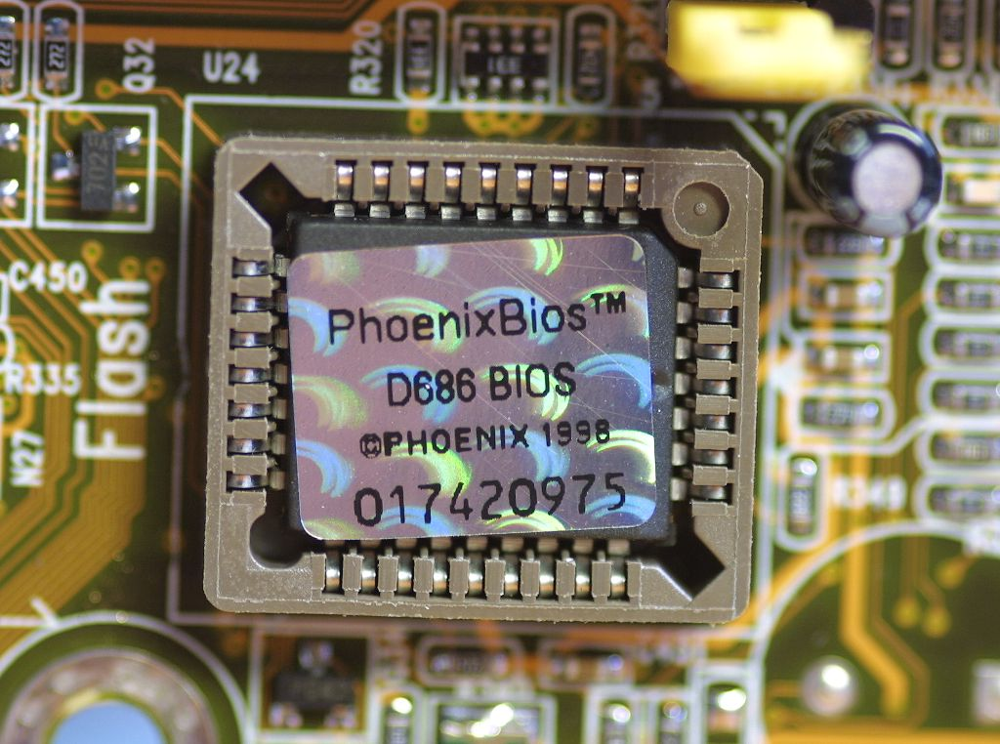
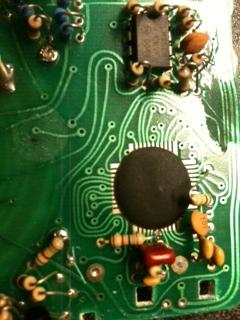

## Overview

Assuming you've successfully removed (reversibly or through more aggressive means) the aesthetic cover from the target device we can now start to perform some non-invasive/non-interactive visual analysis of the hardware. In general we want to cover the following bullets:

- Removal of the cover (i.e. any aesthetic covers that are obscuring the actual PCB).
- Locate Power and Ground Access
- IC Identification (i.e. What chips are on the board.)
- Silk Screen - Usually the white writing on the PCB.

## Printed Circuit Board (PCB) Primer

### Layers and Vias

Printed circuit boards (PCB) are the boards that hold together components that are interconnected with a conductive material (e.g. copper). The PCB is classically a green color, but can be coated with any color during the fabrication process. Visually these circuit boards have 2 layers; one that we consider the _top_ and one we consider the _bottom_. To canonical-ize top from bottom, I usually consider the side that generates the most heat as the top. (But this isn't always true in bad designs!) Typically, the top of the board is where the majority of the discrete components and ICs will be located, although on more populated boards you'll find many passive components on the underside as well.

While you visually only see the two mentioned layers, a PCB can be many layers. Below is a cross cut model of how a multi-layer PCB is organized [Source](https://www.pcbpower.com/blog-detail/important-considerations-while-designing-a-multi-layer-board):

The way that PCBs circuits on one layer connect to the other layers are through what are called _vias_. (i.e. Layer A connects to Layer B _via_ this trace.). There are a few common types of vias shown in the above image:

1. Blind Via - These are vias that you might see on one side of the board but can't visually trace to the other.
2. Buried Via - These are vias that you may never be able to observe (without an X-Ray).
3. Through-hole Via - These are vias that feel like they make logical sense to trace through a board. **Note:** What could appear to be a through hole via could in fact be a combination of stacked blind vias or buried vias, thwarting any visual assumptions.

### Silk Screen

The white writing that appears on top of the green layer of a PCB is the silk screen. This is where various identifiers, labels are marked for human readability. You'll often see nearly meaningless things like R45, J7, S36, or C12. These are marking the various jumpers, switches, ICs, or other discrete components on the board. Sometimes they'll also include goodies like a header pin out or the purpose of some unsoldered component (e.g. UART, I2C, SPI, JTAG).

Attempting to understand and capture as much of the silk screen as possible can be a quick way to get to know your way around an unfamiliar board. If nothing else, the markings give you barrings that you can use when working with others or for your notes when observing various behaviors.

TODO: Show various examples of silk screen information.

### Visually Locating Ground

In many PCB designs, the power rail or the ground rail will be an entire inside layer of the PCB. This can drastically simplify the board layout because power and ground are a _via_ away. Knowing which is which is key to follow up hardware analysis. There are some obvious visual queues that allow us to identify, first, ground and then perhaps power.

Ground is the most important thing in a circuit. Its where electrons comes from, the [ground reference is how we measure the voltage](<https://en.wikipedia.org/wiki/Ground_(electricity)>), and ground has other electrical noise related properties.

To locate ground you can usually start with any screws or other fasteners. Screws are almost always grounded and therefore the screw hole is lined with an exposed trace that leads to ground traces.

[Source](https://www.pxfuel.com/en/free-photo-oyxuu)

Another method for finding ground is by looking at shields or cans around radio circuitry. These shields or cans are always grounded to absorb electrical magnetic interference (EMI) that could interfere with the quality of the radio circuitry.

[Source](https://www.pxfuel.com/en/free-photo-xoumq)

<!-- TODO: This next paragraph needs work. -->

Many boards that have wireless capabilities will have a large ground plane on their surface. These boards will literally fill any empty space with a conductive material connected to ground. _Note:_ Although not suggested in devices you are being gentile with, in a pinch you can scratch away some of the (green) protective coating to get access to the ground plane. While these _planes_ can be tempting to assume ground, its often that board designers will make fat traces or planes for the power rail (i.e. the opposite of ground) as well. In PCBs that have more than 2 layers, there is usually an entire layer in the PCB dedicated to ground, which can lead to only ground vias being visible.

Using knowledge about any cabling pin outs to surmise the ground by tracing from the cable ground pin to the ground plane or a ground trace. For example, if there is an DB9-RS232 connection on the device, you can find ground by tracing pin 5 (or the outer metal housing) of the DB9 connector:

[Source](https://www.youtube.com/watch?v=GHYHrNmKq2E)

## IC Identification

While you are attempting to ascertain as much information about the board based on the traces and silk screen, you also should catalog as many of the integrated circuits (IC) as you can from the board. Once I've captured the IC model numbers, I basically begin the long process of rolling the dice on whether I can find datasheets for them.

<!-- TODO: Talk about multiple lines (e.g. model/when-where), parsing the identifiers (e.g. model, series, specifics), and using manufacturer logos. -->
<!-- TODO: When looking for a datasheet, know the purpose of the IC and know the part number. -->

### Capturing Those Tiny Things

The make and model are the most important, but honestly a camera on a stand is your best friend in this situation. I find that looking at IC model numbers is one of the most physically stressful aspects of this whole process. These little buggers are some times painted on, sometimes they are etched in, sometimes they are smudged, and sometimes they degraded to the point where I'm looking at merely paint residue to deduce what I think the characters are.

When simple eye sight doesn't work and you don't have a nice lab scope, I've found a couple different tricks to clarify the characters:

- If you're lucky you can just snap a picture with a large mega-pixel resolution so that when loaded on a phone or computer you can simply zoom in and read the characters.
- When taking picture of the chip, turn flash off and shine a separate angled light at the chip to reflect off the surface of the chip. You may feel inclined to rotate the board to take advantage of the ambient room light. While this sometimes works, having a separate light allows for more tight spaces to be illuminated when tall capacitors or other board features cast shadows over the identifier.
- When taking a picture isn't working, try doing a video capture while slowly rotating the light in different angles of the chip. You'll likely notice that different angles of the light will show different characters on the chip with varying clarity. You can now go back and frame by frame determine the full identifier of the chip.

### Stickers

At times you may find that an IC has a sticker or "holographic" certification image and whatnot. Always capture what you can from these, but know that they sometimes hide details about the chip. Carefully peeling away the stickers can reveal identifiers that lead to datasheets and other relevant information. **Note:** Using any kind of adhesive remover is likely to remove painted markings from the chip.

[Source](https://forums.tomshardware.com/threads/bios-chip-location.393676/)

### Epoxy Blobs

At times I've opened a device to find a bunch of traces going to a _hill_ of epoxy. This is likely some IC that has been obscured or an IC that has been adhered to the board without packaging to save costs. Extracting information from such a device is outside the scope of non-invasive visual inspection, but I would still recommend capturing that it exists. You may be able to determine its purpose and ID via software during the software analysis phase.

[Source](https://electronics.stackexchange.com/questions/9137/what-kind-of-components-are-black-blobs-on-a-pcb)

## Datasheets

Datasheets are your friends. These documents can be anything from a 3 page product brief, to 10s of pages for assembly, to 100s/1000s of pages for technical programmer data. Obviously our goal is to get as much information as we can about our target device, but getting the complete and official vendor documentation isn't always feasible. In many situations, the official documentation is locked behind sketchy pay walls or Nondisclosure Agreements.

When searching for datasheets on the internet, there is a large market of advertisers and scammers that return search results saying they have everything when in reality they'll give you some sub string search of what you need while filling your screen with ads and adware. Some popular sites that often disappoint include: alldatasheetarchive.com, datasheet-archive.com, and so forth.

### Consider Competitor Compatibility

Sometimes not having the exact datasheet can be acceptable. Manufacturers will sometimes match the pin out of a competitor and when you know this to be true you can derive the pin outs of your target device from a competitor's datasheet. If you're really lucky, some of the register addresses may match as well.

### Use More Powerful Queries

When googling, its often wise to use search syntax to limit the types of results that show up.

- Use site specific qualifiers, for example if you know you can trust datasheetpdf.com, perhaps use `site:datasheetpdf.com` in your google query. You can also negate untrustworthy sites by prepending a hypen in front of the entry, `-site:alldatasheetarchive.com`.

- Use file type qualifiers. More often than not, datasheets are presented as a PDF and therefore you can add `filetype:pdf` to your google queries so that only PDF files that google has crawled will show up. This also has the additional benefit of allowing you to grab a cached version of the file if the site is unavailable for what ever reason.

### Use Linux Community

Linux is often used or supported on many embedded systems. This is supported by both the vendors and other reverse engineering / repurposing communities. Use these communities as a resources for discovering the internals of your target devices. This is usually more related to software analysis, but often you can find observational notes and experiments done by community members, saving you time and effort. Some examples of projects to check out include:

- [Linux](https://www.kernel.org/) - and all its drivers, device trees (new 3.11+ kernels), and board implementations (older 2.6-3.10 kernels)
- [OpenWRT](https://openwrt.org/) - Linux distro builder that targets embedded systems.
- [DD-WRT](https://dd-wrt.com/) - Linux distro builder that targets embedded systems.
- [PolarCloud's Tomato](http://www.polarcloud.com/tomato) - Replacement firmware that supported Broadcom chips.
