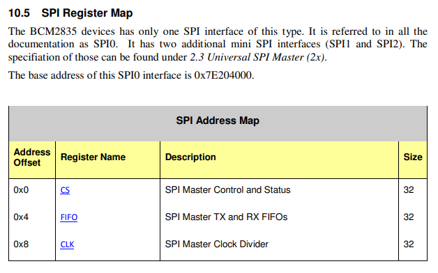

:::danger Incomplete

This document is not yet written.

:::

## Objectives To Describe

- Review what we know:

  - We have an understanding of our target device's behavior.
  - We have a toolchain to create tools for our target device.

- What is virtual vs physical memory?
  - Kinds of memory access (virtual, physical, IO ports, SFRs)
  - How do MMU's work?
- What is a memory map?
  - Volatile memory (SRAM, DRAM).
  - Block diagrams?
  - Memory mapped registers.
  - Pin configurations.
  - Peripherals.

## Overview

To explain system IO and physical memory, I find its best to describe it from the context of a normal user process and branch out from there. Before I go through describing the diagram below, please keep in mind that physical memory is misleading. Its not neccessarily memory at all, its actually just address space. These addresses point to digital logic or peripherals in the system. We refer to it as physical memory because we use it to access memory more than anything else and has become part of the nomenclature. But to ensure this idea sticks ... **physical memory is not memory, its address space**.

## Memory Management


In the above image you've got 2 programs loaded into memory, Program A and Program B. They are both loaded into virtual memory. These programs _think_ they are alone within the entire address space. In reality, the data loaded at the addresses from the program's perspective are loaded into completely different addresses in the actual memory circuitry. This is accomplished through a component referred to as the memory management unit (MMU). Note: I will refer to memory managed memory as virtual memory, other documentation may refer to it as protected memory.

The memory management unit is exposed to the CPU on one side and all of the components mapped into physical memory on the other. When the CPU (i.e. program) wants to access any component associated with a physical memory address, it goes through the MMU to access it. At this point, its worth noting that volatile memory that is used by the program for the stack and heap runs in RAM. **RAM is a component.** It just so happens that its so ubiquitous for the operation of software that we don't often think of RAM as a peripheral that is mapped into our address space.

In the physical address space on the right side of the diagram, I've shown 3 components:

- RAM
- Peripheral A
- Peripheral B

These peripherals can be anything from directly connected components like a real time clock (RTC), watchdog timer (WDT), or a temperature sensor. Often, the component is a bus that itself has an array of components. Bus like peripherals could be a GPIO controller, I2C, SPI, or USB to name a few. In the case of buses, the code talking to these buses typically has a driver for abstracting away the low level communication when talking to the targeted component.

In linux, when a program is loaded, the kernel automatically memory maps the RAM into the program's virtual address space. This allows the program to be loaded and run. On the other hand, if the kernel or a program desire to directly access peripheral address space (i.e. physical memory), they must memory map (i.e. `mmap()` in C) the physical address into virtual memory address space. In Linux, the device file `/dev/mem` is usually exposed in embedded system builds for this purpose. If your system doesn't have `/dev/mem`, you can create it with:

```sh
mknod -m 660 /dev/mem c 1 1
```

### mmap()

`mmap()` can be used to map a file into virtual memory. Our intentions here are to mount the physical memory device file into memory. This effectively allows us to map any physical address into our address space for direct peripheral access.

```c
#include <sys/mman.h>
void *mmap(void *addr, size_t length, int prot, int flags, int fd, off_t offset);
```

When calling `mmap()`, you provide:

- The virtual memory address (`addr`) is only a hint for where to put the mapping in virtual address space, make it `NULL`.
- The `length` of the address space to access. Must be in `0x1000` (4KiB) increments.
- The protection level of the map determines what memory accesses are allowed (e.g. read, write, exec).
- The `flags` determine the visibility of the mapping.
- The file descriptor of `/dev/mem` (`fd`).
- The base address of the physical address (`offset`, `0x1000` aligned)

On success, `mmap()` returns a base address (or _volatile_ pointer) that maps to the requested physical memory base address and all accesses must occur within the size of the request. Accessing memory outside of current MMU mapped memory will cause a _page fault_. This manifests as a segmentation fault in user space.

Notice in the diagram above that Program A and Program B are running from the same memory addresses in virtual memory. This is because when the kernel switches between the programs, it also switches the page table loaded into the MMU.

An example of a program that maps `/dev/mem` and dumps some registers to the terminal:

```c
#include <stdio.h>
#include <stdint.h>
#include <stddef.h>
#include <stdlib.h>

#include <sys/mman.h>
#include <sys/types.h>
#include <sys/stat.h>
#include <fcntl.h>

int main()
{
  const int BASE_ADDRESS = 0xfe200000;

  int fd = open("/dev/mem", O_RDWR | O_SYNC);
  if (fd == -1) {
    printf("error opening /dev/mem.\n");
    exit(0);
  }

  volatile uint32_t *base = (volatile uint32_t *)mmap((void *)BASE_ADDRESS, 0x1000, PROT_READ | PROT_WRITE, MAP_SHARED, fd, BASE_ADDRESS);
  if (base == (void *)-1) {
    printf("Failed to mmap.\n");
    exit(0);
  }

  for (int i = 0; i < 4; ++i)
  {
    printf("%08x [%02d] : %08x\n", (uint32_t)(base + i), i, base[i]);
  }

  return 0;
}
```

## Memory Map

Now that we know that we can map physical memory into virtual address space and physical memory points to peripherals and components in the system: _What are all the physical memory addresses that point to components or peripherals?_ This question is answered by the system's memory map.

In many cases you don't get a memory map. You'll often be required to reverse engineer the memory map by looking at existing drivers in harvested firmware. You can sometimes fire up a customer kernel or boot loader and have it scan for peripherals to locate unused address space. This depends on knowing the base addresses of the bus interfaces.

When you do have access to a memory map, it may look something like the following:


The above diagram is the memory map for the Atmel AT91/SAM9G20 System On A Chip. You can see in the memory map that most of the integrated components are controlled in the address space between `0xfffa0000` and `0xfffffd60`. The rest of the system expects to access its external memory (i.e. SDRAM) over whats referred to a an extended bus interface (EBI). For more information, we'll need to reference the actual [AT91 SAM9G20 datasheet](./SystemIo/sam9g20-datasheet.pdf).

### SAM9G20 Base Addresses

For example, if we wanted to break down the address space of the watchdog controller (WDT) of this SAM9G20 chip, we'll look at page 108 of the datasheet. In there we see a table:


This table lists offsets that are implicitly from the base address of the WDT device. Lets review:

- The WDT base address is: `0xfffffd40`
- The WDT Status Register offset is `0x08`

Therefore, the WDT base address plus the status register offset is the absolute address of the WDT status register.

```text
0xfffffd40 + 0x08 => 0xfffffd48
```

### BCM2835 Base Addresses

In the case of Atmel, the memory map was provided as a diagram at the beginning of the datasheet. In contrast, Broadcom's BCM2835 datasheet lists the various component base addresses inline with the component register documentation. For example, you can see the SPI base address listed in the [BCM2835 datasheet](./SystemIo/bcm2835-peripherals.pdf) on page 152:



The base address is: `0x7e204000`. Therefore the `CLK` register address would be:

```text
0x7e204000 + 0x8 => 0x7e204008
```

<!-- TODO: Describe block diagrams in hardware analysis. -->

## Interrupts

<!-- TODO: Write this out. -->

From software: SWI, opcodes, illegal operations.
From hardware: Serial ports, interrupt inputs, reset, power on reset, watchdog.

## IO Ports

For those folks that are familiar with Intel architectures may have experience with something called IO Ports. Less common in modern Intel, the x86 architecture originally intended to separate system IO from standard memory access. Therefore, IO ports were how software would communicate with the x86 IO bus.

On linux, this bus is accessed from user space via the `/dev/port` device file. It can be created with:

```sh
mknod -m 660 /dev/port c 1 4
```

You can see a list of IO Ports as defined by _Wim Osterholt_: [XT, AT, and PS/2 I/O port addresses](./SystemIo/intel-io-port-list.txt)

## Takeaways

The key take away here is that all datasheets have their own personalities and you'll need to adjust expectations accordingly to be the most effective with treasure hunting for the required data in these beasts.

## Resources

https://developer.arm.com/documentation/den0024/a/CHDEEDDC
https://stackoverflow.com/questions/36933343/exception-vector-addresses-in-u-boot
https://landley.net/writing/memory-faq.txt
https://developer.arm.com/documentation/den0024/a/CHDEEDDC
https://stackoverflow.com/questions/36933343/exception-vector-addresses-in-u-boot
