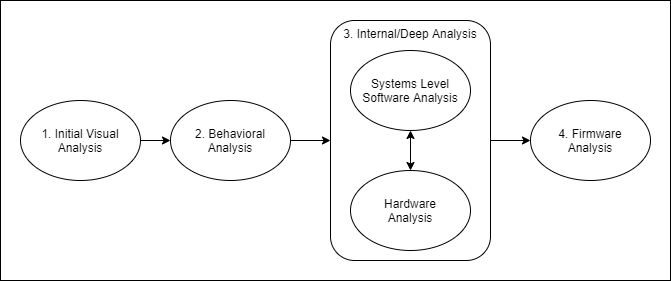

Greetings,

I don't know what to call this ... a course? a book? a document? In any case, this material is something I've wanted to capture for a long time for anyone to freely digest at their own pace.

The material has been organized in an order that I would consider when performing any embedded systems analysis. The following diagram shows this through process graphically.

1. As visualized in the above diagram, we first start with initial **visual** analysis. This means the system or target device is powered down. 

2. After we record all of the relevant properties and attributes from visual analysis, we'll perform behavioral analysis. This is when we power on the device and observe its behavior as the vendor intended.

3. The internal or deep analysis phase isn't as straight forward. Depending on your objectives, the systems level software analysis or hardware analysis could assist you with getting you the information or data required.
  
    - We start with the software analysis because that usually can be a more convenient and lower cost solution if thats all you need.
    - When software analysis doesn't cut it, hardware analysis provides more physical and low level observations that depend less on the state of the machine and more on external tools.

4. Finally, firmware analysis is performed. This is last because a either software analysis or hardware analysis is required to recover the firmware.

The high level break down of the sections:

1. **Meta** - This subject is a bit abstract, but aims to encompass the process that I use to approach problems and strategize how to approach towards a solution.

2. **Initial Visual Analysis** - The initial physical inspection of a device includes gathering as much detail as possible about the device. All information is gathered without providing any power to the device.

3. **Overt Behavioral Analysis** - After a _good enough_ profile of the _visual_ physical aspects of the device have been performed, the next thing I like to do is check the runtime behavior of the device. Many times we can accomplish our goals without actually having to pop a cover or do deeper hardware analysis (i.e. "Just because you have a hammer, not everything is a nail.").

4. **Systems Level Software** - TBD

5. **Hardware Analysis** - If you've exhausted your resources up until now, perhaps a deeper look at the hardware is in order. Memory extraction, IO analysis, and low level system control via JTAG are the name of the game here.

6. **Firmware** - This is essential where the advanced software analysis comes in (in contrast to our initial software analysis). With the firmware extracted, we often have full access to the boot software, the kernel, and all of the application code.

7. **Application** - This is a place holder for an actual full exercise that takes you through the complete process described above.
