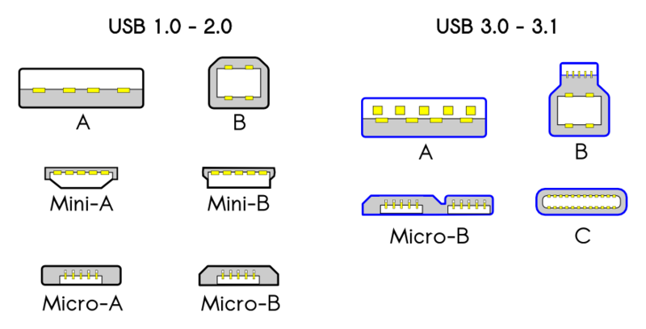

## Isolated Runtime Analysis

- Network Analysis
- Wireshark
- Restricted User Functionality
- Peripherals To Consider

---

## Network Link & Connect

- Know its LINKED
  - Known good cable?
  - Is the known good endpoint link up?
  - Is the target device powered on?
- Know it can CONNECT
  - Can you `ping` or `telnet` to it?
  - Can I `arping` the destination device?
  - Is there a `route` defined to access target device?
  - Am I using the correct subnet?

---

## Network Traffic Analysis

Observe detailed network traffic patterns from a device at start up and 
during its execution. 

Network traffic can provide awareness of:
- Open Ports
- Source/Destination Addresses
- Running Services

---

## Network Node Scanning

If you really can't figure out an address of a device, you can use `nmap`
to scan the entire network:

```sh
nmap -sn 192.168.0.0/16
```

**Note:** You must ensure that your device is in the correct subnet. In the
worst case you can set your subnet to *all addresses*, but this will take
a *very* long time. Its over 4 billion things to scan and each can get 
scanned multiple times depending on the detection method.

---

## Network Port Scanning

Scanning TCP ports usually only requires seeing an ACK following a SYN.
`nmap` automates this.

```
root@devhost:~# nmap 192.168.1.65

Starting Nmap 4.20 ( http://insecure.org ) at 2007-01-26 00:18 CET
Interesting ports on 192.168.1.65:
Not shown: 1692 closed ports
PORT       STATE SERVICE
22/tcp     open  ssh
25/tcp     open  smtp
80/tcp     open  http
1234/tcp   open  hotline
6112/tcp   open  dtspc

Nmap finished: 1 IP address (1 host up) scanned in 5.622 seconds.
```

---

## Network Packet Capture

- tcpdump - A CLI tool for dumping network traffic to terminal. tcpdump can 
  also generate `pcap` files based on pcap filters.
- wireshark - A GUI utility for capturing and viewing `pcap` data similar to 
  tcpdump.
- tshark - The terminal version of wireshark. Similar to tcpdump in many ways
  but may have extended functionality useful for your situation.

Note: Wireshark is known for its network capabilities, but with plugins it
can also be made to be a powerful packet analysis tool for other mediums 
(e.g. USB).

---

## tcpdump

---

## Wireshark


---

## Restricted User Functionality

---

## Peripherals - USB

- There is more than just RJ45 Cat5e/6 access!
- Some systems provide console via USB.



---

## Peripherals - End User Serial


---

## Peripherals - Storage / eSATA


---

## Peripherals - HDMI

What familiar protocol is found in HDMI?


