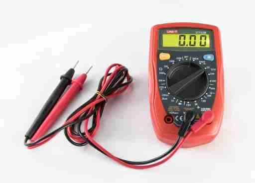

## Power

- What is voltage?
- What is resistance?
- Ohms Law
- Reference Ground
- Multimeters

---

## What is power?

<Flex style={{justifyContent: "center", alignItems: "center"}}>

<Block sx={{width: "40%", p:{textAlign:"left", mt: 0, mb: 0}}}>

_Conceptually_:
- Voltage is a pressure that drives electrons through a circuit.
- The amount or rate of electrons flowing through the circuit is the current.
- Current is measured as the amperage or amps and voltage is measured in volts.

</Block>


</Flex>

<Note>

- In reality, electrons don't move through wires, electromagnetic energy does.
- Electrons move very slowly, electromagentic energy is instantaneous (i.e. infinite speed)
- Electomagnetic energy does not move at the speed of light.
- http://www.pandualism.com/d/instantaneous.html

</Note>

---

## What is resistance?

<Flex style={{justifyContent: "center", alignItems: "center"}}>

<Block sx={{width: "40%", p:{textAlign:"left", mt: 0, mb: 0}}}>

- The opposition to current flow.
- Measured in Ohms (Ω)
- All materials resist current flow to some degree.
- Tip: Never measure the resistance of an operating circuit.

</Block>


</Flex>

<Note>

</Note>

---

## Power Flow

<Block sx={{width: "70%"}}>

- **Alternating Current (AC)** - Power where the voltage alternates in a sine 
  wave over a regular time.
- **Direct Current (DC)** - Power that remains at a constant voltage.

</Block>

---

## Ohms Law

<Block sx={{width: "70%"}}>

<Card bg='MDXPGray5'>

```text
Voltage (volts) = Current (amps) * Resistance (ohms)
Current (amps) = Voltage (volts) / Resistance (ohms)
Resistance (ohms) = Voltage (volts) / Current (amps)
```

</Card>

You may also see voltage referred to as E or V, current as I or A, and resistance as R or Ω.

</Block>

---

## Reference Ground

<Block sx={{p: {textAlign: "left"}, width: "70%"}}>

Voltage is also referred to as the _potential difference_. The difference
of potential between a source and its ground is the voltage.

When measuring voltages of a board, its important to use the same ground
reference between components. 

**Tip**: Don't measure the voltage levels between two different PCBs.

</Block>

---

## Multimeters

<Flex style={{justifyContent: "center", alignItems: "center"}}>



<Block sx={{width: "40%", ml: 20, p:{textAlign:"left", mt: 0, mb: 0}}}>

Can Measure:
- AC Voltage
- DC Voltage
- Ohms
- Continuity (Beep Beep)

</Block>

</Flex>

<Block sx={{color: "#B00"}}>

- Proving live circuits is very risky. It's very easy to create shorts.
- Never use multimeter leads between different boards.
- Measuring (lowest) resistance is often safer than continuity testing.

</Block>