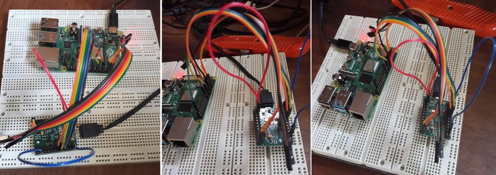

## Practical Electrical Engineering

- Schematics
- Breadboard
- Datasheets
- Pull Ups / Pull Downs
- Controlling Small Loads (e.g. LED)

---

## Schematics

<Block sx={{width: "70%"}}>

Schematics are a clear and concise expression of electrical circuits. The 
following figure shows some common schematic symbols.

</Block>

---

## Schematics

<Block sx={{width: "70%"}}>

Traces are the lines the connect the symbols (i.e. components) in the
schematic. Connections are classically represented with dots while crossed
traces have a dip or hump to indicate its not connected.

</Block>

Tip: In practice, the connection dots or trace jumps are omitted.

---

## Schematics

This is an example schematic for powering an LED.

---

## Breadboard

<Block sx={{width: "70%"}}>

Breadboards are used to prototype a circuit or parts of a circuit. They use
friction to keep components connected.

</Block>

---

## Breadboard Connections

<Block sx={{width: "70%"}}>

Great care must be taken to keep breadboards neat. Otherwise they quickly 
become unmaintainable. A gentle touch when making changes is also highly
recommended.

</Block>

---

## Pull Ups / Pull Downs

- When a signal is neither low nor high, its *floating*.
- When a low signal is activated, its *active high*.
- When a high signal is activated, its *active low*.

<Flex style={{justifyContent: "center", width: "100%", flexDirection: "rows"}}>

<Block sx={{mr: 40}} />

</Flex>

---

## Small Loads

*Small* loads (e.g. leds) can be controlled through microcontrollers with 
drain configuration. This is a configuration that allows the MCU to drain 
directly to ground for activation.

---

## Digital Logic

TODO: Refactor with memories

---

## Memories

TODO: Refactor with digital logic

---

## Pin Configuration

TODO: Finish material before slides.

---

## SPI

TODO: Finish material before slides.

---

## JTAG

- Overview
- The Standard
- The State Machine
- Input / Output
- OpenOCD
- Two Wire JTAG / SWD

---

## JTAG

<Block sx={{mb: "5px", p:{m:0}}}>

JTAG allows engineers to test production systems of integrated circuits.

</Block>

<Note>

- Its good to know JTAG terminiology when working with or troubleshooting 
  JTAG and JTAG tool configurations.
- When you find yourself developing your own JTAG solution, you probably
  missed something. It is very rare to have to go deep with JTAG for most
  analysis objectives.

</Note>

---

## JTAG Standard

- JTAG actually means *Joint Test Action Group*.
- When folks say "JTAG", they usually mean **IEEE 1149.1 Std**.
- JTAG allows for daisy chaining of ICs.
- JTAG pins:
  - **TCK** - The clock signal.
  - **TMS** - Mode select signal for changing the *TAP* controller state.
  - **TDI** - The data input line. (Input from IC perspective.)
  - **TDO** - The data output line. (Output from IC perspective.)
  - **TRST** - (Optional) An *easy button* for resetting the state.
- Its common for all TMS pins in a single chain to be tied together.

---

## JTAG Standard

- All JTAG machines have a data register (DR).
- All JTAG machines have an instruction register (IR).
- Register widths (i.e. bit lengths) are chip specific.
- Required instructions:
  - PRELOAD - load pin output values
  - SAMPLE - read boundary pin values
  - BYPASS - reduces registers to a single bit
- Common **Optional** instructions
  - IDCODE - for reading chip identification
  - EXTEST - for writing data to IC core
  - INTEST - for reading data from IC core

<Note>

- The registers are shift registers, so when setting register values you
  must shift the bits through all the intermediate devices in the chain.

</Note>

---

## JTAG State Machine

<Note>

- Talk about how the state machine works.
- Talk about how the state machine resets.
- Talk about how the state machine counts.

</Note>

---

## JTAG Tools

- Setting up JTAG for an unknown platform is a royal pain.
- [UrJTAG](http://urjtag.org/) is probably the lowest level JTAG tool.
- There are many well supported (and expensive) JTAG tools for purchase.
- [OpenOCD](https://openocd.org/) is an open source JTAG tool.
- JTAG software needs a *programmer*/*debugger* device to connect to target device.

---

## OpenOCD Setup

For our setup, we'll use an FTDI MiniModule to connect OpenOCD to a RaspberryPi 4.

---

## Two Wire JTAG - cJTAG

- cJTAG (i.e. IEEE 1149.7) - *Compact* JTAG interface.
- **TMSC** - Serial data interface. (Bi-directional depending on clock phase).
- **TCKC** - Clock signal.

---

## Two Wire JTAG - SWD

- [SWD, developed by ARM](https://documentation-service.arm.com/static/5f900b1af86e16515cdc0642?token=), 
  is called *Serial Wire Debug*.
- SWDIO (usually ganged with TMS) - The data input/output signal.
- SWCLK (usually ganged with TCK) - The clock signal.
- In contrast to cJTAG, SWD is packet based.
- Packetized chunks increases turn around efficiency.

