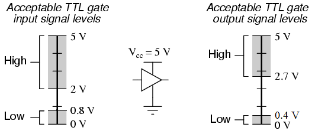

## Serial Access

- Adapters and Cables
- Internal UART
- Serial Terminal
- Booter Output

---

## Adapters and Cables

RS232 to USB

---

## Adapters and Cables

Null Modem

---

## Adapters and Cables

TTL to USB

---

## Adapters and Cables

FTDI Cable

---

## Internal UART

- Many internal console UART connections are TTL.
- Can be identified by a header or paired holes coming from MCU.
- Typical baud rates: 115200, 9600, 38400.
- Common UART config: 8 bits, no parity, 1 stop bit (8-N-1)
- 2 wire TTL/UART uses software flow control.

---

## Baud via Logic Analyzer

Logic Analyzers sample voltage levels on data lines.

---

## Measure Baud With LogicAn

<Block sx={{width: "70%"}}>

Given the microseconds (us) that a protocol takes to signal a single bit
of information, you can derive the baud with: 

`baud = (1/X) * 1000000`

Note: To get the sufficient accurate readings, you need to really crank up
the sample rate. At 8Mhz you can almost measure 115200 baud rates.

</Block>