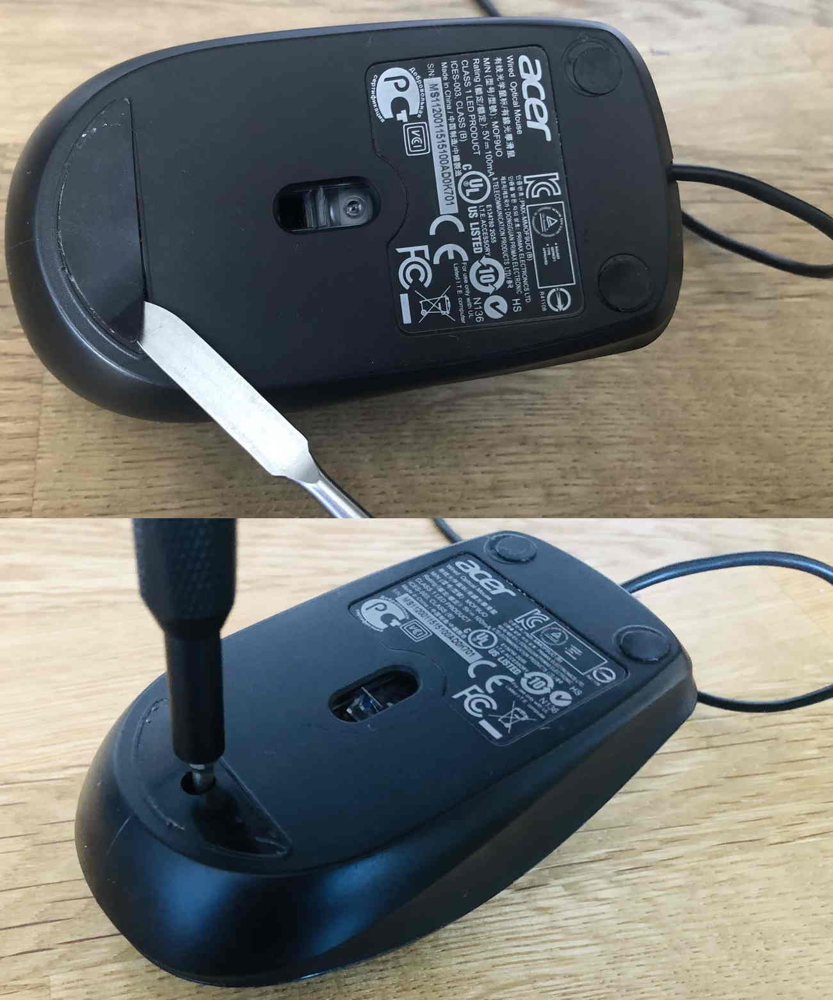
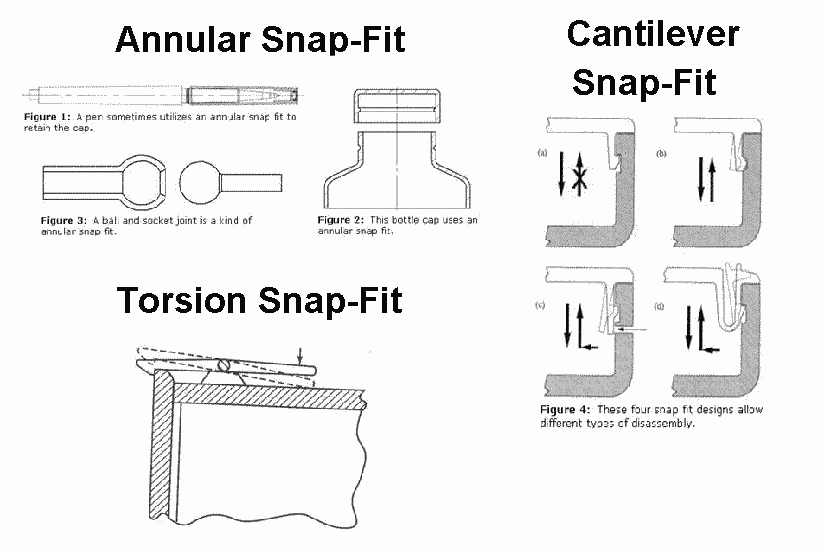
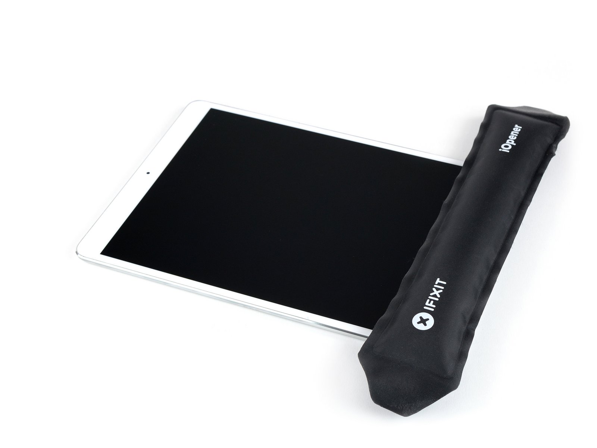
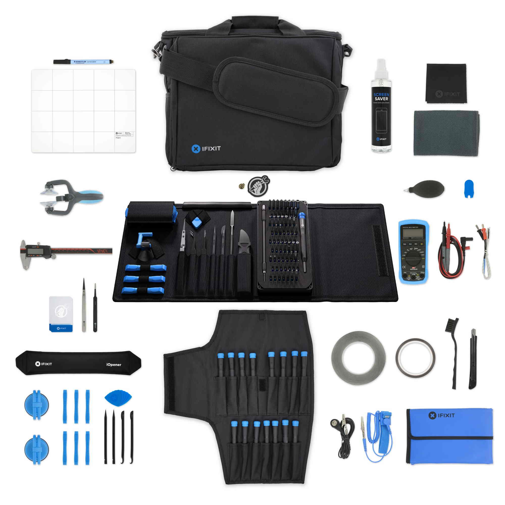

# Disassembly

* Approach and Risks
* What Holds It Together
* Snap Locks
* Tools
* Resources

---

## Approach and Risks

---

## What's Holding It Together?

- Screws
- Snap Locks (e.g. Cantilever, Annular, Torsion)
- Adhesive

---

## Hidden Screws

<Note>

- Screws are commonly hidden under stickers or the feet of the device.
- Screws can have security features (e.g. tri-wing).

</Note>

---

## Snap Locks

---

## Adhesive

---

## Teardown Tools

<Note>

- iFixit Pro Kit is a wildly available tear down kit.
- The Business Repair kit has

</Note>

