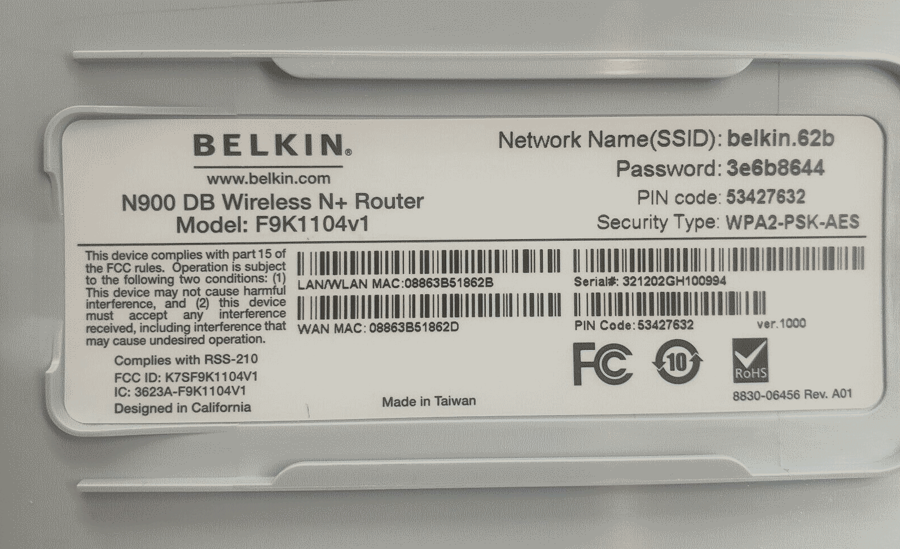
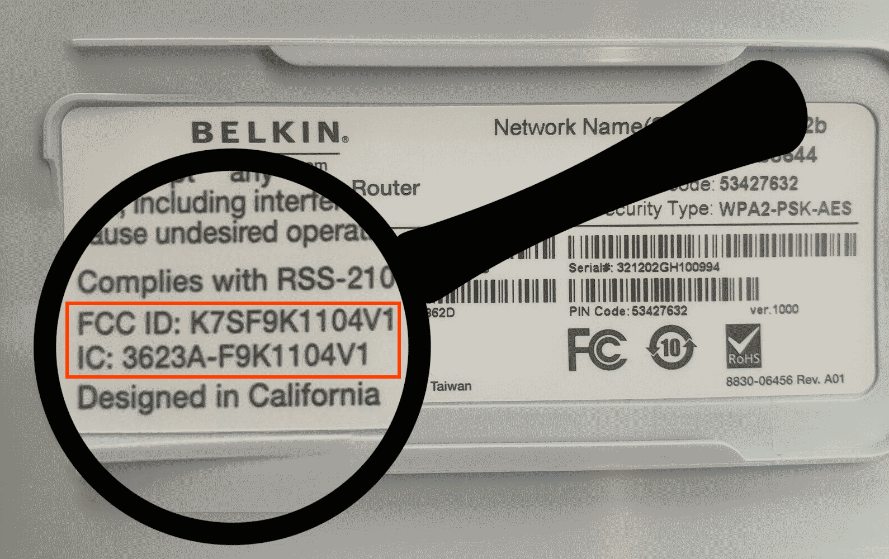
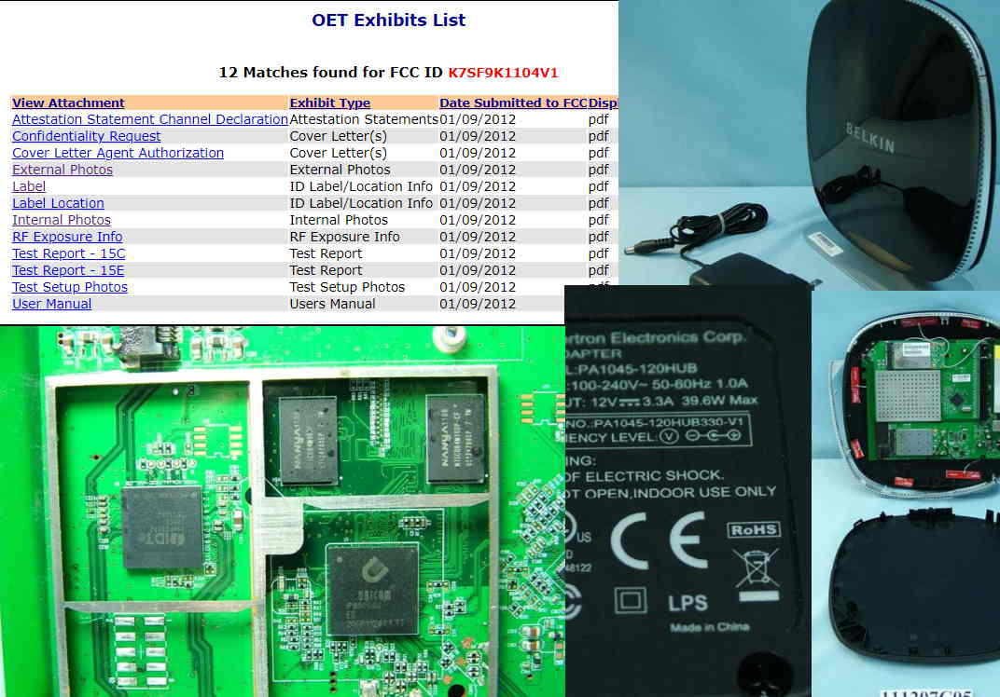

# External Analysis

* Labels
* Ports / Buttons / LEDs
* Photos and Pictures

---

## Labels & Certifications

* MAC OUI - [Organizationally Unique Identifier](https://en.wikipedia.org/wiki/Organizationally_unique_identifier)
  * [OUI Lookup Tool](https://www.wireshark.org/tools/oui-lookup.html)
* IC ID - [Industry Canada](https://www.ic.gc.ca/eic/site/icgc.nsf/eng/home)
  * [Radio Equipment Search](https://sms-sgs.ic.gc.ca/equipmentSearch/searchRadioEquipments?execution=e1s1&lang=en)
* FCC ID - [Federal Communications Commission](https://www.fcc.gov)
  * [FCC ID Search](https://www.fcc.gov/oet/ea/fccid)

---

## Labels - Belkin Example

What value-able information does this label provide?

---

## Labels - End User Information

- Model Name: N900 DB Wireless N+ Router
- Model Number: F9K1104v1
- Network Name (SSID): belkin.62b
- Password: 3e6b8644
- PIN Code: 53427632
- Security Type: WPA2-PSK-AES

<Note>

TODO: Consider having a translucent label in the background.

</Note>

---

## Labels - More Information

- LAN/WAN MAC: 08:86:3b:51:86:2b
- WAN MAC: 08:86:3b:51:86:2d
- Serial Number: 321202GH100994
- PIN Code: 53427632
- ver. 1000
- 8830-06456 Rev A01

<Note>

TODO: Consider having a translucent label in the background.

</Note>

---

## Labels - IC/FCC ID Example

Did you check [FCC ID Search](https://www.fcc.gov/oet/ea/fccid) with the 
below ID?

---

## Labels - FCC ID Information

---

## Misc External Analysis

<Block sx={{width: "70%"}}>

- Find device capability in a User Manual.
- Document Ports, Buttons, and LEDs
- Take/Draw pictures of everything, especially things that you plan to 
  disassemble or change.
- When using photography, use resolutions that can pick up all of the writing 
  on the labels or components.

</Block>