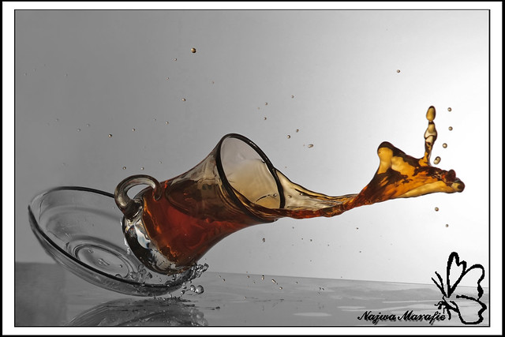
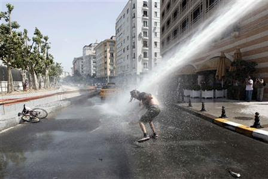
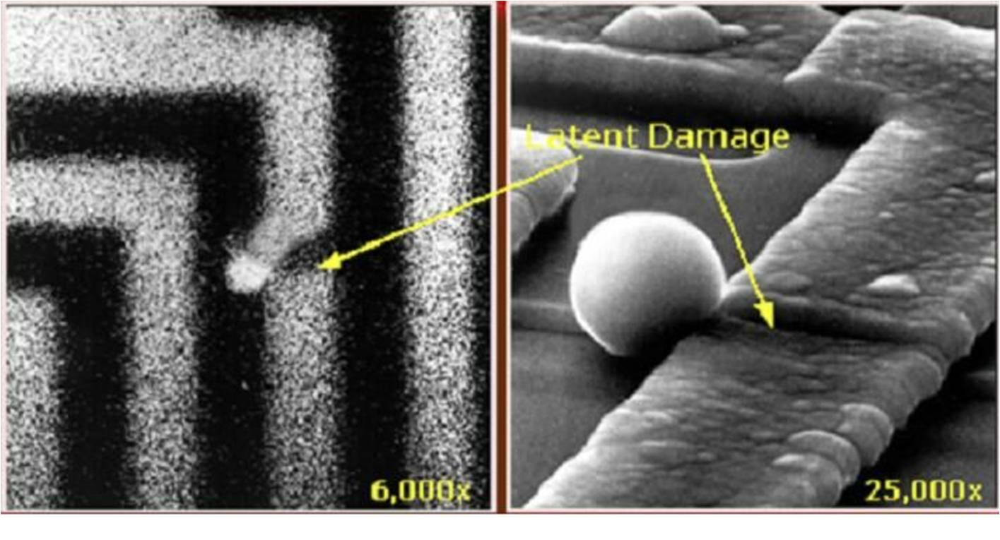
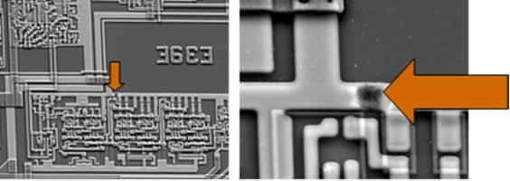
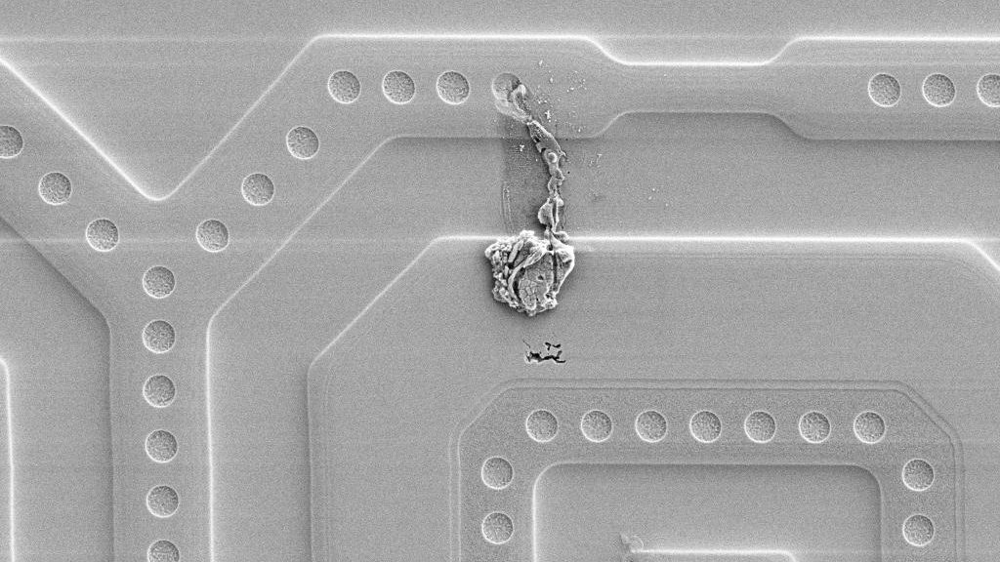

# Handling Hardware

* What is ESD and EOS?
* Non-Electrical Engineers
* Mitigating ESD/EOS
* Accepting Risks

---

## Electrostatic Discharge (ESD)

ESD - Electrostatic Discharge - _Short-lived_ discharge or potential energy between two objects (e.g. device and human).

---

## Electrical Overstress (EOS)

EOS - Electrical Overstress - _Sustained_ over-powering of an object or device.

---

## Hypothetical Situation

<Block sx={{width: "80%", alignItems: "left", textAlign: "left", justifyContent: "left"}}>

EE: Why are you walking around while holding that PCB?

EE: You're going to ruin that board if you don't put it in a ESD safe box or bag!

Sw Dev: Yeah ok, resumes previous activity. I've done this a dozen times. Whats going to happen that hasn't already?

</Block>

<Note>

- TODO: Left justify all these lines in a `div`

</Note>

---

## Latent ESD Damage #1

A circuit that remains closed, but acts more like a fuse than a trace.

---

## Latent ESD Damage #2

Degraded trace that changes circuit behavior.

<Note>

- ESD mats are often found ungrounded. Always double check.
- Important to ground people in chairs and stools. Many have plastic wheels.
- Ideally wrist straps should be worn, but rarely are for analysis.

</Note>

---

## Latent ESO Damage #3

Melted trace from upper layer dripped to lower layer.

---

## Acknowledging Risks

<Block sx={{width: "80%"}}>

- Don't do electrical work on conductive surfaces.
- Ground yourself with a case or grounding wire before coming in contact with an ungrounded PCB.
- Transfer ungrounded PCBs in ESD resistance containers (i.e those ESD bags or black ESD boxes).
- When possible, a _grounded_ ESD mat should be used. This prevents someone casually walking by you from discharging into the device.

</Block>

<Note>

- Accepting the tradeoff between ESD/ESO risks and the time/cost required to achieve objective.

</Note>