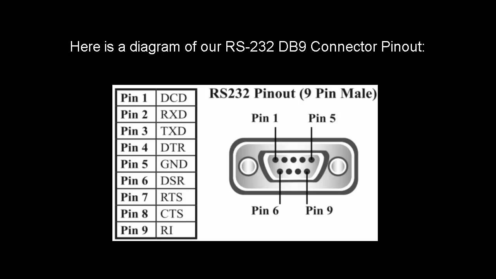

# Internal Inspection

* PCB Primer
  * Layers and Vias
  * Silk Screen
  * Visually Locating Ground
* IC Identification
* Datasheets

---

## PCBs - Layers && Vias

---

## PCBs - Silk Screen

<Note>

- TODO: Find example of silk screen.

</Note>

---

## Visually Locating Ground

- Locate screws or other fasteners.
- Shields (also referred to as cans) are grounded.
- Use port or connector pin-out knowledge.

<Note>

- TODO: List other ways to find ground.
- Wireless boards will have large surface ground planes. Many circuits will 
  also use fat traces for power rails. Its wise not to assume one or the 
  other.

</Note>

---

## Visually Locating Ground

Locate screw holes or other fasteners.

---

## Visually Locating Ground

Use port or connector pin-out knowledge.

---

## IC Identification

<Block sx={{width: "70%"}}>

- Determine make and model of components.
- When using photography
  - A camera stand is suggested for crisp images.
  - Use an angled light instead of flash to capture information hidden in suffice texture of component.
  - Sometimes a video capture with a varying angle can clarify questionable images.

</Block>

<Note>

- TODO: Find collection of chip logos.
- IC - integrated circuit.

</Note>

---

## IC Stickers

Some ICs, especially programmable components (e.g. boot-able flash) will be obscured by stickers. Peeling back stickers is likely destructive.

---

## Epoxy Blobs

Epoxy blobs can be used in place of an actual IC package. It can also be used to obscure parts.

---

## Datasheets

<Block sx={{width: "70%"}}>

- Briefs, Assembly Specs, Technical Manuals
- 10s, 100s, or 1000s of pages.
- Many advertisers and scammers will attempt to distract you when searching 
  for datasheets (e.g. alldatasheetarchive.com, datasheet-archive.com).

</Block>

---

## Datasheets

- Consider Competitor Compatibility
- More Powerful Queries
  - `site:datasheetpdf.com`
  - `-site:alldatasheetarchive.com`
  - `filetype:pdf`

---

## Datasheets

<Block sx={{width: "70%"}}>

- Use Linux/OSS Community
  - [Linux](https://www.kernel.org/) driver code.
  - Many projects that specialize in repurposing commercial embedded systems:
    - [OpenWRT](https://openwrt.org/) - Wide array of platforms.
    - [DD-WRT](https://dd-wrt.com/) - Wide array of platforms.
    - [PolarCloud's Tomato](http://www.polarcloud.com/tomato) - For broadcom.

</Block>