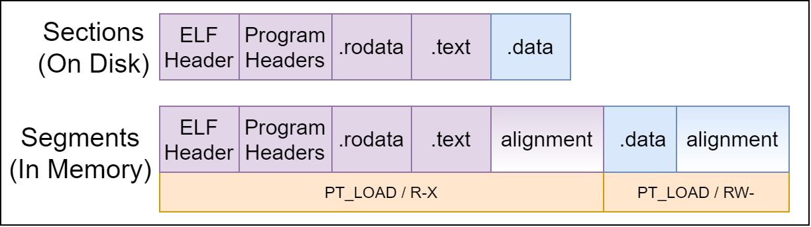

## GNU Toolchain

```text
Source -> Preprocessor -> Compilation -> Assembling -> Linking
```

---

## ELF Overview

- ELF - Executable and Linkable Format
- Conceptually similar to PE or COFF.
- Segments (defined by program headers) are in memory.
- Sections are on disk.
  - `.bss` - Uninitialized data. (0 bytes on disk.)
  - `.data` - Initialized data.
  - `.relaNAME` - (Unlinked) Relocation information (e.g. .rela.text).
  - `.rodata` - Read-only data (by convention).
  - `.text` - Executable instructions.
- For details, see `man 5 elf`.

---

## ELF Overview



<Card bg='MDXPGray5' sx={{mt: 20, width: "70%"}}>

```text
readelf -h /path/to/elf   # Read ELF headers
readelf -S /path/to/elf   # Read ELF section metadata
readelf -l /path/to/elf   # Read ELF program headers
```

</Card>

---

## Build Process (for C)

<Card bg='MDXPGray5' sx={{width: "90%"}}>

```text
Source -> Preprocessor -> Compilation -> Assembling -> Linking
```

</Card>

<Block sx={{width:"90%"}}>

1. **Preprocessor** (`cpp`) - Human readable/maintained C code to pure C.
2. **Compiler** (`cc`) - Converts C source into assembler instructions.   
3. **Assembler** (`as`) - Converts assembler instructions into architecture
   specific machine code.
4. **Linker** (`ld`) - Combines *translation units* into usable ELF files.

</Block>

<Note>

- TODO: Feels like a wall of text.
- CPP Includes things like `#include`, `#define`, and `#ifdef`.
- `gcc` is a variant of `cc` that includes GNE extensions to the C language.
- Assembler instruction isn't always consistent within an architecture. 
  Their behavior can change from model to model.
- Linkers only see translation units, not code or symbols. Linkers rely 
  on the meta data in sections like .rela.text to perform the linking.

</Note>

---

## GNU C Compiler

GCC Command Synopsis:

<Card bg='MDXPGray5' sx={{width: "90%"}}>

```text
[prefix]gcc [-E|-S|-c] [options] [-o outfile] infile
```

</Card>

- **Notice the `[prefix]` before the `gcc` command?**
- `gcc` without a prefix is the *host* toolchain.
- `gcc` with a prefix is *cross compiler*: `aarch64-buildroot-linux-musl-gcc`

---

## GCC Command

You can halt GCC at each of the build phases to inspect the output.

<Card bg='MDXPGray5' sx={{width: "90%"}}>

```text
[prefix]gcc [-E|-S|-c] [options] [-o outfile] infile

-E  Stop after the preprocessing stage; do not run the compiler proper. The output is
    in the form of preprocessed source code, which is sent to the standard output.

-S  Stop after the stage of compilation proper; do not assemble. The output is in the
    form of an assembler code file for each non-assembler input file specified.

-c  Compile or assemble the source files, but do not link. The linking stage simple is
    not done. The ultimate output is in the form of an object file for each source
    file.
```

</Card>

---

## GCC Command

<Grid
        gridTemplateColumns="5% 30% 5% 55% 5%"
        gridTemplateRows="20% 60% 20%"
        sx={{width:"80%"}}
      >

<Block 
    style={{gridColumnStart: 2, gridRowStart: 1}}
    sx={{p: {textAlign: "left", alignItems: "start", justifyContent: "start"}}}>

Given `giant.h`:

</Block>

<Block 
    style={{gridColumnStart: 4, gridRowStart: 1}}
    sx={{p: {textAlign: "left", alignItems: "start", justifyContent: "start"}}}>

Given `main.c`:

</Block>

<Card bg='MDXPGray5' style={{flex: 1, flexShrink: 1, gridColumnStart: 2, gridRowStart: 2}}>

```c
#ifndef GIANT_H
#define GIANT_H
extern int fee();
extern int fie();
extern int foe();
#endif
```

</Card>

<Card bg='MDXPGray5' style={{gridColumnStart: 4, gridRowStart: 2}}>

```c
#include "giant.h"

#define VALUE 0xABCD

int main(void) {
  int ret = 0;
  ret = VALUE + fee() + fie() + foe();
  return ret;
}
```

</Card>

</Grid>

---

## GNU C Preprocessor

<Card bg='MDXPGray5' sx={{width:"70%"}}>

```sh
aarch64-buildroot-linux-musl-gcc -E main.c | grep -v '^#'
```

</Card>

<Card bg='MDXPGray5' sx={{mt: 20, width:"70%"}}>

```c
extern int fee();
extern int fie();
extern int foe();


int main(void) {
  int ret = 0;
  ret = 0xABCD + fee() + fie() + foe();
  return ret;
}
```

</Card>

---

## GNU C Assembler

<Card bg='MDXPGray5' sx={{width:"70%"}}>

```sh
aarch64-buildroot-linux-musl-gcc -S main.c ; cat main.s
```

</Card>

<Card bg='MDXPGray5' sx={{mt: 20, width:"70%", height: "60%", pre: {height:"100%", overflow:"auto"}}}>

```text
.arch armv8-a+crc
        .file   "main.c"
        .text
        .align  2
        .global main
        .type   main, %function
main:
.LFB0:
        .cfi_startproc
        stp     x29, x30, [sp, -48]!
        .cfi_def_cfa_offset 48
        .cfi_offset 29, -48
        .cfi_offset 30, -40
        mov     x29, sp
        str     x19, [sp, 16]
        .cfi_offset 19, -32
        str     wzr, [sp, 44]
        bl      fee
        mov     w1, w0
        mov     w0, 43981
        add     w19, w1, w0
        bl      fie
        add     w19, w19, w0
        bl      foe
        add     w0, w19, w0
        str     w0, [sp, 44]
        ldr     w0, [sp, 44]
        ldr     x19, [sp, 16]
        ldp     x29, x30, [sp], 48
        .cfi_restore 30
        .cfi_restore 29
        .cfi_restore 19
        .cfi_def_cfa_offset 0
        ret
        .cfi_endproc
.LFE0:
        .size   main, .-main
        .ident  "GCC: (Buildroot 2021.08.1) 10.3.0"
        .section        .note.GNU-stack,"",@progbits
```

</Card>

---

## GNU C Compiler

<Card bg='MDXPGray5' sx={{width:"70%"}}>

```sh
aarch64-buildroot-linux-musl-gcc -c main.c ; \
  aarch64-buildroot-linux-musl-objdump -d -j .text main.o
```

</Card>

<Card bg='MDXPGray5' sx={{mt: 20, width:"70%", height: "60%", pre: {height:"100%", overflow:"auto"}}}>

```text
main.o:     file format elf64-littleaarch64


Disassembly of section .text:

0000000000000000 <main>:
   0:   a9bd7bfd        stp     x29, x30, [sp, #-48]!
   4:   910003fd        mov     x29, sp
   8:   f9000bf3        str     x19, [sp, #16]
   c:   b9002fff        str     wzr, [sp, #44]
  10:   94000000        bl      0 <fee>
  14:   2a0003e1        mov     w1, w0
  18:   529579a0        mov     w0, #0xabcd        // #43981
  1c:   0b000033        add     w19, w1, w0
  20:   94000000        bl      0 <fie>
  24:   0b000273        add     w19, w19, w0
  28:   94000000        bl      0 <foe>
  2c:   0b000260        add     w0, w19, w0
  30:   b9002fe0        str     w0, [sp, #44]
  34:   b9402fe0        ldr     w0, [sp, #44]
  38:   f9400bf3        ldr     x19, [sp, #16]
  3c:   a8c37bfd        ldp     x29, x30, [sp], #48
  40:   d65f03c0        ret
```

</Card>

---

## GNU C Relocations

Notice the `bl` instructions below. What is their branch destination?

<Card bg='MDXPGray5' sx={{width:"70%"}}>

```text
...
  10:   94000000        bl      0 <fee>
  14:   2a0003e1        mov     w1, w0
  18:   529579a0        mov     w0, #0xabcd       // #43981
  1c:   0b000033        add     w19, w1, w0
  20:   94000000        bl      0 <fie>
  24:   0b000273        add     w19, w19, w0
  28:   94000000        bl      0 <foe>
...
```

</Card>

Take away: Unlinked ELF output has *blanks* that need to be filled in.

---

## Object Files

- Review
  ```text
  Source -> Preprocessor -> Compilation -> Assembling -> Linking
  ```
- Object files are ELF files.
- Object Files are **not** linked.

---

## Linker Intro

<Block sx={{width:"80%"}}>

Assuming we're still using the previous example, we should now have a
`main.o`. Lets check the external `fee()`, `fie()`, and `foe()` symbols:

</Block>

<Card bg='MDXPGray5' sx={{width:"70%"}}>

```sh
aarch64-buildroot-linux-musl-objdump -t main.o | \
  grep -e fee -e fie -e foe
```

</Card>

<Card bg='MDXPGray5' sx={{mt: 20, width:"70%"}}>

```text
0000000000000000         *UND*  0000000000000000 fee
0000000000000000         *UND*  0000000000000000 fie
0000000000000000         *UND*  0000000000000000 foe
```

</Card>

---

## Linker Intro

Let's write the code that'll provide the missing symbols.

<Card bg='MDXPGray5' sx={{width:"70%"}}>

```c
int fee() { return 1; }
int fie() { return 2; }
int foe() { return 3; }
```

</Card>

<Card bg='MDXPGray5' sx={{mt: 20, width:"70%"}}>

```sh
aarch64-buildroot-linux-musl-gcc -c giant.c
```

</Card>

---

## Linker Intro

Now we can link our original `main.o` with `giant.o`.

<Card bg='MDXPGray5' sx={{mt: -20, width:"70%"}}>

```sh
aarch64-buildroot-linux-musl-gcc -O0 -o main main.o giant.o
```

</Card>

Let's check the symbols once more:

<Card bg='MDXPGray5' sx={{mt: -20, width:"70%"}}>

```sh
aarch64-buildroot-linux-musl-objdump -t main.o | \
  grep -e fee -e fie -e foe
```

</Card>

<Card bg='MDXPGray5' sx={{mt: 20, width:"70%"}}>

```text
00000000004005bc g     F .text  0000000000000008 foe
00000000004005b4 g     F .text  0000000000000008 fie
00000000004005ac g     F .text  0000000000000008 fee
```

</Card>

---

## Archives

<Block sx={{width:"80%"}}>

Static libraries are archives of object files. The archives are created with
the `ar` command. Assuming `fee()`, `fie()`, and `foe()` were each in their 
own `.c` file, we could archive them as a static library.

</Block>

<Card bg='MDXPGray5' sx={{mt: -20, width:"70%"}}>

```sh
ar rcs libgiant.a fee.o fie.o foe.o
```

</Card>

Now build with the static library:

<Card bg='MDXPGray5' sx={{mt: -20, width:"70%"}}>

```sh
gcc -o main main.o libgiant.a
```

</Card>

---

## Archives

<Block sx={{width:"80%"}}>

There is a convention where libraries prefixed with `lib` can use the
`-lNAME` notation.

</Block>

<Card bg='MDXPGray5' sx={{mt: -20, width:"70%"}}>

```sh
gcc -o main main.o -lgiant
```

</Card>

<Block sx={{width:"80%"}}>

Of course this also assumes that `libgiant.a` is in the default library path. 
For things not in the default path, use the `-L` argument.

</Block>

<Card bg='MDXPGray5' sx={{mt: -20, width:"70%"}}>

```sh
gcc -o main main.o -L/path/to/libs -lgiant
```

</Card>

---

## Shared Objects

---

## Generic Commands

---

## Info Pages

If you're using Debian or Ubuntu, ensure that you have the toolchain docs
installed.

<Card bg='MDXPGray5' sx={{mt: -20, width:"70%"}}>

```sh
apt-get install gcc-doc cpp-doc binutils-doc
```

</Card>

Then you can access the terminal based `info` hypertext documentation for GNU.

<Card bg='MDXPGray5' sx={{mt: -20, width:"70%"}}>

```sh
info cpp    # preprocessor docs
info gcc    # compiler docs
info as     # assembler docs
info ld     # linker docs
```

</Card>

---

## Info Pages Hotkeys

<Grid
    gridTemplateColumns="4% 42% 3% 47% 4%"
    gridTemplateRows="100%"
    sx={{width:"80%"}}
    style={{alignItems: "center"}}>

<Block style={{gridColumnStart: 2}} sx={{p: {textAlign: "left"}}}>

- `Space` - Scroll Forward
- `Delete` / `Backspace` - Scroll Backward
- `n` - Scroll Backward
- `p` - Scroll Backward
- `u` - Scroll Backward
- `l` - Scroll Backward
- `t` - Scroll Backward

</Block>

<Block style={{gridColumnStart: 4}} sx={{p: {textAlign: "left"}}}>

- `<` - First Node At Current Level
- `>` - Last Node At Current Level
- `g` - Goto Node
- `/` - Regex Search
- `}` - Search Next
- `{` - Ssearch Previous
- `q` - Quit

</Block>

</Grid>